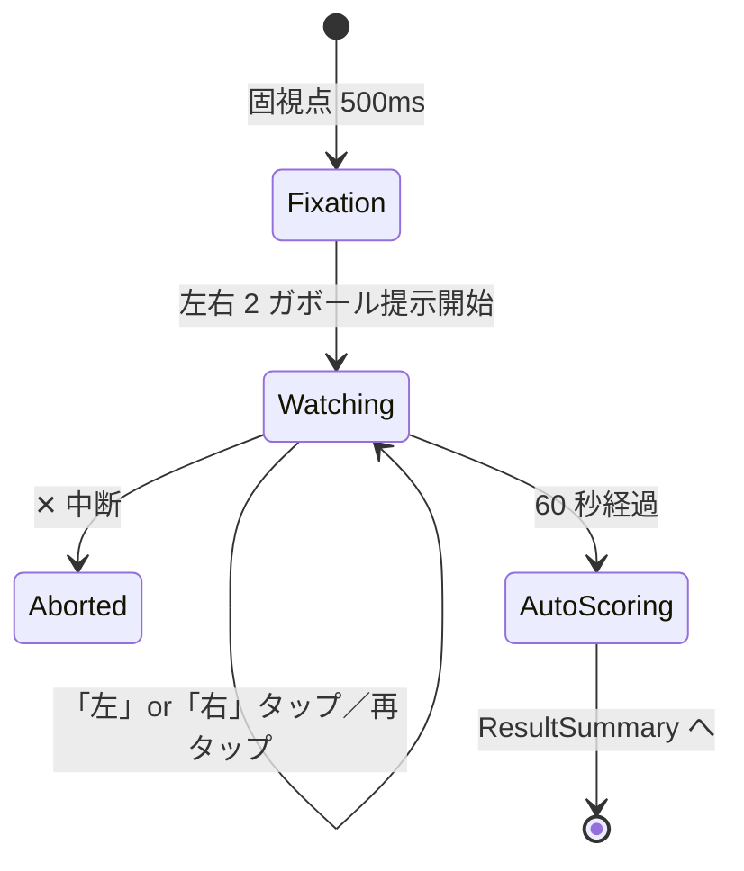

# Sprint 10 — G-02 左右並び傾き判別（v1 改修）

> **Sprint 20 改訂注記（v1.1.1、2026-04-30）**：本スプリントの **S10-02 プレイ画面 / S10-03 結果サマリは Sprint 20 で改訂**された。
> - S10-02：horizontal-2「左」「右」テキストボタン撤去 → ガボールパッチ直接選択方式に変更（spec §7.2 設問刷新）
> - S10-03：独立画面撤去 → ResultOverlay 刺激画面重畳方式に変更（spec F-10 v1.1.1）
> - 選択枠：黄色 4px → 中性グレー 2px（spec F-07 v1.1.1）
> 最新仕様は `docs/design-v11/sprints/sprint-20/screens.md` §3 S20-G02-PLAY / §4 S20-G02-RESULT を参照。S10-01（ミニ説明）の記述は引き続き有効。

## スプリントの目的（spec-v11.md §13）

G-02 が単体プレイで動く（OPT-12 統一フォーマット）。staircase が動く。

含む機能：F-07（G-02）

---

## 0. このスプリントで作る／更新する画面

| 画面 ID | 名称 | 状態 |
|---|---|---|
| S10-01 | G-02 ミニ説明（初回のみ） | 新規 |
| S10-02 | G-02 プレイ画面（左右ガボール 60 秒同時提示） | 新規（v1 Sprint 2 から OPT-12 統一改修） |
| S10-03 | G-02 結果サマリ | 新規（共通フォーマット） |

---

## 1. 受け入れ基準カバレッジ

| 仕様 ID | 基準 | 担当 |
|---|---|---|
| F-07 共通 | 60 秒注視・自由回答変更可・確定ボタンなし・自動採点 | S10-02 |
| 7.2 G-02 | 左右 2 つのガボールを 60 秒間同時提示（点滅・マスク・フェードなし） | S10-02 |
| 7.2 G-02 | 「左」「右」の 2 択 | S10-02（horizontal-2） |
| 7.2 G-02 | staircase: 角度差 易 10°→難 1°、初期 6°、step 1° | コード |
| 7.2 G-02 | 正解開示で正解側を 1.5 秒拡大ハイライト | S10-03 |
| 7.2 G-02 注 | v1 旧仕様の「3 秒タイムアウト」「30 試行ループ」廃止 | S10-02（OPT-12 統一） |

---

## 2. S10-01：G-02 ミニ説明

### スマホ縦

```
┌─────────────────────────────────────┐
│  ←  G-02 左右並び傾き判別             │
│                                     │
│      じーっと見比べて                 │ ← font.h2 30px Bold
│   どちらが時計回りに傾いているか      │
│                                     │
│   ┌─────────────────────────────┐   │
│   │   ▦         ▦              │   │ ← デモ：左右 2 ガボール
│   │  ↺           ↻              │   │   軽く傾き差を見せる
│   └─────────────────────────────┘   │
│                                     │
│   ・60 秒間、両方をじーっと見比べる    │ ← font.body 24px
│   ・「左」「右」のどちらかをタップ      │
│   ・気が変われば何度でも変えてよい     │
│   ・確定ボタンはない                  │
│   ・60 秒経過時の選択が回答になる      │
│                                     │
│  ┌─────────────────────────────────┐│
│  │     はじめる                     ││
│  └─────────────────────────────────┘│
└─────────────────────────────────────┘
```

---

## 3. S10-02：G-02 プレイ画面

`GamePlaySurface` + `SideBySideStimulus`（GE-02）+ `AnswerChoiceGroup`（horizontal-2）

### スマホ縦（375×667）

```
┌─────────────────────────────────────┐
│  ✕     残り 53 秒                    │ ← GameStatusBarV11
│                                     │
│                                     │
│      ┌────────────────────────┐     │
│      │                        │     │
│      │   ▦/▦       ▦\▦         │     │ ← SideBySideStimulus
│      │  (左)        (右)        │     │   左右 2 ガボール 120×120
│      │                        │     │   ギャップ 32px
│      │       +                │     │   中央固視点 0.5°
│      │                        │     │   背景 #808080
│      │  60 秒間ずっと表示       │     │
│      │  （点滅・マスクなし）    │     │
│      └────────────────────────┘     │
│                                     │
│   時計回りに傾いているのは？          │ ← guidance text
│                                     │   font.body 24px
│                                     │
│  ┌──────────────┐  ┌──────────────┐ │ ← AnswerChoiceGroup
│  │      左       │  │      右      │ │   horizontal-2
│  │   (選択中)    │  │              │ │   各 64px 高
│  │  黄 4px 枠   │  │              │ │   font.body.lg 26px
│  └──────────────┘  └──────────────┘ │
│                                     │
└─────────────────────────────────────┘
```

### PC 横（1280×800）

```
┌──────────────────────────────────────────────────────┐
│  ✕     残り 53 秒                                     │
│                                                      │
│         ┌────────────────────────────────┐           │
│         │   ▦/▦              ▦\▦         │           │
│         │  160×160          160×160       │           │
│         │            +                   │           │
│         │   ギャップ 64px、固視点 0.5°    │           │
│         └────────────────────────────────┘           │
│                                                      │
│            時計回りに傾いているのは？                  │
│                                                      │
│       ┌──────────────┐    ┌──────────────┐           │
│       │      左       │    │      右       │           │
│       └──────────────┘    └──────────────┘           │
│                                                      │
└──────────────────────────────────────────────────────┘
```

### モックアップ（Mermaid 状態図）



### フェーズタイミング表（v1 → v1.1 改訂）

| 時刻 | 表示 | 備考 |
|---|---|---|
| -0.5s〜0s | 固視点のみ表示（500ms） | 注視位置を整える |
| 0s〜60s | 左右 2 ガボール + 固視点（同時提示、ずっと表示） | **v1 旧の「3 秒タイムアウト」廃止** |
| 0s〜60s | ユーザーは何度でも「左 / 右」を選択／解除可 | OPT-12 自由回答変更 |
| 60s | 自動採点 → S10-03 | 選択中状態が回答 |

### v1 からの変更点
- 旧 v1 仕様：1 試行 ≈ 3 秒提示 → 3 秒タイムアウト → 30 試行ループ
- v1.1 仕様：**1 試行 = 60 秒**、ガボール 2 つを 60 秒同時提示、自由選択
- 提示時間も staircase 連動も廃止（パラメータは「角度差」のみ）

### 状態
- 選択前：両ボタンとも default、文字 `color.fg.primary`
- 「左」選択中：左ボタン黄色 4px 枠
- 「右」選択中：右ボタン黄色 4px 枠
- ボタン再タップ：解除（null）
- 別ボタン押下：切替

### a11y
- ガボール領域 `aria-hidden="true"`
- 選択肢 `<div role="radiogroup" aria-label="どちらが時計回りに傾いているか">`
- 各ボタン `<button role="radio" aria-checked="..">`
- ガイドテキスト `aria-describedby` でグループにリンク

---

## 4. S10-03：G-02 結果サマリ

`ResultSummaryV11` 共通フォーマット。

### スマホ縦

```
┌─────────────────────────────────────┐
│         G-02 の結果                  │
│                                     │
│       正解は「右」                    │ ← font.h1 36px Bold
│                                     │   黄色 4px 装飾
│   ┌──────────────────────────────┐  │
│   │   ▦/▦         [▦\▦]           │  │ ← 採点後ハイライト
│   │              (黄 4px拡大)     │  │   1.5 秒 scale(1→1.18→1)
│   └──────────────────────────────┘  │
│                                     │
│    あなたの回答「左」 ← 不正解アイコン │ ← font.body.lg 26px
│                                     │   不正解時：error 装飾
│                                     │
│  ┌────────────────┐ ┌────────────────┐
│  │ 今回の閾値      │ │ 前回比          │
│  │   6.0°          │ │  -1.0 ↓ 改善   │
│  │ 角度差          │ │                │
│  └────────────────┘ └────────────────┘
│                                     │
│  ┌─────────────────────────────────┐│
│  │     次へ                         ││
│  └─────────────────────────────────┘│
└─────────────────────────────────────┘
```

### G-02 固有の指標

| 表示項目 | 値の例 |
|---|---|
| correctAnswerLabel | 「左」または「右」 |
| userAnswerLabel | 「左」/「右」/「未回答」 |
| threshold.value | 6.0 |
| threshold.unit | "角度差（°）" |
| diff | direction="improved" は値が小さい方向 |

### a11y
- SR：「G-02 結果。正解は右。あなたの回答は左、不正解。今回の閾値は 6 度。前回より 1 度改善。次へボタン」

---

## 5. レスポンシブ確認

| ブレイクポイント | パッチ一辺 | ギャップ |
|---|---|---|
| 360px | 100×100px | 24px |
| 375px | 120×120px | 32px |
| 768px | 140×140px | 48px |
| 1280px | 160×160px | 64px |

## 6. ダーク／ライト両対応
- ガボール領域は #808080 固定
- ボタン色は両モードで AAA 適合（system.md §1.4）

## 7. テスト観点

- 60 秒タイマー終了で自動採点
- 「左」/「右」選択切替・解除
- 未回答時の不正解扱い
- staircase が「6° → 5° → ...」と難方向に動くこと
- ResultSummaryV11 の前回比計算
