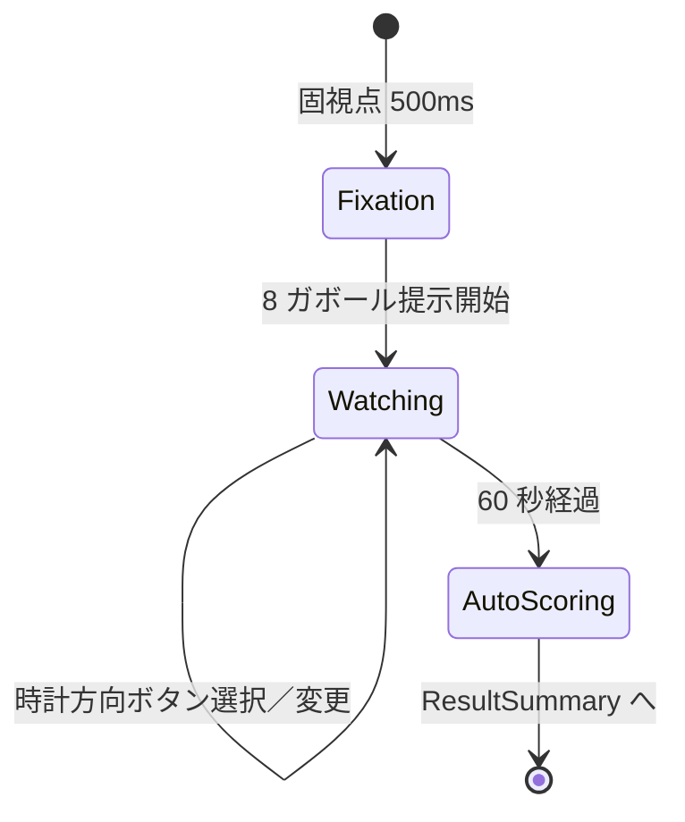

# Sprint 11 — G-03 周辺視野ハント（v1 改修）

> **Sprint 22 v1.2 改訂注記（2026-05-10、最重要）**：本スプリントの G-03 は **v1.2 で解答表示が改訂**された。**中央線方式（v1.0 期）は完全廃止**され、F-10 統一仕様（パッチ上 ✅/❌ 重畳 + 刺激領域直下に試行全体総合 ✅/❌ を 1 個）に統一される。staircase 値・採点ロジック・選択方式（円周 8 ガボール直接タップ単一選択）は不変。最新仕様は `docs/design-v11/sprints/sprint-22/screens.md` §4 G-03 を参照。S11-01 / S11-02 の構造は引き続き有効（カウントダウン UI と結果オーバーレイのみ sprint-22 に従う）。
>
> **Sprint 20 改訂注記（v1.1.1、2026-04-30）**：本スプリントの **S11-03 G-03 結果サマリ独立画面は撤去**された。Sprint 20 で結果開示が刺激画面統合方式（ResultOverlay 重畳、◯/✕ は時計 8 ボタン上に配置）に再設計された。最新仕様は `docs/design-v11/sprints/sprint-20/screens.md` §10 / §2 を参照。S11-01（ミニ説明）/ S11-02（プレイ画面）の記述は引き続き有効。なお、S11-02 の時計ボタン選択枠「黄色 4px」は v1.1.1 で「中性グレー 2px」に改訂（components.md §5 ClockChoiceLayout 参照）。

> **Sprint 21 改訂注記（v1.1.2、2026-05-01）**：本スプリントの **S11-02 G-03 プレイ画面は Sprint 21 で改訂**された（clock-8 テキスト 8 択ボタン撤去 → 円周 8 ガボールパッチを `ImageChoiceCell` × 8 でラップして直接タップ選択化）。最新仕様は `docs/design-v11/sprints/sprint-21/screens.md` §3 S21-G03-PLAY を参照。staircase 値・採点ロジック・閾値計算は不変。`ClockChoiceLayout`（AC-3）は Sprint 21 後に実質未使用となるが、API は将来用途のため残す。Sprint 21 後の ◯/✕ 重畳位置は **円周上のガボールパッチ中央**に変わる（S20 では時計ボタン中央、S21 でパッチ中央）。

## スプリントの目的（spec-v11.md §13）

G-03 が単体プレイで動く。マスクなし・60 秒同時提示型。

含む機能：F-07（G-03）

---

## 0. このスプリントで作る／更新する画面

| 画面 ID | 名称 | 状態 |
|---|---|---|
| S11-01 | G-03 ミニ説明 | 新規 |
| S11-02 | G-03 プレイ画面（中央固視 + 周囲 8 ガボール 60 秒同時提示） | 新規（v1 Sprint 3 の G-03 から OPT-12 統一改修） |
| S11-03 | G-03 結果サマリ | 新規（共通フォーマット） |

---

## 1. 受け入れ基準カバレッジ

| 仕様 ID | 基準 | 担当 |
|---|---|---|
| F-07 共通 | 60 秒注視・自由回答変更可・自動採点 | S11-02 |
| 7.3 G-03 | 中央固視点 + 円周 8 ガボール、odd one を見つける | S11-02 |
| 7.3 G-03 | **マスクなし、60 秒間ずっと提示**（v1 旧マスク 200ms 廃止） | S11-02 |
| 7.3 G-03 | 8 択時計方向ボタン | S11-02（ClockChoiceLayout） |
| 7.3 G-03 | staircase: 向き差 易 45°→難 5°、初期 25°、step 2°、離心角 8° 固定 | コード |
| 7.3 G-03 | 正解開示で正解位置を矢印 1.5 秒提示 | S11-03 |

---

## 2. S11-01：G-03 ミニ説明

### スマホ縦

```
┌─────────────────────────────────────┐
│  ←  G-03 周辺視野ハント                │
│                                     │
│       中央を見つめたまま              │ ← font.h2 30px Bold
│   違う向きのパッチを 8 個から探す      │
│                                     │
│   ┌─────────────────────────────┐   │
│   │           ▦                 │   │ ← デモ：8 個円周配置
│   │       ▦       ▦             │   │
│   │   ▦       +       ▦         │   │
│   │       ▦       ▦             │   │
│   │           ▦                 │   │
│   └─────────────────────────────┘   │
│                                     │
│   ・中央の十字をじーっと見続ける       │ ← font.body 24px
│   ・周辺視で違う向きを探す            │
│   ・時計の方向で答える                │
│   ・60 秒間ずっと表示される           │
│   ・気が変われば何度でも変えてよい     │
│                                     │
│  ┌─────────────────────────────────┐│
│  │     はじめる                     ││
│  └─────────────────────────────────┘│
└─────────────────────────────────────┘
```

---

## 3. S11-02：G-03 プレイ画面

`GamePlaySurface` + `PeripheralStimulusV11`（GE-03、マスクなし版）+ `ClockChoiceLayout`（AC-3）

### スマホ縦（375×667）

```
┌─────────────────────────────────────┐
│  ✕     残り 38 秒                    │
│                                     │
│  ┌─────────────────────────────┐    │
│  │              ▦                │    │ ← PeripheralStimulusV11
│  │                              │    │   320×320px グレー領域
│  │       ▦              ▦       │    │   8 ガボール円周配置
│  │                              │    │   離心角 8°（換算半径 ≒ 110px）
│  │   ▦         +         ▦      │    │   中央固視点 0.5°
│  │                              │    │
│  │       ▦              ▦       │    │   うち 1 個（odd one）が
│  │                              │    │   違う向き
│  │              ▦                │    │
│  │                              │    │   60 秒間ずっと表示
│  │   違う向きはどこ？             │    │   （マスクなし）
│  └─────────────────────────────┘    │
│                                     │
│  ┌─────────────────────────────┐    │ ← ClockChoiceLayout
│  │           12                  │    │   8 ボタン円配置
│  │     10:30      1:30           │    │   各 72×72px、radius.circle
│  │   9      [中央]      3        │    │   ラベル 24px tabular-nums
│  │     7:30      4:30            │    │   選択中：黄 4px 枠
│  │            6                  │    │
│  └─────────────────────────────┘    │
└─────────────────────────────────────┘
```

### PC 横（1280×800）

```
┌────────────────────────────────────────────────────────┐
│  ✕     残り 38 秒                                       │
│                                                        │
│       ┌─────────────────────────┐    ┌──────────────┐ │
│       │    8 ガボール + 固視点    │    │  時計方向 8 択  │ │
│       │    ガボール領域 400×400  │    │  円直径 360    │ │
│       │                         │    │                │ │
│       │   違う向きはどこ？        │    │       12       │ │
│       │                         │    │  10:30   1:30  │ │
│       │                         │    │   9  + 　  3   │ │
│       │                         │    │   7:30  4:30   │ │
│       │                         │    │       6        │ │
│       └─────────────────────────┘    └──────────────┘ │
│                                                        │
└────────────────────────────────────────────────────────┘
```

### モックアップ（Mermaid 状態図）



### フェーズタイミング表（v1 → v1.1 改訂）

| 時刻 | 表示 | 備考 |
|---|---|---|
| -0.5s〜0s | 中央固視点のみ表示（500ms） | 注視位置を整える |
| 0s〜60s | 中央固視点 + 円周 8 ガボール（同時提示、ずっと表示） | **v1 旧の「マスク 200ms」「40 試行ループ」廃止** |
| 0s〜60s | 8 択ボタンのうちどれを押しても OK（再タップで解除、別を押すと切替） | OPT-12 |
| 60s | 自動採点 → S11-03 | |

### v1 → v1.1 の変更点
- 旧 v1：100〜800ms 短時間提示 → 200ms マスク → 2 秒回答 → 40 試行ループ
- v1.1：60 秒間ずっと 8 ガボールを同時提示。staircase は「向き差」のみ（提示時間 staircase は廃止、離心角は 8° 固定）

### a11y
- ガボール領域 `aria-hidden="true"`、ガイド文「中央の十字を見ながら、違う向きのパッチを探してください。時計の方向で答えてください」を `aria-describedby`
- ClockChoiceLayout：`role="radiogroup"`、各ボタン `role="radio" aria-checked aria-label="時計の {N} 時の方向"`
- 矢印キー：時計回り／反時計回りで隣接ボタンへ移動

---

## 4. S11-03：G-03 結果サマリ

### スマホ縦

```
┌─────────────────────────────────────┐
│         G-03 の結果                  │
│                                     │
│      正解は「3 時の方向」             │ ← font.h1 36px Bold
│                                     │   黄色 4px 装飾
│                                     │
│   ┌─────────────────────────────┐   │
│   │       ▦                       │   │ ← 採点後円配置再現
│   │    ▦      ▦                   │   │   正解位置に矢印 1.5 秒
│   │  ▦   +   →[▦]                 │   │   （拡大ハイライト）
│   │    ▦      ▦                   │   │
│   │       ▦                       │   │
│   └─────────────────────────────┘   │
│                                     │
│  あなたの回答「6 時の方向」  不正解   │ ← font.body.lg 26px
│                                     │
│  ┌────────────────┐ ┌────────────────┐
│  │ 今回の閾値      │ │ 前回比          │
│  │  25°            │ │  -3.0 ↓ 改善   │
│  │ 向き差           │ │                │
│  └────────────────┘ └────────────────┘
│                                     │
│  ┌─────────────────────────────────┐│
│  │     次へ                         ││
│  └─────────────────────────────────┘│
└─────────────────────────────────────┘
```

### G-03 固有の指標

| 表示項目 | 値の例 |
|---|---|
| correctAnswerLabel | 「3 時の方向」（時計位置） |
| userAnswerLabel | 「6 時の方向」/「未回答」 |
| threshold.value | 25 |
| threshold.unit | "向き差（°）" |
| 補助：採点開示時の矢印演出 | 正解位置を矢印で 1.5 秒拡大ハイライト |

### a11y
- SR：「G-03 結果。正解は 3 時の方向。あなたの回答は 6 時の方向、不正解。今回の閾値は 25 度。前回より 3 度改善」

---

## 5. レスポンシブ

| ブレイクポイント | ガボール領域 | 円直径 | 各パッチ |
|---|---|---|---|
| 360px | 320×320 | 220 | 約 50px |
| 375px | 320×320 | 220 | 50〜56px |
| 768px | 400×400 | 280 | 64px |
| 1280px | 400×400 | 280 | 64px |

## 6. テスト観点

- 60 秒間ずっと 8 ガボール表示（マスク発火しない）
- ClockChoiceLayout 8 ボタンのいずれかを選択／解除
- 矢印演出 1.5 秒
- staircase が「25° → 23° → ...」と推移
