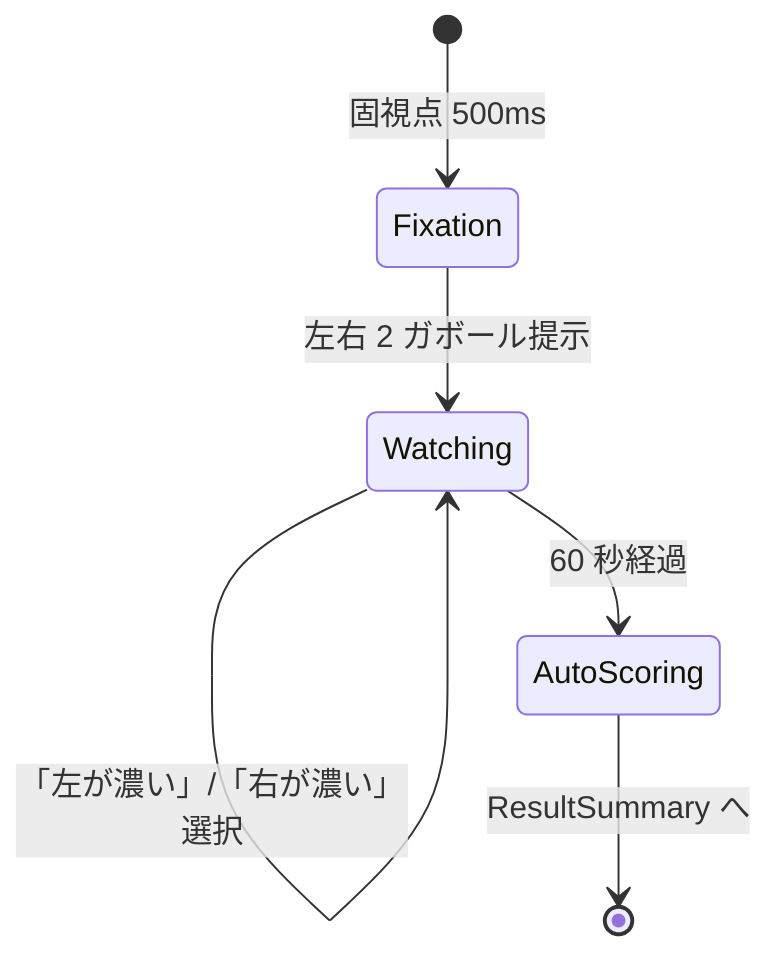

# Sprint 12 — G-04 コントラスト弁別

> **Sprint 22 v1.2 改訂注記（2026-05-10、最重要）**：本スプリントの G-04 は **v1.2 で大幅改訂**された。「左右 2 ガボール直接選択」方式は廃止され、**3×3 グリッド + 違うパッチ複数ランダム + 複数選択 + TP+1/FP-1 部分点**方式に統合される（G-05 / G-06 と共通フォーマット）。最新仕様は `docs/design-v11/sprints/sprint-22/screens.md` §5 G-04 / G-05 / G-06 を参照。**本書 S12-01 / S12-02 / S12-03 の記述は履歴目的でのみ残置**。新規実装は sprint-22 を参照すること。
>
> **Sprint 20 改訂注記（v1.1.1、2026-04-30）**：本スプリントの **S12-03 G-04 結果サマリ独立画面は撤去**された。Sprint 20 で結果開示が刺激画面統合方式（ResultOverlay 重畳、◯/✕ は horizontal-2 ボタン上に配置）に再設計された。最新仕様は `docs/design-v11/sprints/sprint-20/screens.md` §10 / §2 を参照。S12-01（ミニ説明）/ S12-02（プレイ画面）の記述は引き続き有効。なお、S12-02 の horizontal-2 ボタン選択枠「黄色 4px」は v1.1.1 で「中性グレー 2px」に改訂（components.md §3 AnswerChoiceGroup 参照）。

> **Sprint 21 改訂注記（v1.1.2、2026-05-01）**：本スプリントの **S12-02 G-04 プレイ画面は Sprint 21 で改訂**された（horizontal-2「左が濃い／右が濃い」テキストボタン撤去 → 左右 2 ガボールパッチを `ImageChoiceCell` × 2 でラップして直接タップ選択化、G-02 と同パターン）。最新仕様は `docs/design-v11/sprints/sprint-21/screens.md` §4 S21-G04-PLAY を参照。staircase 値・採点ロジック・閾値計算は不変。設問文言は「より濃く見えるパッチを選んでください」（Designer 確定、18pt 以上）。Sprint 21 後の ◯/✕ 重畳位置は **パッチ中央**に変わる（S20 ではボタン中央、S21 でパッチ中央）。

## スプリントの目的（spec-v11.md §13）

G-04 が単体プレイで動く。

含む機能：F-07（G-04）

---

## 0. このスプリントで作る／更新する画面

| 画面 ID | 名称 | 状態 |
|---|---|---|
| S12-01 | G-04 ミニ説明 | 新規 |
| S12-02 | G-04 プレイ画面（左右 2 ガボール、コントラスト差） | 新規 |
| S12-03 | G-04 結果サマリ | 新規（共通フォーマット） |

---

## 1. 受け入れ基準カバレッジ

| 仕様 ID | 基準 | 担当 |
|---|---|---|
| F-07 共通 | 60 秒注視・自由回答変更可・自動採点 | S12-02 |
| 7.4 G-04 | 左右 2 つのガボール（向き・cpd 同一）でどちらが濃いかを 60 秒同時提示で判別 | S12-02 |
| 7.4 G-04 | 「左が濃い」「右が濃い」の 2 択 | S12-02（horizontal-2） |
| 7.4 G-04 | staircase: コントラスト差 易 0.3→難 0.05、初期 0.15、step 0.02 | コード |

---

## 2. S12-01：G-04 ミニ説明

### スマホ縦

```
┌─────────────────────────────────────┐
│  ←  G-04 コントラスト弁別             │
│                                     │
│        じーっと見比べて               │ ← font.h2 30px Bold
│      どちらの縞模様が濃いか           │
│                                     │
│   ┌─────────────────────────────┐   │
│   │   ▦/▦       ▦/▦             │   │ ← デモ：左右 2 ガボール
│   │   薄め      濃いめ            │   │   コントラスト差を見せる
│   └─────────────────────────────┘   │
│                                     │
│   ・60 秒間、両方をじーっと見比べる    │ ← font.body 24px
│   ・「左が濃い」「右が濃い」を選ぶ      │
│   ・気が変われば何度でも変えてよい     │
│   ・じっと見ていると差が消える錯視も   │
│                                     │
│  ┌─────────────────────────────────┐│
│  │     はじめる                     ││
│  └─────────────────────────────────┘│
└─────────────────────────────────────┘
```

---

## 3. S12-02：G-04 プレイ画面

`GamePlaySurface` + `ContrastDiscrimStimulus`（GE-04）+ `AnswerChoiceGroup`（horizontal-2）

### スマホ縦（375×667）

```
┌─────────────────────────────────────┐
│  ✕     残り 51 秒                    │
│                                     │
│      ┌────────────────────────┐     │
│      │                        │     │
│      │   ▦/▦         ▦/▦       │     │ ← GE-04
│      │   左          右         │     │   左右 2 ガボール 120×120
│      │   コントラスト 0.30      │     │   ギャップ 32px
│      │            コントラスト 0.42 │   │   中央固視点 0.5°
│      │       +                │     │   向き・cpd 同一
│      │                        │     │
│      │  60 秒間ずっと表示       │     │   コントラスト差のみ
│      └────────────────────────┘     │
│                                     │
│   どちらが濃い？                     │ ← guidance text
│                                     │   font.body 24px
│                                     │
│  ┌──────────────┐  ┌──────────────┐ │ ← AnswerChoiceGroup
│  │   左が濃い     │  │   右が濃い    │ │   horizontal-2
│  │              │  │  (選択中)    │ │   選択中：黄 4px 枠
│  │              │  │  黄 4px枠     │ │
│  └──────────────┘  └──────────────┘ │
│                                     │
└─────────────────────────────────────┘
```

### PC 横

```
┌──────────────────────────────────────────────────────┐
│  ✕     残り 51 秒                                     │
│                                                      │
│         ┌────────────────────────────────┐           │
│         │   ▦/▦              ▦/▦         │           │
│         │  160×160 contrast 160×160      │           │
│         │  0.30      +       0.42        │           │
│         └────────────────────────────────┘           │
│                                                      │
│            どちらが濃い？                              │
│                                                      │
│       ┌──────────────┐    ┌──────────────┐           │
│       │   左が濃い     │    │   右が濃い     │           │
│       └──────────────┘    └──────────────┘           │
│                                                      │
└──────────────────────────────────────────────────────┘
```

### モックアップ（Mermaid 状態図）



### フェーズタイミング表

| 時刻 | 表示 |
|---|---|
| -0.5s〜0s | 固視点のみ |
| 0s〜60s | 左右 2 ガボール（コントラスト差） + 固視点（同時提示、ずっと表示） |
| 60s | 自動採点 |

### a11y
- ガボール領域 `aria-hidden="true"`
- 選択肢 `role="radiogroup" aria-label="どちらのコントラストが高いか"`
- 各ボタン `aria-checked`

---

## 4. S12-03：G-04 結果サマリ

### スマホ縦

```
┌─────────────────────────────────────┐
│         G-04 の結果                  │
│                                     │
│       正解は「右が濃い」              │ ← font.h1 36px Bold + 黄装飾
│                                     │
│   ┌─────────────────────────────┐   │
│   │   ▦/▦         [▦/▦]          │   │ ← 採点後ハイライト
│   │              黄 4px 拡大     │   │   1.5 秒 scale(1→1.18→1)
│   └─────────────────────────────┘   │
│                                     │
│  あなたの回答「左が濃い」 不正解      │ ← font.body.lg 26px
│                                     │   不正解時：error 装飾
│                                     │
│  ┌────────────────┐ ┌────────────────┐
│  │ 今回の閾値      │ │ 前回比          │
│  │  0.12          │ │  -0.02 ↓ 改善  │
│  │ コントラスト差  │ │                │
│  └────────────────┘ └────────────────┘
│                                     │
│  ┌─────────────────────────────────┐│
│  │     次へ                         ││
│  └─────────────────────────────────┘│
└─────────────────────────────────────┘
```

### G-04 固有の指標

| 表示項目 | 値の例 |
|---|---|
| correctAnswerLabel | 「左が濃い」/「右が濃い」 |
| threshold.value | 0.12 |
| threshold.unit | "コントラスト差" |

### a11y
- SR：「G-04 結果。正解は右が濃い。あなたの回答は左が濃い、不正解。今回の閾値はコントラスト差 0.12。前回より 0.02 改善」

---

## 5. レスポンシブ

| ブレイクポイント | パッチ一辺 | ギャップ |
|---|---|---|
| 360px | 100×100 | 24px |
| 375px | 120×120 | 32px |
| 1280px | 160×160 | 64px |

## 6. テスト観点

- 左右パッチのコントラストが staircase 値で異なる
- どちらが「正解（高コントラスト側）」かをランダム
- 選択切替・解除
- staircase 推移（0.15 → 0.13 → ...）
