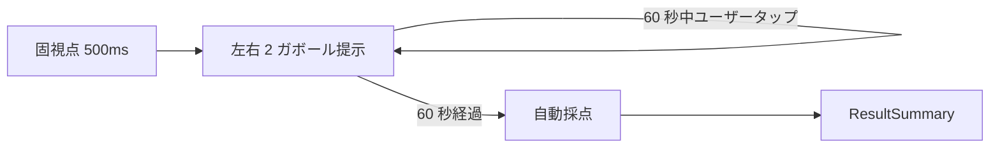

# Sprint 13 — G-05 空間周波数弁別

> **Sprint 20 改訂注記（v1.1.1、2026-04-30）**：本スプリントの **S13-03 G-05 結果サマリ独立画面は撤去**された。Sprint 20 で結果開示が刺激画面統合方式（ResultOverlay 重畳、◯/✕ は horizontal-2 ボタン上に配置）に再設計された。最新仕様は `docs/design-v11/sprints/sprint-20/screens.md` §10 / §2 を参照。S13-01（ミニ説明）/ S13-02（プレイ画面）の記述は引き続き有効。なお、選択枠「黄色 4px」は v1.1.1 で「中性グレー 2px」に改訂（components.md §3 AnswerChoiceGroup 参照）。

> **Sprint 21 改訂注記（v1.1.2、2026-05-01）**：本スプリントの **S13-02 G-05 プレイ画面は Sprint 21 で改訂**された（horizontal-2「左が細かい／右が細かい」テキストボタン撤去 → 左右 2 ガボールパッチを `ImageChoiceCell` × 2 でラップして直接タップ選択化）。最新仕様は `docs/design-v11/sprints/sprint-21/screens.md` §5 S21-G05-PLAY を参照。staircase 値・採点ロジック・閾値計算は不変。設問文言は「より細かい縞のパッチを選んでください」（Designer 確定、18pt 以上）。Sprint 21 後の ◯/✕ 重畳位置は **パッチ中央**に変わる。

## スプリントの目的（spec-v11.md §13）

G-05 が単体プレイで動く。

含む機能：F-07（G-05）

---

## 0. このスプリントで作る／更新する画面

| 画面 ID | 名称 | 状態 |
|---|---|---|
| S13-01 | G-05 ミニ説明 | 新規 |
| S13-02 | G-05 プレイ画面（左右 2 ガボール、cpd 差） | 新規 |
| S13-03 | G-05 結果サマリ | 新規（共通フォーマット） |

---

## 1. 受け入れ基準カバレッジ

| 仕様 ID | 基準 | 担当 |
|---|---|---|
| F-07 共通 | 60 秒注視・自由回答変更可・自動採点 | S13-02 |
| 7.5 G-05 | 左右 2 つのガボール（コントラスト・向き同一）でどちらが細かい縞か | S13-02 |
| 7.5 G-05 | 「左が細かい」「右が細かい」の 2 択 | S13-02 |
| 7.5 G-05 | staircase: cpd 比 易 2.0→難 1.1、初期 1.5、step 0.1 | コード |

---

## 2. S13-01：G-05 ミニ説明

```
┌─────────────────────────────────────┐
│  ←  G-05 空間周波数弁別               │
│                                     │
│       じーっと見比べて                │
│   どちらの縞が細かいか              │
│                                     │
│   ┌─────────────────────────────┐   │
│   │   ▦/▦       ▦/||/▦           │   │ ← デモ：左右 2 ガボール
│   │   太め      細め              │   │   cpd 差を見せる
│   └─────────────────────────────┘   │
│                                     │
│   ・60 秒間、両方をじーっと見比べる    │
│   ・「左が細かい」「右が細かい」を選ぶ  │
│   ・気が変われば何度でも変えてよい     │
│                                     │
│  ┌─────────────────────────────────┐│
│  │     はじめる                     ││
│  └─────────────────────────────────┘│
└─────────────────────────────────────┘
```

---

## 3. S13-02：G-05 プレイ画面

`GamePlaySurface` + `SFDiscrimStimulus`（GE-05）+ `AnswerChoiceGroup`（horizontal-2）

### スマホ縦（375×667）

```
┌─────────────────────────────────────┐
│  ✕     残り 47 秒                    │
│                                     │
│      ┌────────────────────────┐     │
│      │                        │     │
│      │   ▦/▦         ▦/||/▦    │     │ ← GE-05
│      │   左 cpd=3   右 cpd=4.5 │     │   左右 2 ガボール 120×120
│      │            +           │     │   ギャップ 32px
│      │   60 秒同時提示         │     │   中央固視点 0.5°
│      │                        │     │
│      │   コントラスト・向き同一 │     │   cpd 差のみ
│      │   （cpd のみ異なる）     │     │
│      └────────────────────────┘     │
│                                     │
│   どちらが細かい？                   │ ← guidance text
│                                     │
│  ┌──────────────┐  ┌──────────────┐ │ ← AnswerChoiceGroup
│  │  左が細かい    │  │  右が細かい    │ │
│  │              │  │  (選択中)     │ │
│  │              │  │  黄 4px枠     │ │
│  └──────────────┘  └──────────────┘ │
│                                     │
└─────────────────────────────────────┘
```

### モックアップ（Mermaid フロー）



### フェーズタイミング

| 時刻 | 表示 |
|---|---|
| -0.5s〜0s | 固視点のみ |
| 0s〜60s | 左右 2 ガボール（cpd 差） + 固視点 同時提示 |
| 60s | 自動採点 |

### a11y
- 選択肢 `role="radiogroup" aria-label="どちらの空間周波数が高いか"`
- ガボール領域 aria-hidden

---

## 4. S13-03：G-05 結果サマリ

### スマホ縦

```
┌─────────────────────────────────────┐
│         G-05 の結果                  │
│                                     │
│      正解は「右が細かい」             │ ← 黄装飾
│                                     │
│   ┌─────────────────────────────┐   │
│   │   ▦/▦        [▦/||/▦]         │   │ ← 採点後ハイライト
│   └─────────────────────────────┘   │
│                                     │
│  あなたの回答「右が細かい」 正解 ✓    │ ← success 装飾
│                                     │
│  ┌────────────────┐ ┌────────────────┐
│  │ 今回の閾値      │ │ 前回比          │
│  │  1.5（cpd 比）  │ │  -0.1 ↓ 改善   │
│  └────────────────┘ └────────────────┘
│                                     │
│  ┌─────────────────────────────────┐│
│  │     次へ                         ││
│  └─────────────────────────────────┘│
└─────────────────────────────────────┘
```

### G-05 固有の指標

| 表示項目 | 値の例 |
|---|---|
| correctAnswerLabel | 「左が細かい」/「右が細かい」 |
| threshold.value | 1.5 |
| threshold.unit | "cpd 比" |

### a11y
- SR：「G-05 結果。正解は右が細かい。あなたの回答は右が細かい、正解。今回の閾値は cpd 比 1.5。前回より 0.1 改善」

---

## 5. レスポンシブ

GE-05 は GE-02 / GE-04 と同じ寸法系統（120×120 〜 160×160、ギャップ 32〜64）。

## 6. テスト観点

- 左右の cpd が staircase 値で異なる
- 高 cpd 側がランダムに「正解」
- staircase 推移（1.5 → 1.4 → ...）
- ResultSummaryV11 の cpd 比単位表示
