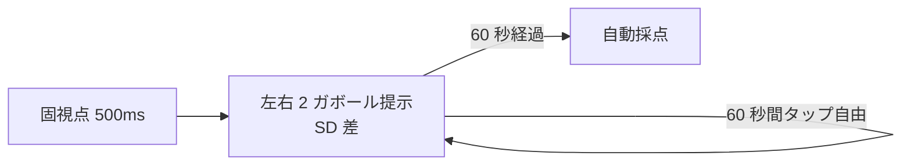
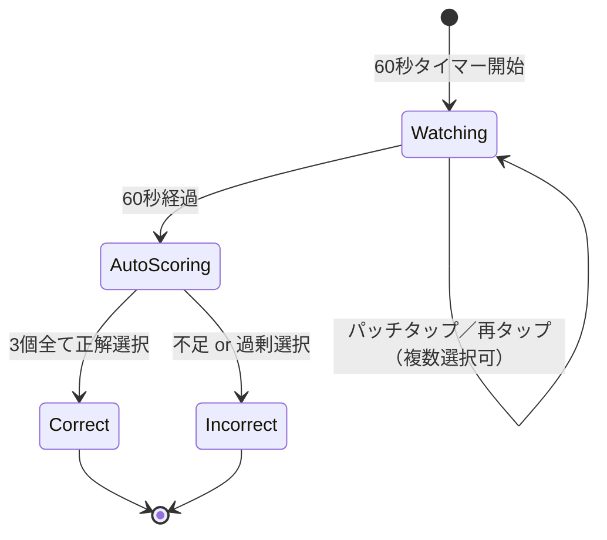

# Sprint 14 — G-06 ガウス窓サイズ + G-07 エッジ検出

> **Sprint 20 改訂注記（v1.1.1、2026-04-30）**：本スプリントの **S14-03 G-06 結果サマリ / S14-06 G-07 結果サマリ独立画面は撤去**された。Sprint 20 で結果開示が刺激画面統合方式（ResultOverlay 重畳）に再設計された。
> - G-06：◯/✕ は horizontal-2 ボタン上（単数選択） → `sprint-20/screens.md` §10 / §2
> - G-07：◯/✕ は 16 セル個別パッチ上（複数選択、4 状態判定 = 通常 ◯ / 薄 ◯ / ✕ / 何も無し） → `sprint-20/screens.md` §8 S20-G07-RESULT
>
> S14-01 / S14-02 / S14-04 / S14-05（ミニ説明・プレイ画面）の記述は引き続き有効。選択枠「黄色 4px」は v1.1.1 で「中性グレー 2px」に改訂（components.md §3 / §4 参照）。

> **Sprint 21 改訂注記（v1.1.2、2026-05-01）**：本スプリントの **S14-02 G-06 プレイ画面は Sprint 21 で改訂**された（horizontal-2「左が大きい／右が大きい」テキストボタン撤去 → 左右 2 ガボールパッチを `ImageChoiceCell` × 2 でラップして直接タップ選択化）。最新仕様は `docs/design-v11/sprints/sprint-21/screens.md` §6 S21-G06-PLAY を参照。staircase 値・採点ロジック・閾値計算は不変。設問文言は「より大きく広がっているパッチを選んでください」（Designer 確定、18pt 以上）。Sprint 21 後の ◯/✕ 重畳位置は **パッチ中央**に変わる。**S14-04 / S14-05 G-07 プレイ画面は Sprint 21 では変更なし**（既存の ImageChoiceCell × 16 複数選択構造を維持）。

## スプリントの目的（spec-v11.md §13）

G-06 と G-07 が単体プレイで動く。

含む機能：F-07（G-06、G-07）

---

## 0. このスプリントで作る／更新する画面

| 画面 ID | 名称 | 状態 |
|---|---|---|
| S14-01 | G-06 ミニ説明 | 新規 |
| S14-02 | G-06 プレイ画面（左右 2 ガボール、SD 差） | 新規 |
| S14-03 | G-06 結果サマリ | 新規（共通フォーマット） |
| S14-04 | G-07 ミニ説明 | 新規 |
| S14-05 | G-07 プレイ画面（4×4 グリッド、エッジ統合） | 新規 |
| S14-06 | G-07 結果サマリ | 新規（共通フォーマット） |

---

## 1. 受け入れ基準カバレッジ

### G-06
| 仕様 ID | 基準 |
|---|---|
| 7.6 G-06 | 左右 2 ガボール（cpd・コントラスト・向き同一）でガウス窓 SD のみ異なる |
| 7.6 G-06 | 「左が大きい」「右が大きい」の 2 択 |
| 7.6 G-06 | staircase: SD 比 易 2.0→難 1.1、初期 1.5、step 0.1 |

### G-07
| 仕様 ID | 基準 |
|---|---|
| 7.7 G-07 | 4×4 ガボール、うち 3 個が同向き同一線上 |
| 7.7 G-07 | 複数選択可（最大 16 個、3 個正解） |
| 7.7 G-07 | 採点：3 個全て正解で正解、1 個でも誤りや欠落で不正解 |
| 7.7 G-07 | staircase: 向きズレ許容角 易 ±10°→難 ±2°、初期 ±5°、step 1° |

---

## 2. S14-01〜S14-03：G-06 ガウス窓サイズ弁別

### S14-02 G-06 プレイ画面

`GamePlaySurface` + `WindowSizeStimulus`（GE-06）+ `AnswerChoiceGroup`（horizontal-2）

```
┌─────────────────────────────────────┐
│  ✕     残り 49 秒                    │
│                                     │
│      ┌────────────────────────┐     │
│      │                        │     │
│      │  ◯▦/▦◯       ◯◯▦/▦◯◯    │     │ ← GE-06
│      │  小ガウス窓  大ガウス窓  │     │   左右 2 ガボール
│      │     SD=0.5°    SD=0.75° │     │   コントラスト・cpd・向き同一
│      │            +           │     │   ガウス窓 SD のみ異なる
│      │  60 秒同時提示          │     │   外周がなだらかにフェード
│      │                        │     │
│      └────────────────────────┘     │
│                                     │
│   どちらが大きい範囲？               │
│                                     │
│  ┌──────────────┐  ┌──────────────┐ │
│  │  左が大きい    │  │  右が大きい    │ │
│  └──────────────┘  └──────────────┘ │
└─────────────────────────────────────┘
```

#### G-06 のビジュアル特徴
- 縞のサイズは同じだが、ガウス窓 SD（縞のフェード範囲）が異なる
- 左：内側だけ縞、外周はすぐぼんやり
- 右：縞が広範囲にじわっと広がる
- パッチ全体の描画キャンバスは同サイズ（160×160）、ガウス窓だけ違う

### Mermaid



### S14-03 G-06 結果サマリ

```
┌─────────────────────────────────────┐
│         G-06 の結果                  │
│                                     │
│      正解は「右が大きい」             │
│                                     │
│   ┌─────────────────────────────┐   │
│   │   ◯▦/▦◯      [◯◯▦/▦◯◯]       │   │ ← 黄装飾ハイライト
│   └─────────────────────────────┘   │
│                                     │
│  あなたの回答「右が大きい」 正解 ✓    │
│                                     │
│  ┌────────────────┐ ┌────────────────┐
│  │ 今回の閾値      │ │ 前回比          │
│  │  1.5（SD 比）   │ │  -0.05 ↓ 改善  │
│  └────────────────┘ └────────────────┘
│                                     │
│  ┌─────────────────────────────────┐│
│  │     次へ                         ││
│  └─────────────────────────────────┘│
└─────────────────────────────────────┘
```

#### G-06 の指標
- threshold.unit = "SD 比"
- correctAnswerLabel = 「左が大きい」/「右が大きい」

---

## 3. S14-04〜S14-06：G-07 ガボールエッジ検出

### S14-04 G-07 ミニ説明

```
┌─────────────────────────────────────┐
│  ←  G-07 ガボールエッジ検出           │
│                                     │
│       16 個のパッチの中に             │ ← font.h2 30px Bold
│   3 個の「線」が隠れています          │
│   (同じ向きで 1 直線)                 │
│                                     │
│   ┌─────────────────────────────┐   │
│   │ ▦  ▦  ▦  ▦                  │   │ ← デモ：4×4 グリッド
│   │ ▦ [▦] ▦ [▦]  ← 同向き 3 個   │   │   うち 3 個が同方向で
│   │ ▦  ▦ [▦] ▦                  │   │   1 直線を成す
│   │ ▦  ▦  ▦  ▦                  │   │
│   └─────────────────────────────┘   │
│                                     │
│   ・60 秒間、グリッド全体を見渡す      │
│   ・3 個全部のパッチをタップで選ぶ     │
│   ・1 個でも違うと不正解              │
│   ・タップで選択／再タップで解除       │
│                                     │
│  ┌─────────────────────────────────┐│
│  │     はじめる                     ││
│  └─────────────────────────────────┘│
└─────────────────────────────────────┘
```

### S14-05 G-07 プレイ画面

`GamePlaySurface` + `EdgeHuntStimulus`（GE-07）+ 注視領域内 `ImageChoiceCell` ×16

```
┌─────────────────────────────────────┐
│  ✕     残り 42 秒                    │
│                                     │
│  ┌─────────────────────────────┐    │
│  │  ▦   ▦   ▦   ▦                │    │ ← EdgeHuntStimulus
│  │  /  -  \  |                  │    │   4×4 = 16 ガボール
│  │  ▦  [▦]  ▦  [▦]               │    │   各セル 64×64
│  │  -  \   |  \   ←選択中        │    │   ギャップ 8px
│  │  ▦   ▦  [▦]  ▦                │    │   全体辺 320×320
│  │  /  /   \   /  ←選択中         │    │
│  │  ▦   ▦   ▦   ▦                │    │   うち 3 個が同向き
│  │  -  /   \   |                 │    │   1 直線
│  └─────────────────────────────┘    │
│                                     │
│   3 個の「線」を構成するパッチを       │ ← guidance
│   全部選んでください                 │   font.body 24px
│                                     │
└─────────────────────────────────────┘
```

#### G-07 のビジュアル
- 4×4 = 16 個のガボール
- うち 3 個が同向き（向きズレ許容 ±5°）かつ同一直線上に並ぶ
- 残り 13 個はランダム向き
- ユーザーは 3 個を全部選んで正解

### Mermaid 状態図



### フェーズタイミング

| 時刻 | 表示 |
|---|---|
| 0s〜60s | 4×4 グリッドずっと表示。ユーザー任意セルタップ／解除 |
| 60s | 自動採点（3 個全選択 = 正解） |

### a11y
- グリッド `role="grid"`、各セル `role="gridcell"` + `role="checkbox"` + `aria-checked`
- ガイド「3 個の線を構成するパッチを全部選んでください」を `aria-describedby`
- 矢印キーで隣接セルへ移動

### S14-06 G-07 結果サマリ

```
┌─────────────────────────────────────┐
│         G-07 の結果                  │
│                                     │
│   正解は 3 個のパッチが「線」を構成    │ ← font.h1 36px
│                                     │
│   ┌─────────────────────────────┐   │
│   │  ▦   ▦   ▦   ▦                │   │ ← グリッド再現
│   │  ▦ [*] ▦ [*]  ←正解 + 線描画 │   │   正解パッチ黄拡大
│   │  ▦   ▦  [*] ▦                 │   │   赤線でつなぎ表示
│   │  ▦   ▦   ▦   ▦                │   │
│   └─────────────────────────────┘   │
│                                     │
│  あなたの回答 2/3 個正解 (1 過剰)    │ ← 部分正解は不正解扱い
│                                     │
│  ┌────────────────┐ ┌────────────────┐
│  │ 今回の閾値      │ │ 前回比          │
│  │  ±5°            │ │  -1.0 ↓ 改善   │
│  │ 向きズレ許容    │ │                │
│  └────────────────┘ └────────────────┘
│                                     │
│  ┌─────────────────────────────────┐│
│  │     次へ                         ││
│  └─────────────────────────────────┘│
└─────────────────────────────────────┘
```

#### G-07 の指標
- threshold.unit = "向きズレ許容角（°）"
- correctAnswerLabel = 「3 個のパッチが線を構成」（具体位置は「2 行 2 列」「2 行 4 列」「3 行 3 列」など）
- 採点ハイライト：正解パッチを黄色拡大 + 赤線でつないで「線」を可視化

---

## 4. レスポンシブ

| ブレイクポイント | G-06 パッチ | G-07 グリッド辺 | G-07 セル |
|---|---|---|---|
| 360px | 100×100 | 288 | 60×60 |
| 375px | 120×120 | 320 | 64×64 |
| 768px | 140×140 | 400 | 88×88 |
| 1280px | 160×160 | 480 | 104×104 |

## 5. テスト観点

- G-06：左右 SD 差で見え方が変わる
- G-07：3 個全選択 = 正解、1 個でも違う / 過剰選択で不正解
- G-07：staircase 「±5° → ±4° → ±3°」と推移
