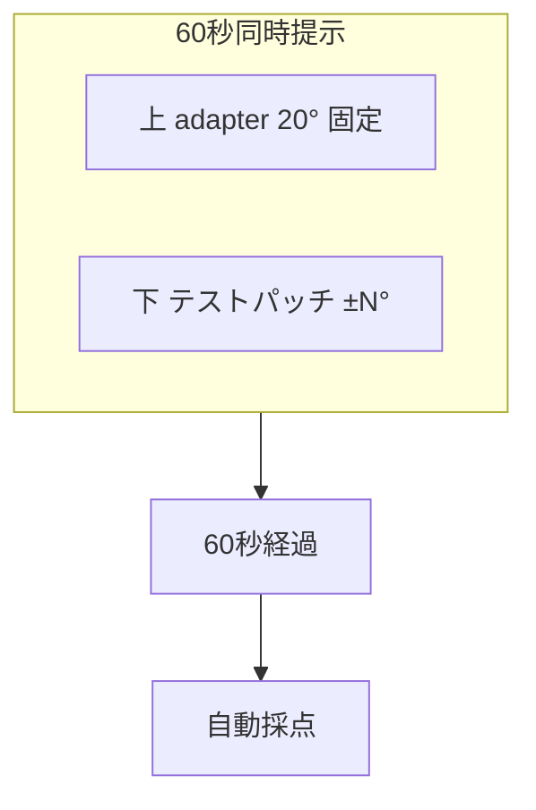
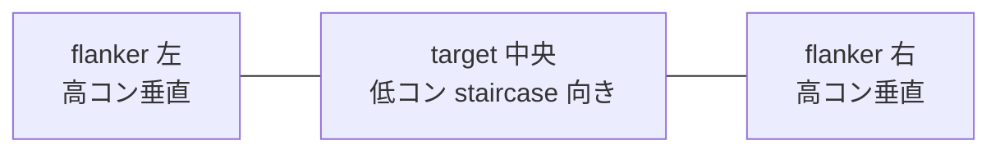

# Sprint 15 — G-08 残像方位弁別 + G-09 側方マスキング

> **Sprint 20 改訂注記（v1.1.1、2026-04-30）**：本スプリントは **G-08 / G-09 ともに大幅改訂**された。
> - **S15-02 G-08 プレイ画面**：horizontal-2「下のパッチは時計回り／反時計回り」テキストボタン撤去 → 上 adapter（disabled）+ 下部左右 2 テストパッチを ImageChoiceCell で直接選択方式に変更（spec §7.8 設問刷新）。最新仕様は `docs/design-v11/sprints/sprint-20/screens.md` §5 S20-G08-PLAY を参照
> - **S15-03 G-08 結果サマリ独立画面**：撤去 → ResultOverlay 刺激画面重畳に変更。`sprint-20/screens.md` §6 S20-G08-RESULT を参照
> - **S15-06 G-09 結果サマリ独立画面**：撤去 → ResultOverlay（◯/✕ は horizontal-2 ボタン上）。`sprint-20/screens.md` §9 S20-G09-RESULT を参照
> - **選択枠**：黄色 4px → 中性グレー 2px（spec F-07 v1.1.1）
>
> S15-01 / S15-04（ミニ説明）/ S15-05（G-09 プレイ画面）の記述は引き続き有効（選択枠スタイルのみ改訂を反映）。

> **Sprint 21 改訂注記（v1.1.2、2026-05-01）**：本スプリントの **G-09（S15-04〜S15-05）は Sprint 21 で空間対応配置を明確化**した。Designer 判断は **案 B（horizontal-2 維持、target 直下に空間配置）** を採用：Polat 2004/2012 Lateral Masking パラダイムの「target 1 個 + flanker 2 個」構造を維持して臨床根拠を保つため、horizontal-2 ボタン（縦寄り／横寄り）は撤去せず、target 中心軸の直下にボタン中心軸を一致させる空間対応配置に整理。最新仕様は `docs/design-v11/sprints/sprint-21/screens.md` §7 S21-G09-PLAY を参照。staircase 値・採点ロジック・閾値計算は不変。**G-08（S15-01〜S15-02）は Sprint 21 では変更なし**（Sprint 20 で確立した「上 adapter + 下に左右 2 テストパッチ ImageChoiceCell」構造を維持）。

## スプリントの目的（spec-v11.md §13）

G-08 と G-09 が単体プレイで動く。Polat ら 2004/2012 の Lateral Masking パラダイム（target/flanker 同時提示）が機能する。

含む機能：F-07（G-08、G-09）

---

## 0. このスプリントで作る／更新する画面

| 画面 ID | 名称 | 状態 |
|---|---|---|
| S15-01 | G-08 ミニ説明 | 新規 |
| S15-02 | G-08 プレイ画面（上下 adapter + テストパッチ） | 新規 |
| S15-03 | G-08 結果サマリ | 新規 |
| S15-04 | G-09 ミニ説明 | 新規 |
| S15-05 | G-09 プレイ画面（flanker | target | flanker 横一列） | 新規 |
| S15-06 | G-09 結果サマリ | 新規 |

---

## 1. 受け入れ基準カバレッジ

### G-08
| 仕様 ID | 基準 |
|---|---|
| 7.8 G-08 | 上 adapter（傾き 20° 固定）+ 下テストパッチを 60 秒同時提示 |
| 7.8 G-08 | 「下のパッチは時計回り」「下のパッチは反時計回り」の 2 択 |
| 7.8 G-08 | staircase: テスト絶対角度 易 10°→難 1°、初期 5°、step 1° |

### G-09
| 仕様 ID | 基準 |
|---|---|
| 7.9 G-09 | 「flanker | target | flanker」を横一列に 60 秒同時提示 |
| 7.9 G-09 | 「縦寄り」「横寄り」の 2 択 |
| 7.9 G-09 | staircase: target コントラスト + flanker 距離の合成 |

---

## 2. S15-01〜S15-03：G-08 残像方位弁別

### S15-01 G-08 ミニ説明

```
┌─────────────────────────────────────┐
│  ←  G-08 残像方位弁別                 │
│                                     │
│       上の傾いたパッチを              │ ← font.h2 30px Bold
│   ずっと見ながら、下のパッチが        │
│   どちらに傾いているか判定            │
│                                     │
│   ┌─────────────────────────────┐   │
│   │   ▦/▦  ←上 adapter           │   │ ← デモ
│   │  傾き 20° 固定               │   │
│   │                              │   │
│   │   ▦|▦  ←下 テストパッチ       │   │
│   │   傾き ±N° (staircase)        │   │
│   └─────────────────────────────┘   │
│                                     │
│   ・60 秒間、上下を見続ける           │ ← font.body 24px
│   ・上の影響で下の見え方が揺らぐ感覚   │
│   ・「時計回り」「反時計回り」を選ぶ    │
│                                     │
│  ┌─────────────────────────────────┐│
│  │     はじめる                     ││
│  └─────────────────────────────────┘│
└─────────────────────────────────────┘
```

### S15-02 G-08 プレイ画面

`GamePlaySurface` + `TiltAftereffectStimulus`（GE-08）+ `AnswerChoiceGroup`（horizontal-2）

```
┌─────────────────────────────────────┐
│  ✕     残り 35 秒                    │
│                                     │
│   ┌─────────────────────────────┐   │
│   │                              │   │
│   │      ┌────┐                  │   │ ← GE-08 上 adapter
│   │      │ ▦/▦ │  傾き 20° 固定   │   │   140×140 px
│   │      └────┘                  │   │   高コントラスト 0.6
│   │                              │   │
│   │  〜 ギャップ 32px 〜          │   │
│   │                              │   │
│   │      ┌────┐                  │   │ ← 下 テストパッチ
│   │      │ ▦|▦ │  傾き 5°         │   │   140×140 px
│   │      └────┘                  │   │   staircase 値
│   │                              │   │
│   │     60 秒同時提示             │   │
│   └─────────────────────────────┘   │
│                                     │
│   下のパッチはどちらに傾いている？     │
│                                     │
│  ┌──────────────┐  ┌──────────────┐ │
│  │   時計回り     │  │  反時計回り    │ │
│  └──────────────┘  └──────────────┘ │
└─────────────────────────────────────┘
```

### Mermaid



### フェーズタイミング

| 時刻 | 表示 |
|---|---|
| 0s〜60s | 上 adapter + 下テストパッチ 同時提示。ずっと表示 |
| 60s | 自動採点 |

### S15-03 G-08 結果サマリ

```
┌─────────────────────────────────────┐
│         G-08 の結果                  │
│                                     │
│   正解は「下のパッチは時計回り」      │ ← 黄装飾
│                                     │
│   ┌─────────────────────────────┐   │
│   │      ▦/▦                     │   │ ← 採点後ハイライト
│   │   adapter                    │   │
│   │     [▦|▦]  ←黄拡大           │   │
│   │   テスト                      │   │
│   └─────────────────────────────┘   │
│                                     │
│  あなたの回答「反時計回り」 不正解    │
│                                     │
│  ┌────────────────┐ ┌────────────────┐
│  │ 今回の閾値      │ │ 前回比          │
│  │  5.0°           │ │  -1.0 ↓ 改善   │
│  │ テスト絶対角度  │ │                │
│  └────────────────┘ └────────────────┘
│                                     │
│  ┌─────────────────────────────────┐│
│  │     次へ                         ││
│  └─────────────────────────────────┘│
└─────────────────────────────────────┘
```

---

## 3. S15-04〜S15-06：G-09 側方マスキング

### S15-04 G-09 ミニ説明

```
┌─────────────────────────────────────┐
│  ←  G-09 側方マスキング                │
│                                     │
│       中央の薄いパッチが              │ ← font.h2 30px Bold
│   どちらに傾いているか判定           │
│                                     │
│   ┌─────────────────────────────┐   │
│   │  | ▦|▦   ▦|▦   ▦|▦   |       │   │ ← デモ：3 ガボール横一列
│   │   flanker target flanker      │   │   両側 flanker は高コン
│   │                              │   │   中央 target は低コン
│   └─────────────────────────────┘   │
│                                     │
│   ・両側のパッチが中央の見え方を      │ ← font.body 24px
│   　邪魔したり助けたりします          │
│   ・中央が「縦寄り」「横寄り」を選ぶ   │
│   ・60 秒見続けると見え方が揺らぐ     │
│                                     │
│  ┌─────────────────────────────────┐│
│  │     はじめる                     ││
│  └─────────────────────────────────┘│
└─────────────────────────────────────┘
```

### S15-05 G-09 プレイ画面

`GamePlaySurface` + `LateralMaskingStimulus`（GE-09）+ `AnswerChoiceGroup`（horizontal-2）

```
┌─────────────────────────────────────┐
│  ✕     残り 38 秒                    │
│                                     │
│   ┌─────────────────────────────┐   │
│   │                              │   │
│   │  ▦|▦ ─ ▦|▦ ─ ▦|▦              │   │ ← GE-09 横一列
│   │ flanker target flanker        │   │   80×80 各パッチ
│   │ 高コン 低コン 高コン           │   │   target は低コン
│   │ 0.5  staircase 0.5            │   │   両側 flanker 高コン 0.5
│   │       距離 N×λ                │   │   spacing staircase 連動
│   │                              │   │
│   │  60 秒同時提示                │   │
│   │  flanker は垂直平行           │   │
│   └─────────────────────────────┘   │
│                                     │
│   中央のパッチはどっち寄り？          │ ← guidance
│                                     │
│  ┌──────────────┐  ┌──────────────┐ │
│  │   縦寄り       │  │   横寄り      │ │
│  │   (垂直に近い) │  │  (水平に近い) │ │
│  └──────────────┘  └──────────────┘ │
└─────────────────────────────────────┘
```

#### G-09 のビジュアル特徴
- 横一列に 3 ガボール
- 両側 flanker：高コントラスト 0.5、垂直（90°）固定
- 中央 target：低コントラスト（staircase 0.05〜0.20）、向きが垂直寄り or 水平寄り（staircase 連動）
- target-flanker spacing：target 直径の N 倍（N が staircase 値）
- 60 秒間ずっと表示

### Mermaid



### S15-06 G-09 結果サマリ

```
┌─────────────────────────────────────┐
│         G-09 の結果                  │
│                                     │
│      正解は「中央は縦寄り」           │
│                                     │
│   ┌─────────────────────────────┐   │
│   │  ▦|▦ ─ [▦|▦] ─ ▦|▦            │   │ ← 中央拡大ハイライト
│   └─────────────────────────────┘   │
│                                     │
│  あなたの回答「横寄り」 不正解        │
│                                     │
│  ┌────────────────┐ ┌────────────────┐
│  │ 今回の閾値      │ │ 前回比          │
│  │  c=0.10         │ │  -0.01 ↓ 改善  │
│  │  d=3λ           │ │                │
│  │ コントラスト/距離│ │                │
│  └────────────────┘ └────────────────┘
│                                     │
│  ┌─────────────────────────────────┐│
│  │     次へ                         ││
│  └─────────────────────────────────┘│
└─────────────────────────────────────┘
```

#### G-09 の指標（合成閾値）
- threshold は target コントラスト + flanker 距離の合成（spec.md §7.9）
- 表示は 2 行：「c=0.10」「d=3λ」
- diff は spacing をベースに評価（distance ↓ で改善）

---

## 4. レスポンシブ

| ブレイクポイント | G-08 パッチ | G-09 パッチ |
|---|---|---|
| 360px | 120×120 | 64×64 |
| 375px | 140×140 | 80×80 |
| 768px | 160×160 | 100×100 |
| 1280px | 180×180 | 120×120 |

## 5. テスト観点

- G-08：上 adapter 固定、下テストパッチが ±N° で時計回り／反時計回り判定
- G-09：3 ガボール横一列、target-flanker spacing が staircase 連動
- G-09：未回答時は不正解、staircase は易方向
