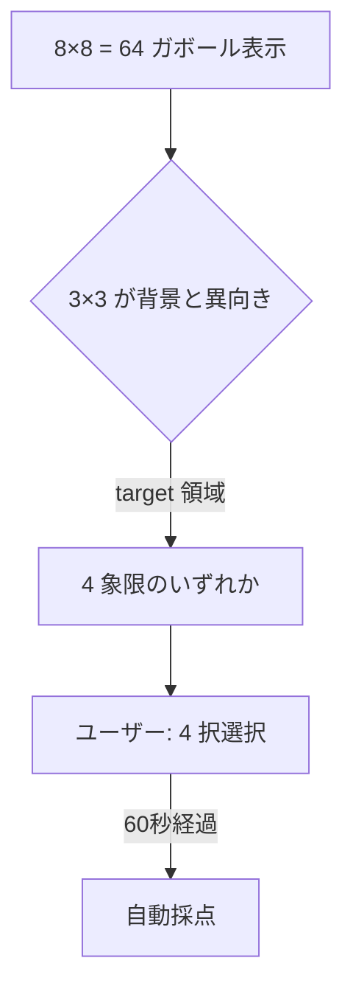
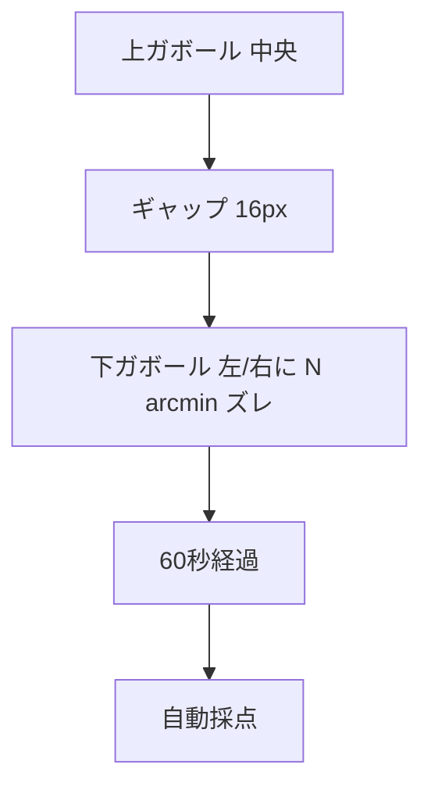

# Sprint 16 — G-10 テクスチャ分離 + G-11 Vernier 整列

> **Sprint 20 改訂注記（v1.1.1、2026-04-30）**：本スプリントの **S16-03 G-10 結果サマリ / S16-06 G-11 結果サマリ独立画面は撤去**された。Sprint 20 で結果開示が刺激画面統合方式（ResultOverlay 重畳）に再設計された。
> - G-10：◯/✕ は 4 象限ボタン中央（grid-4） → `sprint-20/screens.md` §10 / §2
> - G-11：◯/✕ は horizontal-2「左にずれている／右にずれている」ボタン上 → `sprint-20/screens.md` §10 / §2
>
> S16-01 / S16-02 / S16-04 / S16-05（ミニ説明・プレイ画面）の記述は引き続き有効。選択枠「黄色 4px」は v1.1.1 で「中性グレー 2px」に改訂。

> **Sprint 21 改訂注記（v1.1.2、2026-05-01）**：本スプリントの **G-10 / G-11 ともに Sprint 21 で大幅改訂**された。
> - **S16-02 G-10 プレイ画面**：grid-4「左上／右上／左下／右下」テキストボタン撤去 → 8×8 grid 全体を 4 象限（4×4 セル単位）に分割、各象限を `ImageChoiceCell` でラップして直接タップ選択化（**Designer 判断：案 A 採用**）。最新仕様は `docs/design-v11/sprints/sprint-21/screens.md` §8 S21-G10-PLAY を参照。象限境界線は 1px ダッシュ薄で視覚化、選択中象限のみ 2px 中性グレー枠。Sprint 21 後の ◯/✕ 重畳位置は **象限の中央**（grid 上）に変わる
> - **S16-05 G-11 プレイ画面**：構造変更（**Designer 判断：案 A 採用**）。horizontal-2「左にずれている／右にずれている」テキストボタン撤去 → 上 1 reference（disabled、垂直 90° 固定）+ 下に左右 2 テストパッチ（ImageChoiceCell × 2、±arcmin 対称配置）の構造に変更（G-08 と統一）。最新仕様は `docs/design-v11/sprints/sprint-21/screens.md` §9 S21-G11-PLAY を参照。設問文言は「下のパッチのうち上と整列しているものを選んでください」または「下のパッチのうち上に対して右にズレているものを選んでください」（出題方向ランダム、Designer 確定、18pt 以上）。Sprint 21 後の ◯/✕ 重畳位置は **テストパッチ中央**（reference には置かない）に変わる
> - 両ゲームとも staircase 値・採点ロジック・閾値計算は不変（G-11 は左右 ± 対称配置で実現）

## スプリントの目的（spec-v11.md §13）

G-10 と G-11 が単体プレイで動く。8×8 ガボール grid と上下 Vernier 配置の描画が機能する。

含む機能：F-07（G-10、G-11）

---

## 0. このスプリントで作る／更新する画面

| 画面 ID | 名称 | 状態 |
|---|---|---|
| S16-01 | G-10 ミニ説明 | 新規 |
| S16-02 | G-10 プレイ画面（8×8 グリッド、4 象限から target 領域選択） | 新規 |
| S16-03 | G-10 結果サマリ | 新規 |
| S16-04 | G-11 ミニ説明 | 新規 |
| S16-05 | G-11 プレイ画面（上下 2 ガボール、水平ズレ判定） | 新規 |
| S16-06 | G-11 結果サマリ | 新規 |

---

## 1. 受け入れ基準カバレッジ

### G-10
| 仕様 ID | 基準 |
|---|---|
| 7.10 G-10 | 8×8 ガボール grid、3×3 が target 領域として向き差を持つ |
| 7.10 G-10 | 「左上 / 右上 / 左下 / 右下」の 4 択 |
| 7.10 G-10 | staircase: 向き差 易 90°→難 5°、初期 30°、step 5° |

### G-11
| 仕様 ID | 基準 |
|---|---|
| 7.11 G-11 | 上下 2 ガボール（垂直）、下が左右に staircase 値ズレ |
| 7.11 G-11 | 「左にずれている」「右にずれている」の 2 択 |
| 7.11 G-11 | staircase: ズレ量 易 5'→難 0.5'（arcmin）、初期 2'、step 0.2' |

---

## 2. S16-01〜S16-03：G-10 テクスチャ分離

### S16-01 G-10 ミニ説明

```
┌─────────────────────────────────────┐
│  ←  G-10 テクスチャ分離               │
│                                     │
│      画面いっぱいに敷き詰めた         │ ← font.h2 30px Bold
│   パッチの中で、向きが違う            │
│   かたまりがどの象限にあるか          │
│                                     │
│   ┌─────────────────────────────┐   │
│   │ |||||||||| ||||||||||         │   │ ← デモ：8×8 = 64 パッチ
│   │ |||||||||| ||||||||||         │   │   背景 65 度方向
│   │ ||┌──┐|||| ||||||||||         │   │   うち 3×3 = 9 個が
│   │ ||│--│|||| ||||||||||         │   │   違う向き（90 度差）
│   │ ||│--│|||| ||||||||||         │   │
│   │ ||└──┘|||| ||||||||||         │   │
│   │ |||||||||| ||||||||||         │   │
│   └─────────────────────────────┘   │
│                                     │
│   ・grid 全体を 60 秒見渡す          │ ← font.body 24px
│   ・違う向きのかたまりがどこか        │
│   ・「左上 / 右上 / 左下 / 右下」を選ぶ │
│                                     │
│  ┌─────────────────────────────────┐│
│  │     はじめる                     ││
│  └─────────────────────────────────┘│
└─────────────────────────────────────┘
```

### S16-02 G-10 プレイ画面

`GamePlaySurface` + `TextureSegmentationStimulus`（GE-10）+ `AnswerChoiceGroup`（grid-4）

```
┌─────────────────────────────────────┐
│  ✕     残り 41 秒                    │
│                                     │
│   ┌──────────────────────────────┐  │
│   │ ▦▦▦▦▦▦▦▦                      │  │ ← TextureSegmentationStimulus
│   │ ▦▦▦▦▦▦▦▦                      │  │   8×8 = 64 ガボール
│   │ ▦▦▦▦▦▦▦▦                      │  │   全体辺 320×320
│   │ ▦▦▦▦▦▦▦▦                      │  │   各パッチ 32〜40px
│   │ ▦▦▦▦▦▦▦▦      ←target領域     │  │
│   │ ▦▦▦▦▦▦▦▦         (3×3 が      │  │   背景は同向き
│   │ ▦▦  ▦▦▦▦         向き差を持つ)│  │   3×3 が向き差
│   │ ▦▦▦▦▦▦▦▦                      │  │
│   └──────────────────────────────┘  │
│                                     │
│   違う向きのかたまりは？             │ ← guidance
│                                     │
│  ┌──────────────┐  ┌──────────────┐ │ ← AnswerChoiceGroup
│  │   左上        │  │    右上       │ │   grid-4 (2×2 配置)
│  │              │  │              │ │
│  └──────────────┘  └──────────────┘ │
│  ┌──────────────┐  ┌──────────────┐ │
│  │   左下        │  │    右下       │ │
│  │   (選択中)    │  │              │ │
│  └──────────────┘  └──────────────┘ │
└─────────────────────────────────────┘
```

### Mermaid



### S16-03 G-10 結果サマリ

```
┌─────────────────────────────────────┐
│         G-10 の結果                  │
│                                     │
│      正解は「左下」                   │
│                                     │
│   ┌──────────────────────────────┐  │
│   │ ▦▦▦▦▦▦▦▦                      │  │ ← grid 再現
│   │ ▦▦▦▦▦▦▦▦                      │  │   target 領域を黄枠で囲む
│   │ ▦▦▦▦▦▦▦▦                      │  │   1.5 秒拡大ハイライト
│   │ ▦▦▦▦▦▦▦▦                      │  │
│   │ ▦▦▦▦▦▦▦▦                      │  │
│   │ ▦▦▦▦▦▦▦▦                      │  │
│   │ [▦▦▦] ▦▦▦▦▦  ←target黄枠     │  │
│   │  ▦▦▦  ▦▦▦▦                    │  │
│   └──────────────────────────────┘  │
│                                     │
│  あなたの回答「右下」 不正解          │
│                                     │
│  ┌────────────────┐ ┌────────────────┐
│  │ 今回の閾値      │ │ 前回比          │
│  │  30°            │ │  -5.0 ↓ 改善   │
│  │ 向き差          │ │                │
│  └────────────────┘ └────────────────┘
│                                     │
│  ┌─────────────────────────────────┐│
│  │     次へ                         ││
│  └─────────────────────────────────┘│
└─────────────────────────────────────┘
```

---

## 3. S16-04〜S16-06：G-11 Vernier 整列判定

### S16-04 G-11 ミニ説明

```
┌─────────────────────────────────────┐
│  ←  G-11 Vernier 整列判定             │
│                                     │
│       上下に並んだ 2 つの縞模様の      │ ← font.h2 30px Bold
│   下のパッチが                        │
│   左右どちらにずれているか            │
│                                     │
│   ┌─────────────────────────────┐   │
│   │     ▦|||▦                    │   │ ← デモ：上ガボール
│   │                              │   │
│   │      ▦|||▦  ←少し右にズレ    │   │ ← デモ：下ガボール
│   └─────────────────────────────┘   │
│                                     │
│   ・上下を見比べて整列を判定          │ ← font.body 24px
│   ・「左にずれ」「右にずれ」を選ぶ      │
│   ・じーっと見るほど精度が上がる      │
│   ・とても微小なズレ                  │
│                                     │
│  ┌─────────────────────────────────┐│
│  │     はじめる                     ││
│  └─────────────────────────────────┘│
└─────────────────────────────────────┘
```

### S16-05 G-11 プレイ画面

`GamePlaySurface` + `VernierStimulus`（GE-11）+ `AnswerChoiceGroup`（horizontal-2）

```
┌─────────────────────────────────────┐
│  ✕     残り 28 秒                    │
│                                     │
│   ┌─────────────────────────────┐   │
│   │                              │   │
│   │       ┌────┐                  │   │ ← GE-11 上ガボール
│   │       │▦|▦ │  上 中央位置     │   │   100×100 px
│   │       └────┘                  │   │   垂直
│   │                              │   │
│   │  ギャップ space.4 (16px)      │   │
│   │                              │   │
│   │        ┌────┐                 │   │ ← 下ガボール
│   │        │▦|▦ │ 下 staircase 分│   │   水平ズレ N arcmin
│   │        └────┘  右にズレ        │   │   左 / 右 ランダム
│   │                              │   │
│   │   60 秒同時提示               │   │
│   └─────────────────────────────┘   │
│                                     │
│   下のパッチはどちらにズレている？    │
│                                     │
│  ┌──────────────┐  ┌──────────────┐ │
│  │ 左にずれている │  │ 右にずれている │ │
│  └──────────────┘  └──────────────┘ │
└─────────────────────────────────────┘
```

### Mermaid



### フェーズタイミング

| 時刻 | 表示 |
|---|---|
| 0s〜60s | 上下 2 ガボール 同時提示。下が staircase 値分 水平ズレ |
| 60s | 自動採点 |

### S16-06 G-11 結果サマリ

```
┌─────────────────────────────────────┐
│         G-11 の結果                  │
│                                     │
│   正解は「下のパッチは右にズレ」     │
│                                     │
│   ┌─────────────────────────────┐   │
│   │       ▦|▦                    │   │
│   │       上                     │   │
│   │                              │   │
│   │       [▦|▦]   ←黄拡大        │   │ ← 採点後ハイライト
│   │       下 (右ズレ)             │   │
│   └─────────────────────────────┘   │
│                                     │
│  あなたの回答「右にずれている」 正解 ✓│
│                                     │
│  ┌────────────────┐ ┌────────────────┐
│  │ 今回の閾値      │ │ 前回比          │
│  │  2.0'           │ │  -0.2 ↓ 改善   │
│  │ ズレ量(arcmin)  │ │                │
│  └────────────────┘ └────────────────┘
│                                     │
│  ┌─────────────────────────────────┐│
│  │     次へ                         ││
│  └─────────────────────────────────┘│
└─────────────────────────────────────┘
```

#### G-11 の指標
- threshold.value = 2.0
- threshold.unit = "ズレ量（arcmin、角度視野）"

---

## 4. レスポンシブ

| ブレイクポイント | G-10 grid 辺 | G-10 セル | G-11 パッチ |
|---|---|---|---|
| 360px | 288 | 36 | 80×80 |
| 375px | 320 | 40 | 100×100 |
| 768px | 400 | 50 | 120×120 |
| 1280px | 480 | 60 | 140×140 |

## 5. テスト観点

- G-10：4 象限のいずれかに 3×3 = 9 個の異向きパッチ
- G-10：8×8 描画パフォーマンス（NF-1：30fps 最低許容）
- G-11：下のパッチが arcmin 単位で水平ズレ
- G-11：dpi メタ + 視聴距離から arcmin → px 換算
- staircase 推移
