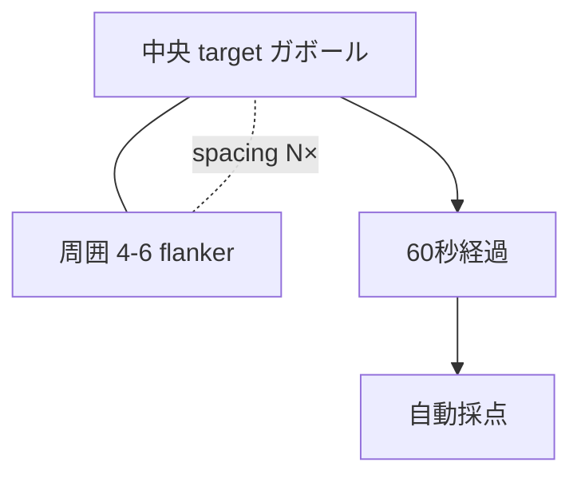
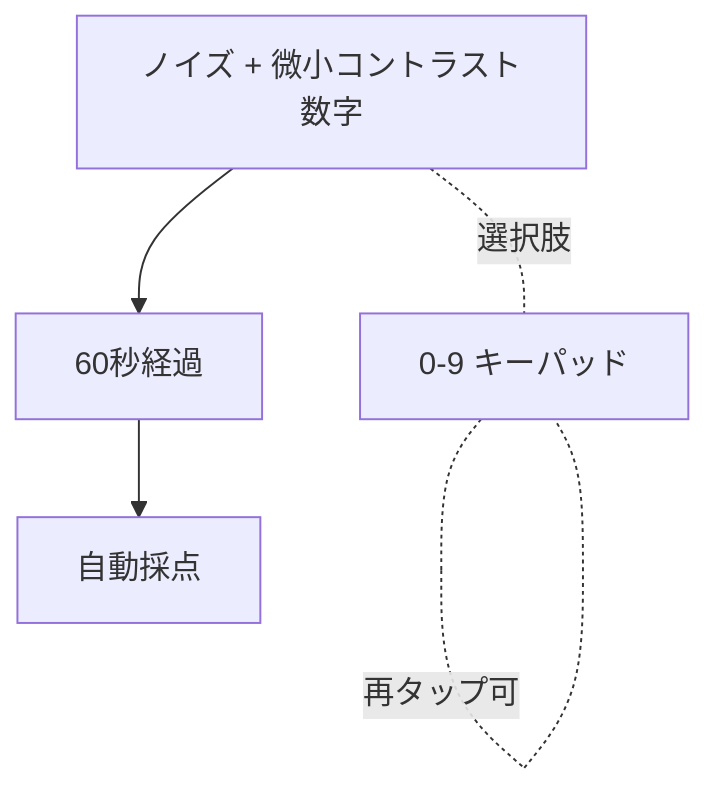

# Sprint 17 — G-12 クラウディング + G-13 数字探し

> **Sprint 20 改訂注記（v1.1.1、2026-04-30）**：本スプリントの **S17-03 G-12 結果サマリ / S17-06 G-13 結果サマリ独立画面は撤去**された。Sprint 20 で結果開示が刺激画面統合方式（ResultOverlay 重畳）に再設計された。
> - G-12：◯/✕ は horizontal-4「垂直／水平／斜め右／斜め左」アイコンボタン上 → `sprint-20/screens.md` §10 / §2
> - G-13：◯/✕ は 0〜9 キーパッドのキー上（最大 2 個） → `sprint-20/screens.md` §10 / §2
>
> S17-01 / S17-02 / S17-04 / S17-05（ミニ説明・プレイ画面）の記述は引き続き有効。選択枠「黄色 4px」は v1.1.1 で「中性グレー 2px」に改訂（components.md §3 / §6 参照）。

> **Sprint 21 改訂注記（v1.1.2、2026-05-01）**：本スプリントの **G-12 / G-13 ともに Sprint 21 で空間対応配置を明確化**した（プレイ画面の構造自体は変更なし）。
> - **S17-02 G-12 プレイ画面**：Designer 判断 **案 B（horizontal-4 維持、target 直下に空間配置）** を採用：Crowding パラダイムは「target を見つめ続ける注視」を妨げないことが要のため、horizontal-4 ボタン（垂直／水平／斜め右／斜め左）は撤去せず、target 中心軸の真下にボタン群（2×2 折り返し時を含む）の中心軸を一致させる空間対応配置に整理。最新仕様は `docs/design-v11/sprints/sprint-21/screens.md` §10 S21-G12-PLAY を参照
> - **S17-05 G-13 プレイ画面**：Designer 判断 **案 B（keypad-10 維持、刺激画像直下に 5×2 配置）** を採用：数字 0〜9 を刺激上で直接選択させる構造は不可能（埋め込まれた数字は 1 個のみ）のため、keypad-10 は撤去せず、刺激画像（240×240 〜 320×320 px）の直下に keypad 5×2 配置（`1 2 3 4 5 / 6 7 8 9 0`）の中心軸を刺激領域中心軸と一致させる空間対応配置に整理。最新仕様は `docs/design-v11/sprints/sprint-21/screens.md` §11 S21-G13-PLAY を参照
> - 両ゲームとも staircase 値・採点ロジック・閾値計算は不変。◯/✕ 重畳位置は **ボタン中央／キー中央** で v1.1.1（Sprint 20）と同じ

## スプリントの目的（spec-v11.md §13）

G-12 と G-13 が単体プレイで動く。target-flanker spacing の staircase が機能する。13 ゲーム全実装完了。

含む機能：F-07（G-12、G-13）

---

## 0. このスプリントで作る／更新する画面

| 画面 ID | 名称 | 状態 |
|---|---|---|
| S17-01 | G-12 ミニ説明 | 新規 |
| S17-02 | G-12 プレイ画面（中央 target + 周囲 4〜6 flanker） | 新規 |
| S17-03 | G-12 結果サマリ | 新規 |
| S17-04 | G-13 ミニ説明 | 新規 |
| S17-05 | G-13 プレイ画面（ノイズ + 微小コントラスト数字） | 新規 |
| S17-06 | G-13 結果サマリ | 新規 |

---

## 1. 受け入れ基準カバレッジ

### G-12
| 仕様 ID | 基準 |
|---|---|
| 7.12 G-12 | 中央 target + 周囲 4〜6 flanker、spacing が staircase 連動 |
| 7.12 G-12 | 「垂直 / 水平 / 斜め右 / 斜め左」の 4 択（アイコン付き） |
| 7.12 G-12 | staircase: spacing（target 直径倍率） 易 4×→難 1.2× |

### G-13
| 仕様 ID | 基準 |
|---|---|
| 7.13 G-13 | ノイズ + 微小コントラストの数字（0〜9 のいずれか）を 60 秒間表示 |
| 7.13 G-13 | 「0」〜「9」の 10 択 |
| 7.13 G-13 | staircase: コントラスト 易 0.3→難 0.03、初期 0.10、step 0.01 |

---

## 2. S17-01〜S17-03：G-12 クラウディング

### S17-01 G-12 ミニ説明

```
┌─────────────────────────────────────┐
│  ←  G-12 クラウディング                │
│                                     │
│       中央のパッチが                  │ ← font.h2 30px Bold
│   どの向きを向いているか              │
│   （周囲のパッチに邪魔されながら）     │
│                                     │
│   ┌─────────────────────────────┐   │
│   │      ▦|▦  ▦/▦                │   │ ← デモ：中央 + 周囲 5
│   │  ▦\▦  [▦/▦]  ▦/▦               │   │   target-flanker spacing
│   │      ▦|▦  ▦|▦                │   │   が staircase 連動
│   └─────────────────────────────┘   │
│                                     │
│   ・中央 target の向きを判定         │ ← font.body 24px
│   ・周囲のパッチが「のませ」てくる    │
│   ・「垂直 / 水平 / 斜め右 / 斜め左」 │
│   ・60 秒見続けると向きが浮かぶ      │
│                                     │
│  ┌─────────────────────────────────┐│
│  │     はじめる                     ││
│  └─────────────────────────────────┘│
└─────────────────────────────────────┘
```

### S17-02 G-12 プレイ画面

`GamePlaySurface` + `CrowdingStimulus`（GE-12）+ `AnswerChoiceGroup`（horizontal-4）

```
┌─────────────────────────────────────┐
│  ✕     残り 33 秒                    │
│                                     │
│   ┌──────────────────────────────┐  │
│   │                              │  │
│   │      ▦/▦       ▦|▦            │  │ ← GE-12
│   │   ▦|▦   [▦?▦]   ▦/▦           │  │   中央 target + 周囲 5
│   │      ▦\▦       ▦/▦            │  │   各 60×60 px
│   │                              │  │   spacing 2× target直径
│   │  60 秒同時提示                │  │   (staircase 連動)
│   │                              │  │
│   └──────────────────────────────┘  │
│                                     │
│   中央のパッチの向きは？              │ ← guidance
│                                     │
│  ┌──────┐ ┌──────┐ ┌──────┐ ┌──────┐ │ ← AnswerChoiceGroup
│  │  |   │ │  -   │ │  /   │ │  \   │ │   horizontal-4
│  │ 垂直  │ │ 水平 │ │斜右  │ │斜左  │ │   各 アイコン 32px + ラベル 24px
│  └──────┘ └──────┘ └──────┘ └──────┘ │   選択中：黄 4px 枠
│                                     │
│  ※ スマホ縦狭幅では 2×2 グリッドに    │
│  　 折り返し（layout="grid-2"）        │
└─────────────────────────────────────┘
```

#### スマホ 360〜375px での折返し

```
┌─────────────────────────────────────┐
│   ・・・                              │
│  ┌──────────┐  ┌──────────┐         │
│  │  |       │  │  -        │         │ ← 2×2 グリッド
│  │  垂直    │  │  水平     │         │   各 64×64 + ラベル
│  └──────────┘  └──────────┘         │
│  ┌──────────┐  ┌──────────┐         │
│  │  /       │  │  \        │         │
│  │  斜め右   │  │  斜め左    │         │
│  └──────────┘  └──────────┘         │
└─────────────────────────────────────┘
```

### Mermaid



### S17-03 G-12 結果サマリ

```
┌─────────────────────────────────────┐
│         G-12 の結果                  │
│                                     │
│      正解は「斜め右」                 │
│                                     │
│   ┌──────────────────────────────┐  │
│   │      ▦/▦       ▦|▦            │  │ ← 採点後ハイライト
│   │   ▦|▦   [▦/▦]   ▦/▦           │  │   中央パッチ黄拡大
│   │     ▦\▦       ▦/▦              │  │
│   └──────────────────────────────┘  │
│                                     │
│  あなたの回答「垂直」 不正解          │
│                                     │
│  ┌────────────────┐ ┌────────────────┐
│  │ 今回の閾値      │ │ 前回比          │
│  │  2.0×           │ │  -0.2 ↓ 改善   │
│  │ spacing(target直径倍)│ │            │
│  └────────────────┘ └────────────────┘
│                                     │
│  ┌─────────────────────────────────┐│
│  │     次へ                         ││
│  └─────────────────────────────────┘│
└─────────────────────────────────────┘
```

---

## 3. S17-04〜S17-06：G-13 数字探し

### S17-04 G-13 ミニ説明

```
┌─────────────────────────────────────┐
│  ←  G-13 数字探し                     │
│                                     │
│       ノイズの中に薄く埋め込まれた     │ ← font.h2 30px Bold
│   「数字」が何か当てる                 │
│                                     │
│   ┌─────────────────────────────┐   │
│   │  ▦▦▦▦▦▦▦▦▦                    │   │ ← デモ：ノイズ + 数字
│   │  ▦▦ノイズ▦▦                  │   │   薄く「3」が埋まる
│   │  ▦▦▦▦▦▦▦▦▦                    │   │
│   │  ▦▦ ▎▎ ▦▦  ←薄く 3 が埋まる   │   │
│   │  ▦▦ ▎▎ ▦▦                    │   │
│   │  ▦▦▦▦▦▦▦▦▦                    │   │
│   └─────────────────────────────┘   │
│                                     │
│   ・60 秒見続けると数字が浮かぶ      │ ← font.body 24px
│   ・「0」〜「9」の数字を当てる         │
│   ・気が変われば何度でも変えてよい     │
│                                     │
│  ┌─────────────────────────────────┐│
│  │     はじめる                     ││
│  └─────────────────────────────────┘│
└─────────────────────────────────────┘
```

### S17-05 G-13 プレイ画面

`GamePlaySurface` + `EmbeddedNumeralStimulus`（GE-13）+ `NumericKeypadChoice`（AC-4、layout=keypad-10）

```
┌─────────────────────────────────────┐
│  ✕     残り 25 秒                    │
│                                     │
│   ┌──────────────────────────────┐  │
│   │ ▦▦▦▦▦▦▦▦▦▦▦▦                  │  │ ← EmbeddedNumeralStimulus
│   │ ▦▦▦▦▦▦▦▦▦▦▦▦                  │  │   240×240 (スマホ)
│   │ ▦▦  ▎▎  ▦▦▦▦                  │  │   ノイズ背景
│   │ ▦▦  ▎▎  ▦▦▦▦                  │  │   微小コントラスト数字
│   │ ▦▦  ▎▎  ▦▦▦▦                  │  │   60 秒間ずっと表示
│   │ ▦▦▦▦▦▦▦▦▦▦▦▦                  │  │
│   │ ▦▦▦▦▦▦▦▦▦▦▦▦                  │  │
│   └──────────────────────────────┘  │
│                                     │
│   何の数字が埋まっている？           │ ← guidance
│                                     │
│  ┌────┬────┬────┬────┬────┐         │ ← NumericKeypadChoice
│  │ 1  │ 2  │ 3  │ 4  │ 5  │         │   5×2 = 10 ボタン
│  └────┴────┴────┴────┴────┘         │   各 64×64 px
│  ┌────┬────┬────┬────┬────┐         │   ラベル 26px Bold
│  │ 6  │ 7  │ 8  │[9] │ 0  │         │   選択中：黄 4px 枠
│  └────┴────┴────┴────┴────┘         │
│        (選択中は 9)                 │
└─────────────────────────────────────┘
```

#### スマホ 360px での縦長表示
- キーパッドは 5×2 を維持（横スクロールでなく flex-wrap で 5 列維持）
- 各ボタン 56×56 px に縮小（タップ領域 OPT-2 確保）

### Mermaid



### S17-06 G-13 結果サマリ

```
┌─────────────────────────────────────┐
│         G-13 の結果                  │
│                                     │
│      正解は「3」                      │
│                                     │
│   ┌──────────────────────────────┐  │
│   │ ▦▦▦▦▦▦▦▦▦▦                    │  │ ← 採点後 数字を強調
│   │ ▦▦  ▎▎  ▦▦                    │  │   コントラストを上げて
│   │ ▦▦  3   ▦▦  ←黄拡大           │  │   1.5 秒見せる
│   │ ▦▦▦▦▦▦▦▦▦▦                    │  │
│   └──────────────────────────────┘  │
│                                     │
│  あなたの回答「9」 不正解             │
│                                     │
│  ┌────────────────┐ ┌────────────────┐
│  │ 今回の閾値      │ │ 前回比          │
│  │  0.10           │ │  -0.01 ↓ 改善  │
│  │ コントラスト    │ │                │
│  └────────────────┘ └────────────────┘
│                                     │
│  ┌─────────────────────────────────┐│
│  │     次へ                         ││
│  └─────────────────────────────────┘│
└─────────────────────────────────────┘
```

---

## 4. レスポンシブ

| ブレイクポイント | G-12 中央パッチ | G-12 spacing 例 | G-13 grid 辺 | G-13 ボタン |
|---|---|---|---|---|
| 360px | 50×50 | 100px | 240×240 | 56×56 |
| 375px | 60×60 | 120px | 240×240 | 64×64 |
| 768px | 72×72 | 144px | 280×280 | 64×64 |
| 1280px | 80×80 | 160px | 320×320 | 72×72 |

## 5. ダーク／ライト両対応

- G-12：ガボール領域 #808080 固定。アイコンは brand.primary
- G-13：ノイズ背景 #808080、数字輪郭は微小コントラストで描画（OS テーマに追従しない）
- キーパッドは両モードで AAA 適合

## 6. テスト観点

- G-12：spacing が staircase 値で連動
- G-12：4 択（垂直/水平/斜右/斜左）の正誤判定
- G-13：ノイズ + 数字描画
- G-13：0〜9 のキーパッド選択切替
- 全 13 ゲーム実装完了確認（gameRegistry の全 13 件 enabled、単体プレイで全部起動可）
