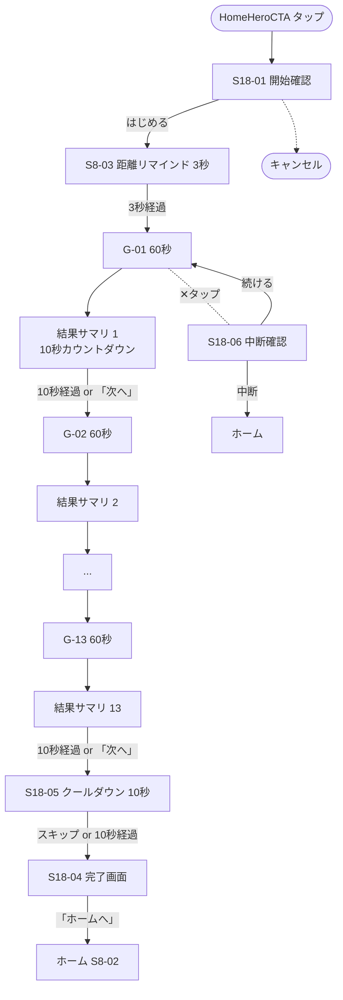

# Sprint 18 — 全ゲーム連続コース + ワイドスコア + 進捗グラフ

> **Sprint 22 v1.2 改訂注記（2026-05-10、最重要）**：本スプリントは **v1.2 で大規模改訂**された。
> - **連続プレイ対象ゲーム**：13 → **7 ゲーム**（G-01, G-03, G-04, G-05, G-06, G-07, G-13）。順序固定（番号順）。1 周のみ。スキップ不可。
> - **起動 = 即連続プレイ**：S18-01 ホーム CTA は廃止。アプリ起動 = 即 F-16 距離リマインド。
> - **F-21 連続プレイ事後画面の追加**：S18-04 コース完了画面に代わって、F-21 事後画面（結果＋進捗グラフ＋バッジ＋設定への入口）が表示される。
> - **クールダウン UI 統一**：S18-05 クールダウンの 10 秒カウントダウンは v1.2 統一カウントダウン UI（白→黄→赤 + 太字）に変更。
> - **進捗グラフ**：13 タブ → 7 タブ（G-02 / G-08 / G-09〜G-12 タブ削除）。ワイドスコアの正規化対象は 7 ゲームに変更。
> - 最新仕様は `docs/design-v11/sprints/sprint-22/screens.md` §2 起動フロー / §8 F-21 事後画面 / §9 進捗グラフ差分 を参照。
>
> **Sprint 20 改訂注記（v1.1.1、2026-04-30）**：本スプリントの **S18-03 ゲーム間結果サマリ独立画面（CourseInterstitialResultScreen）は撤去**された。Sprint 20 で結果開示が刺激画面統合方式（ResultOverlay 重畳）に再設計され、コース動線は「ゲーム N 60 秒注視 → 同画面で ResultOverlay → 10 秒カウントダウン → ゲーム N+1」になった。最新仕様は `docs/design-v11/sprints/sprint-20/screens.md` §11 S20-COURSE-FLOW / §2 S20-COMMON-RESULT-OVERLAY を参照。
>
> S18-01（ホーム CTA）/ S18-02（距離リマインド）/ S18-04（コース完了画面）/ S18-05（クールダウン）/ S18 進捗グラフ・ワイドスコアは引き続き有効。

## スプリントの目的（spec-v11.md §13）

全 13 ゲームを連続実行できる（約 13 分）。ワイドスコアが算出され、進捗グラフ（タブ切替）が見える。ストリークが動く。

含む機能：F-05、F-11、F-12

---

## 0. このスプリントで作る／更新する画面

| 画面 ID | 名称 | 状態 |
|---|---|---|
| S18-01 | 全ゲーム連続コース：開始確認画面 | 新規 |
| S18-02 | コースフロー全体（距離リマインド → 13 ゲーム → 各結果サマリ → クールダウン → 完了） | 新規（フロー図） |
| S18-03 | ゲーム間結果サマリ（コース時、10 秒カウントダウン併記） | S9-S17 の ResultSummary に項目追加 |
| S18-04 | コース完了画面（ストリーク・ワイドスコア表示） | 新規 |
| S18-05 | クールダウン画面 | 新規 |
| S18-06 | コース中断確認ダイアログ | v1 AbortConfirmDialog 流用 |
| S18-07 | 進捗グラフ画面：ワイドスコアタブ | 新規（F-11） |
| S18-08 | 進捗グラフ画面：ゲーム別タブ（13 ゲームの子タブ） | 新規（F-11） |
| S18-09 | ストリーク表示（ホーム連動） | 既存 StreakBadge 流用、22 時警告ロジック追加 |

---

## 1. 受け入れ基準カバレッジ

### F-05
| 仕様 ID | 基準 | 担当 |
|---|---|---|
| F-05 | `releaseEnabled=true` のゲームのみが対象、全ゲームが順番に実行される | S18-02 |
| F-05 | 距離リマインドは 3 秒カウントダウンで自動進行 | S18-02（既存 S8-03） |
| F-05 | 各ゲームは 60 秒で自動終了 | S18-02 |
| F-05 | ゲーム間の結果画面は 10 秒カウントダウンで自動進行、「次へ」で即進める | S18-03 |
| F-05 | コース中断時は確認ダイアログ | S18-06 |
| F-05 | 完了時にセッション完了画面でストリーク／ワイドスコア表示 | S18-04 |

### F-11
| 仕様 ID | 基準 | 担当 |
|---|---|---|
| F-11 | ワイドスコアは 0〜100 の整数 | S18-07 |
| F-11 | 過去 28 日の日次値を折れ線グラフ | S18-07 |
| F-11 | 軸ラベルは 18pt 以上 | S18-07 |
| F-11 | 当日のスコアはグラフ上で強調 | S18-07 |
| F-11 | データ 7 日未満時は「もう少しデータが集まると傾向が見えます」 | S18-07 |
| F-11 | タブ切替で「全体ワイドスコア」「ゲーム別」を切り替え | S18-07 / S18-08 |
| F-11 | ゲーム別タブで各ゲームの閾値折れ線が個別に見られる | S18-08 |
| F-11 | `releaseEnabled=false` のゲームはタブから除外 | S18-08 |

### F-12
| 仕様 ID | 基準 | 担当 |
|---|---|---|
| F-12 | ストリーク現在値表示 | S18-09 |
| F-12 | 全コース完了でストリーク +1（同日 2 回目以降は加算しない） | コード |
| F-12 | 0:00 跨ぎで前日未完了なら 0 リセット | コード |
| F-12 | 各ゲームの日次ベスト閾値記録 | コード |
| F-12 | 22 時以降警告 | S18-09 |

---

## 2. S18-01：コース開始確認画面（簡易）

ホームの HeroCTA タップ後、サクッとコース開始を確認する画面。

### スマホ縦

```
┌─────────────────────────────────────┐
│  ✕                                  │
│                                     │
│       全ゲーム連続プレイ              │ ← font.h2 30px Bold
│       約 13 分                       │
│                                     │
│  ┌─────────────────────────────┐    │
│  │ 含まれるゲーム                │    │
│  │ G-01 変化察知                 │    │ ← enabledGames を縦リスト
│  │ G-02 左右並び傾き判別         │    │   font.body 24px
│  │ G-03 周辺視野ハント           │    │   各 56px 高
│  │ G-04 コントラスト弁別         │    │
│  │ ...                          │    │
│  │ G-13 数字探し                 │    │
│  └─────────────────────────────┘    │
│                                     │
│  ┌─────────────────────────────────┐│
│  │     はじめる                     ││ ← Primary lg, 64px
│  └─────────────────────────────────┘│   タップ → S8-03 距離リマインド
│                                     │
│  ┌─────────────────────────────────┐│
│  │     キャンセル                   ││ ← Secondary lg
│  └─────────────────────────────────┘│
└─────────────────────────────────────┘
```

### F-18 反映
- リストは `gameRegistry.getEnabledGames()` 経由（disabled は表示されない）
- リスト件数が 7〜13 で揺れても「約 N 分」が動的計算され、UI 崩れなし

---

## 3. S18-02：コースフロー全体

### Mermaid 全体フロー



### コース中の総所要時間（13 ゲーム時）
- 距離リマインド：3 秒
- ゲーム 60 秒 × 13 = 780 秒
- 結果サマリ 10 秒 × 12（最終以外） = 120 秒
- 最終ゲーム結果サマリ：10 秒
- クールダウン：10 秒
- 合計：3 + 780 + 120 + 10 + 10 = **923 秒 ≒ 約 15 分 23 秒**（仕様書では「約 13 分」と表記、結果サマリ込みで 16 分）

---

## 4. S18-03：ゲーム間結果サマリ（コース時、10 秒カウントダウン併記）

`ResultSummaryV11` の `isCourseMode=true` 版。

### スマホ縦

```
┌─────────────────────────────────────┐
│           G-04 の結果        ⏱ 7  │ ← 右上にカウントダウン
│                                     │   font.h3 26px tabular-nums
│       正解は「右が濃い」              │   `aria-live="polite"`
│                                     │
│   ┌─────────────────────────────┐   │
│   │   ▦/▦         [▦/▦]          │   │
│   └─────────────────────────────┘   │
│                                     │
│  あなたの回答「左が濃い」 不正解      │
│                                     │
│  ┌────────────────┐ ┌────────────────┐
│  │ 今回の閾値      │ │ 前回比          │
│  │  0.12          │ │  -0.02 ↓ 改善  │
│  └────────────────┘ └────────────────┘
│                                     │
│  ┌─────────────────────────────────┐│
│  │     次へ (次：G-05 空間周波数弁別) ││ ← Primary lg
│  └─────────────────────────────────┘│   ボタンラベルに次ゲーム名併記
│                                     │
│  10 秒後に自動で次のゲームへ          │ ← font.body 24px、center
│                                     │
└─────────────────────────────────────┘
```

### コースモードの仕様（v1.1 改訂）
- 「次へ」ボタンに次のゲーム名を併記（「次：G-05 空間周波数弁別」）
- 右上に 10 秒カウントダウン（CountdownDisplay md = 30px tabular-nums）
- 5 秒以下で `aria-live="polite"` 1 秒間隔読み上げ
- 「次へ」タップで即進行（カウントダウン無視）
- 最終ゲーム時：「次へ」のラベルは「クールダウンへ」、カウントダウン後はクールダウン S18-05 へ

---

## 5. S18-04：コース完了画面

### スマホ縦

```
┌─────────────────────────────────────┐
│                                     │
│           🎉                         │
│                                     │
│      お疲れさまでした                 │ ← font.h1 36px Bold
│                                     │
│  ┌─────────────────────────────┐    │
│  │ 本日のワイドスコア             │    │ ← Card outlined
│  │                              │    │
│  │      72 点                    │    │ ← font.numeric.l 48px
│  │   （13 ゲーム平均）            │    │   tabular-nums
│  │                              │    │
│  │  ↑ 前回より +3 点改善         │    │ ← diff 表示
│  └─────────────────────────────┘    │
│                                     │
│  ┌─────────────────────────────┐    │
│  │ ストリーク                    │    │ ← Card outlined
│  │  🔥 24 日連続                 │    │   StreakBadge 流用
│  │  最長 30 日                   │    │
│  └─────────────────────────────┘    │
│                                     │
│  ┌─────────────────────────────────┐│
│  │     進捗グラフを見る             ││ ← Primary lg
│  └─────────────────────────────────┘│
│                                     │
│  ┌─────────────────────────────────┐│
│  │     ホームへ                     ││ ← Secondary lg
│  └─────────────────────────────────┘│
└─────────────────────────────────────┘
```

### バッジ獲得時の演出
- ストリーク Card の下、「進捗グラフを見る」Primary ボタンの上の位置に AchievementBadge が挿入される
- 1.5 秒の scale-up 演出（scale 0.6 → 1.05 → 1.0、overshoot 5% 以下、点滅なし）
- 例：「🏅 三日坊主突破 を獲得しました」
- フェーズタイミング・複数バッジ同時獲得時の挙動・aria-live 仕様は **Sprint 19 S19-07 §8.1〜§8.7 の仕様に準拠**（同一の AchievementBadge コンポーネントを使用）
- フルコース完了時にしか取得できないバッジ（B-02 三日坊主突破、B-03 一週間の習慣、B-04 一ヶ月の継続、B-09 探検家、B-12 制覇など）はこの S18-04 完了画面で演出される
- 1 ゲーム完了で取得しうるバッジ（B-01 はじめの一歩、B-06 視野ハンター、B-08 細部マスターなど）は各ゲームの結果サマリ S9-03〜S17-06 で演出される
- 演出後は通常表示

### a11y
- SR：「お疲れさまでした。本日のワイドスコアは 72 点。前回より 3 点改善。ストリーク 24 日連続。進捗グラフを見る、ホームへ」

---

## 6. S18-05：クールダウン画面

### スマホ縦

```
┌─────────────────────────────────────┐
│                                     │
│       目を休めましょう                │ ← font.h1 36px Bold
│                                     │
│   ┌─────────────────────────────┐   │
│   │   [遠くを見るイラスト]         │   │ ← cooldown-far.svg
│   │   240×180px (静止)            │   │
│   └─────────────────────────────┘   │
│                                     │
│   10 秒間、できるだけ遠くを見る       │ ← font.body 24px
│                                     │
│            ┌────┐                   │
│            │  7  │                  │ ← font.numeric.xl 72px
│            └────┘                   │   tabular-nums
│                                     │
│  ┌─────────────────────────────────┐│
│  │     スキップ                     ││ ← Secondary lg
│  └─────────────────────────────────┘│
│                                     │
└─────────────────────────────────────┘
```

### 仕様（v1 から継承）
- 10 秒カウントダウン、自動で完了画面へ
- スキップ時もセッション完了は記録される

---

## 7. S18-06：コース中断確認ダイアログ

v1 AbortConfirmDialog 流用、文言は「コースを中断しますか？」「ここまでの記録は未完了として保存されます」「続ける」「中断する」

---

## 8. S18-07：進捗グラフ画面：ワイドスコアタブ（F-11）

### スマホ縦

```
┌─────────────────────────────────────┐
│  ←  進捗グラフ                       │ ← header
│                                     │
│  ┌──────────────┬──────────────┐    │ ← ProgressGraphTabs
│  │ ワイドスコア   │ ゲーム別      │    │   2 タブ、各 56px
│  │ (選択中)      │              │    │   font.body.lg 26px
│  │ ─────下線4px─│              │    │   選択中下線4px brand.primary
│  └──────────────┴──────────────┘    │
│                                     │
│  本日のスコア:  72 点                │ ← font.h2 30px Bold
│  過去 28 日推移                      │
│                                     │
│   ┌────────────────────────────┐    │
│   │ 100│                        │    │ ← V1ScoreChart
│   │  75│  ・        ・ ●        │    │   折れ線、当日強調点
│   │    │ ・ ・    ・   ・        │    │   軸ラベル font.body 24px
│   │  50│・     ・                │    │   高 240px
│   │  25│                        │    │
│   │   0└─────────────────────── │    │
│   │   4/3   4/10  4/17  4/24     │    │
│   └────────────────────────────┘    │
│                                     │
│  データ件数: 28 日中 24 日           │ ← font.body 24px
│  最高: 78 点 (4/22)                 │
│  平均: 65 点                         │
│                                     │
└─────────────────────────────────────┘
```

### 7 日未満時

```
┌─────────────────────────────────────┐
│  本日のスコア: 65 点                  │
│  過去 28 日推移                      │
│   ┌────────────────────────────┐    │
│   │      もう少しデータが        │    │ ← オーバーレイ
│   │      集まると傾向が          │    │   font.body 24px
│   │      見えます                │    │   color.fg.secondary
│   │   (うっすら点だけ表示)      │    │
│   └────────────────────────────┘    │
└─────────────────────────────────────┘
```

---

## 9. S18-08：進捗グラフ画面：ゲーム別タブ（F-11）

### スマホ縦

```
┌─────────────────────────────────────┐
│  ←  進捗グラフ                       │
│                                     │
│  ┌──────────────┬──────────────┐    │
│  │ ワイドスコア   │ ゲーム別 ●   │    │ ← 親タブ：ゲーム別選択
│  └──────────────┴──────────────┘    │
│                                     │
│  ── 子タブ（13 ゲーム横スクロール）── │
│  ┌─G-01─┬─G-02─┬─G-03─┬─G-04─┬─...│ ← GameSubTabsScroll
│  │       │ 選択中│       │      │   │   各タブ高 48px
│  │       │ 下線4px      │      │    │   横スクロール
│  └───────┴───────┴───────┴──────┴──┘ │   F-18: enabled のみ
│                                     │
│  G-02 左右並び傾き判別                │ ← font.h2 30px Bold
│  本日の閾値: 5.0°                    │ ← 縦軸の単位は「角度差(°)」
│  過去 28 日推移                      │
│                                     │
│   ┌────────────────────────────┐    │
│   │ 10°│                       │    │ ← V1ScoreChart 流用
│   │  8°│ ●                     │    │   ただし Y 軸はゲーム別単位
│   │  6°│   ●  ●     ●          │    │   下が良い指標（角度差小）
│   │  4°│       ●        ●      │    │   なら「下に行くほど改善」と注記
│   │  2°│                       │    │
│   │  0°└─────────────────────── │    │
│   └────────────────────────────┘    │
│                                     │
│  ※ 値が小さいほど良い（角度差）       │ ← font.body 24px caption
│                                     │
└─────────────────────────────────────┘
```

### 子タブの順序とフィルタ
- `gameRegistry.getEnabledGames()` 経由（F-18）
- 順序は `order` 昇順
- 横スクロール、左右にフェードグラデーション
- F-18 で disabled になっているゲームのタブは表示されない

### Y 軸の単位（ゲームごと）

| ゲーム | Y 軸単位 | 軸方向 |
|---|---|---|
| G-01 | 角度差（°） | 下が改善 |
| G-02 | 角度差（°） | 下が改善 |
| G-03 | 向き差（°） | 下が改善 |
| G-04 | コントラスト差 | 下が改善 |
| G-05 | cpd 比 | 下が改善 |
| G-06 | SD 比 | 下が改善 |
| G-07 | 向きズレ許容（°） | 下が改善 |
| G-08 | テスト絶対角度（°） | 下が改善 |
| G-09 | コントラスト + 距離合成 | 下が改善 |
| G-10 | 向き差（°） | 下が改善 |
| G-11 | ズレ量（arcmin） | 下が改善 |
| G-12 | spacing 倍率 | 下が改善 |
| G-13 | コントラスト | 下が改善 |

各ゲーム共通：「値が小さいほど良い」の注記を `font.body` 24px caption で表示。

### a11y
- 親タブ：`role="tablist"`、各タブ `role="tab" aria-selected`
- 子タブ：別 `role="tablist"`、`aria-controls` で対応グラフを指定
- グラフ：`role="img"`, `aria-label="G-02 の閾値、過去 28 日推移、最新値 5 度"`、テーブル代替 `aria-describedby`

---

## 10. S18-09：ストリーク表示（ホーム連動）

ホーム S8-02 で既存表示。22 時以降の警告ロジック追加。

### 22 時以降未完了時の表示

```
┌─────────────────────────────────────┐
│   🔥 23 日連続                       │ ← StreakBadge
│   ⚠️ 今日終わるとリセットされます    │ ← 警告 font.body 24px
│                                     │   palette.semantic.warning 装飾アイコン
└─────────────────────────────────────┘
```

### a11y
- 警告は `aria-live="polite"`、ホームを開いた直後に 1 度読み上げ

---

## 11. レスポンシブ

| 画面 | スマホ | PC |
|---|---|---|
| S18-01 開始確認 | 縦リスト | 中央寄せ最大 480px |
| S18-04 完了 | 縦並び 2 カード | 横並び 2 カード（最大 720px） |
| S18-07 ワイドスコア | グラフ高 240px | 480px |
| S18-08 ゲーム別 | 子タブ横スクロール | 子タブ 4 列グリッド |

## 12. ダーク／ライト両対応
- グラフ：当日強調点は `color.score.point.today` `palette.brand.accent`、ライト #0A6C53 / ダーク #4FD9B0
- カウントダウン：両モードで AAA 適合

## 13. テスト観点

- 13 ゲーム連続実行（順序は order 昇順 or 日付シードランダム）
- 結果サマリ 10 秒カウントダウン → 自動進行
- 「次へ」即進行
- ストリーク +1（同日 2 回目以降は加算しない）
- 0:00 跨ぎ未完了でストリーク 0
- ワイドスコア計算（enabled ゲーム平均）
- F-18 動的反映（disabled タブは表示されない、CTA「約 N 分」が動的）
- 7 日未満時の「もう少しデータが集まると傾向が見えます」表示
