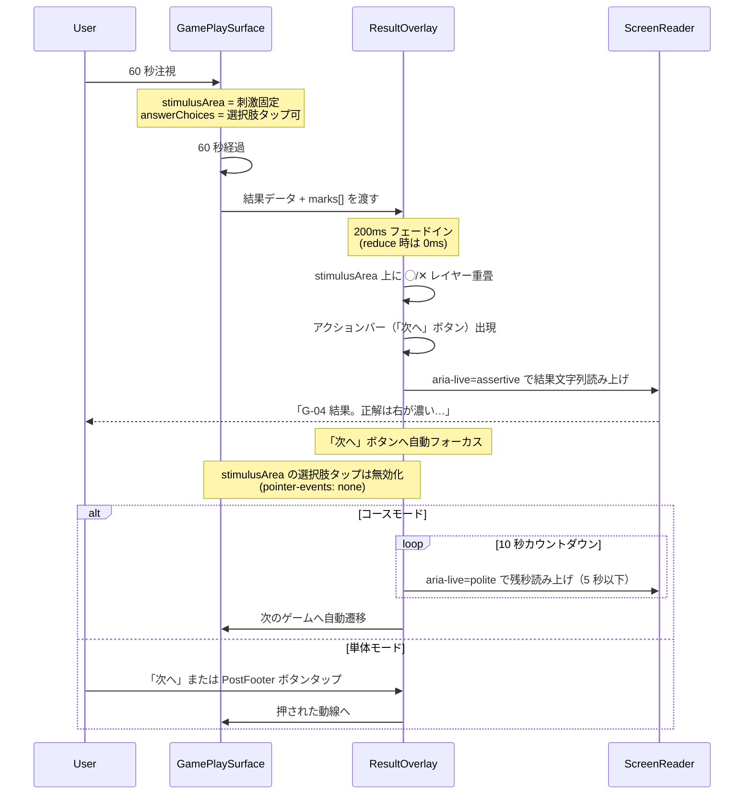
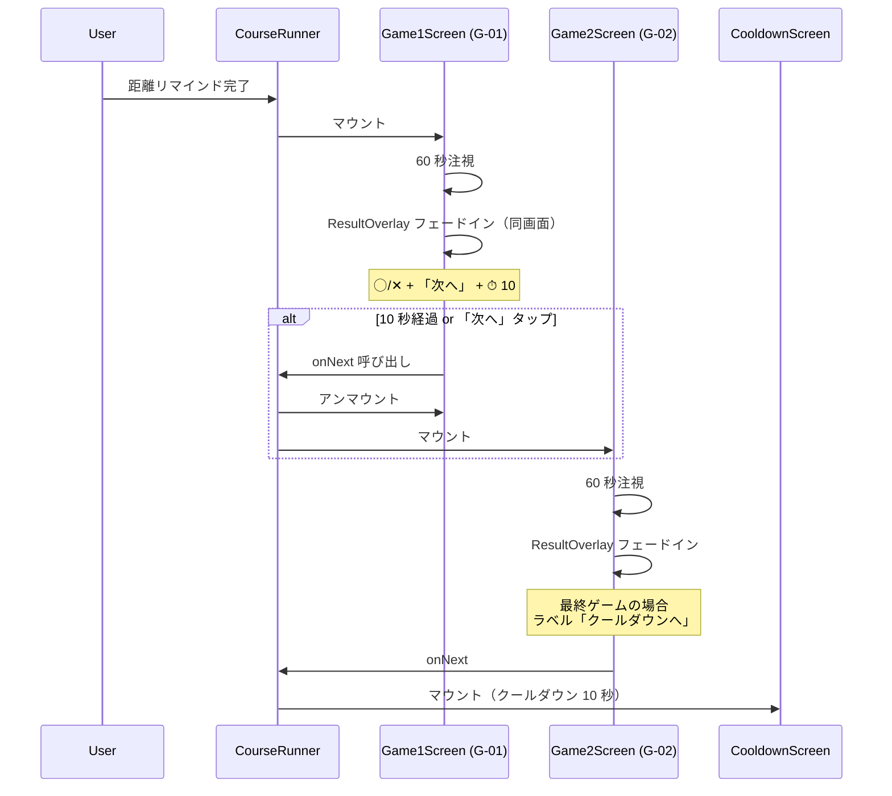

# Sprint 20 — v1.1.1 結果開示と選択 UX 改善（実機フィードバック反映）

> **Sprint 22 v1.2 改訂注記（2026-05-10、最重要）**：本スプリントの **F-10 結果オーバーレイは v1.2 でさらに改訂**された。
> - **試行全体総合 ✅/❌ を刺激領域直下に 1 個追加**（A5 確定、新規 `ResultBadge` コンポーネント、components.md §28）
> - 既存のパッチ上 ◯/✕（MarkBadge）は維持。複数選択ゲームでは併用、単一選択ゲームでも併用
> - カウントダウン UI は v1.2 統一仕様（数字のみ・白→黄→赤・太字補強）に変更（components.md §27 `CountdownTimer`）
> - **G-02 / G-08 関連の S20-G02-* / S20-G08-* は v1.2 で完全削除**（G-02 / G-08 削除）。S20-G09-* もリリース対象外
> - 最新仕様は `docs/design-v11/sprints/sprint-22/screens.md` §3〜§7 各ゲームのプレイ画面 / §13 結果オーバーレイ統一仕様 を参照

## スプリントの目的（spec-v11.md §13 Sprint 20）

1. 13 ゲーム全部で結果開示が刺激画面統合になり、独立した結果サマリ画面に遷移しない。正解側に ◯、ユーザー誤選択側に ✕ がオーバーレイ表示される
2. 結果オーバーレイは ◯ / ✕ アイコン + 「次へ」ボタン（コース時はカウントダウン）のみで構成され、刺激の視認を妨げる追加メトリクス（閾値・前回比・単位）は表示しない（spec 再確定）
3. G-02 / G-08 でテキスト 2 択ボタンが撤去され、ガボールパッチ直接選択のみで回答できる
4. 選択枠が薄く控えめ（線幅 2px 以下、ガボール視認性を阻害しない色）になる
5. 永続化スキーマ・staircase 値・閾値計算ロジックは不変。既存テストはリグレッションを検出（特に F-10 / G-02 / G-08 のテストは新仕様に追従して書き換え）

含む機能：F-07（共通フォーマット改訂：選択枠を控えめに）、F-10（結果サマリ刷新：刺激画面オーバーレイ統合）、§7.2 G-02・§7.8 G-08（設問刷新）

---

## 0. このスプリントで作る／更新する画面

| 画面 ID | 名称 | 状態 |
|---|---|---|
| **S20-COMMON-RESULT-OVERLAY** | 13 ゲーム共通の結果オーバーレイレイアウト規範 | 新規（共通仕様） |
| **S20-G02-PLAY** | G-02 プレイ画面改訂（horizontal-2 撤去、SideBySideStimulus 直接選択） | 改訂（既存 S10-02 を上書き） |
| **S20-G02-RESULT** | G-02 結果オーバーレイ | 新規（旧 S10-03 撤去） |
| **S20-G08-PLAY** | G-08 プレイ画面改訂（adapter 上 / 下部に左右 2 テストパッチ） | 改訂（既存 S15-02 を上書き） |
| **S20-G08-RESULT** | G-08 結果オーバーレイ | 新規（旧 S15-03 撤去） |
| **S20-G01-RESULT** | G-01 結果オーバーレイ（複数選択ゲーム） | 新規（旧 S9-03 撤去） |
| **S20-G07-RESULT** | G-07 結果オーバーレイ（複数選択ゲーム） | 新規（旧 S14-06 撤去） |
| **S20-G09-RESULT** | G-09 結果オーバーレイ（horizontal-2 + 中央 target） | 新規（旧 S15-06 撤去） |
| **S20-G03-RESULT** | G-03 結果オーバーレイ（時計 8 ボタン上） | 新規（旧 S11-03 撤去） |
| **S20-G04-RESULT** | G-04 結果オーバーレイ（horizontal-2 ボタン上） | 新規（旧 S12-03 撤去） |
| **S20-G05-RESULT** | G-05 結果オーバーレイ（同 horizontal-2） | 新規（旧 S13-03 撤去） |
| **S20-G06-RESULT** | G-06 結果オーバーレイ（同 horizontal-2） | 新規（旧 S14-03 撤去） |
| **S20-G10-RESULT** | G-10 結果オーバーレイ（4 象限ボタン上） | 新規（旧 S16-03 撤去） |
| **S20-G11-RESULT** | G-11 結果オーバーレイ（horizontal-2） | 新規（旧 S16-06 撤去） |
| **S20-G12-RESULT** | G-12 結果オーバーレイ（horizontal-4 アイコン） | 新規（旧 S17-03 撤去） |
| **S20-G13-RESULT** | G-13 結果オーバーレイ（10 キーパッド上） | 新規（旧 S17-06 撤去） |
| **S20-COURSE-FLOW** | コース動線改訂（CourseRunner、独立 Interstitial 画面廃止） | 改訂（既存 S18-03 を上書き） |
| **S20-SELECTION-BORDER** | 選択枠規範（13 ゲーム + ホーム共通） | 改訂（既存 components.md §3 / §4 / §5 / §6 反映） |

---

## 1. 受け入れ基準カバレッジ

| 仕様 ID | 基準 | 担当画面 |
|---|---|---|
| F-07（v1.1.1） | 選択中の選択肢は控えめな枠（線幅 2px 以下、ガボール視認性を阻害しない色） | S20-SELECTION-BORDER（components.md §3 / §4） |
| F-07（v1.1.1） | 画像系・テキスト系問わずハイライトトグル方式は維持 | S20-SELECTION-BORDER |
| F-07 | 「現在の回答：◯◯」テキスト表示は行わない（不変） | 全画面（変更なし） |
| F-10（v1.1.1） | 60 秒経過後、独立した結果画面に遷移しない | S20-COMMON-RESULT-OVERLAY、全 13 ゲーム RESULT |
| F-10（v1.1.1） | 正解選択肢に ◯ アイコン重畳 | 全 13 ゲーム RESULT |
| F-10（v1.1.1） | ユーザー誤選択に ✕ アイコン重畳 | 全 13 ゲーム RESULT |
| F-10（v1.1.1） | 偶然正解時は ◯ のみ、✕ なし | S20-COMMON-RESULT-OVERLAY、全 13 ゲーム RESULT |
| F-10（v1.1.1） | 複数選択ゲーム（G-01 / G-07 / G-09）でも個別に ◯/✕ | S20-G01-RESULT / S20-G07-RESULT / S20-G09-RESULT |
| F-10（v1.1.1） | ◯/✕ がガボール本体縞模様を完全に覆い隠さない | S20-COMMON-RESULT-OVERLAY、components.md §24 MarkBadge |
| F-10（v1.1.1） | 結果オーバーレイは ◯/✕ + 「次へ」ボタン（コース時はカウントダウン）のみで構成され、刺激の視認を妨げる追加メトリクス（閾値・前回比・単位）は表示しない | S20-COMMON-RESULT-OVERLAY |
| F-10（v1.1.1） | 単体時は「次へ」を押すまで自動進行しない | S20-COMMON-RESULT-OVERLAY 単体パターン |
| F-10（v1.1.1） | コース時は同画面 10 秒カウントダウン | S20-COMMON-RESULT-OVERLAY コースパターン、S20-COURSE-FLOW |
| F-10（v1.1.1） | スキップ操作（× 中断）は結果オーバーレイを表示せず即中断確認に遷移 | S20-COMMON-RESULT-OVERLAY |
| F-10（v1.1.1） | 試行中（注視 60 秒）は ◯/✕ オーバーレイ非表示 | S20-COMMON-RESULT-OVERLAY |
| F-10（v1.1.1） | バッジ獲得演出 1.5 秒は結果オーバーレイ上で 1 度だけ流れる | S20-COMMON-RESULT-OVERLAY |
| F-10（v1.1.1） | オーバーレイ中の選択肢タップは無効 | S20-COMMON-RESULT-OVERLAY |
| §7.2 G-02 | テキスト「左」「右」の 2 択ボタンが画面に存在しない | S20-G02-PLAY |
| §7.2 G-02 | 左右のガボールパッチをタップで回答 | S20-G02-PLAY |
| §7.2 G-02 | パッチタップ時に控えめ枠（2px 以下）でハイライト | S20-G02-PLAY |
| §7.2 G-02 | 出題方向（時計回り／反時計回り）が画面内に 18pt 以上で明示 | S20-G02-PLAY |
| §7.8 G-08 | テキスト「下のパッチは時計回り／反時計回り」の 2 択ボタンが画面に存在しない | S20-G08-PLAY |
| §7.8 G-08 | adapter 画面上部、テストパッチ 2 つ画面下部に左右並びで配置 | S20-G08-PLAY |
| §7.8 G-08 | 下部テストパッチをタップで回答 | S20-G08-PLAY |
| §7.8 G-08 | パッチタップ時に控えめ枠でハイライト | S20-G08-PLAY |
| §7.8 G-08 | 出題方向が 18pt 以上で明示 | S20-G08-PLAY |
| §7.8 G-08 | adapter は選択不能（disabled） | S20-G08-PLAY |

---

## 2. S20-COMMON-RESULT-OVERLAY：13 ゲーム共通の結果オーバーレイレイアウト規範

### 2.1 全体構造

`GamePlaySurface`（GS-1）はそのまま維持し、その上に `ResultOverlay`（GE-RESULT、components.md §23）を重畳する。画面遷移は発生しない。`stimulusArea` は固定表示。`answerChoices` 領域はオーバーレイで「『次へ』ボタン（コース時はカウントダウン併記）」に置き換わる。

> **構成（spec 再確定）**：結果オーバーレイは **◯ / ✕ アイコンの重畳 + 『次へ』ボタン（およびコースモード時のカウントダウン）のみ** で構成される。閾値・前回比・単位といったメトリクスバーは表示しない（実機テストで刺激の視認を妨げるとのフィードバックのため撤去）。閾値の数値推移は **F-11 進捗グラフ** から参照する設計とする。

### 2.2 レイアウト（スマホ縦 375×667、コース時）

```
┌─────────────────────────────────────┐
│  ✕    残り 0 秒（停止）              │ ← GameStatusBarV11 そのまま維持
│                                     │   ✕ は機能継続（ホーム強制脱出用）
│  ┌────────────────────────────────┐ │
│  │                                │ │
│  │     ┌──────┐    ┌──────┐        │ │ ← GE-XX 刺激領域そのまま
│  │     │ ▦/▦  │    │ ▦\▦  │        │ │   GamePlaySurface.stimulusArea
│  │     │ ╱◯╲  │    │ ╱✕╲  │        │ │   は固定（変更なし）
│  │     │ ╲ ╱  │    │ ╲ ╱  │        │ │   ◯ / ✕ アイコンを各
│  │     └──────┘    └──────┘        │ │   data-target-id 中央に重畳
│  │                                │ │
│  │   60 秒終了。固定表示。         │ │
│  └────────────────────────────────┘ │
│                                     │
│  ┌─────────────────────────────────┐│ ← アクションバー（コース時）
│  │   次へ              ⏱ 8         ││   Primary lg 64px
│  │   次：G-03 周辺視野ハント         ││   font.body.lg 26px Bold
│  └─────────────────────────────────┘│   右内側カウントダウン併記
│                                     │
└─────────────────────────────────────┘
```

### 2.3 レイアウト（スマホ縦、単体プレイ時）

```
┌─────────────────────────────────────┐
│  ✕    残り 0 秒（停止）              │
│  ┌────────────────────────────────┐ │
│  │   [ 刺激領域 + ◯/✕ オーバーレイ ] │ │
│  └────────────────────────────────┘ │
│                                     │
│  ┌─────────────────────────────────┐│
│  │       次へ                       ││ ← カウントダウンなし
│  └─────────────────────────────────┘│   押すまで進まない
│                                     │
│  ─────── 区切り線 ───────────────── │ ← SinglePlayPostFooter
│                                     │   （v1.1 から不変、ResultOverlay
│  ┌─────────────────────────────────┐│   内蔵）
│  │   同じゲームをもう一度            ││ ← Primary lg 64px
│  └─────────────────────────────────┘│
│  ┌─────────────────────────────────┐│
│  │   ゲーム一覧へ戻る                ││ ← Secondary lg 64px
│  └─────────────────────────────────┘│
│  ┌─────────────────────────────────┐│
│  │      ホームへ                     ││ ← Tertiary lg 64px
│  └─────────────────────────────────┘│
└─────────────────────────────────────┘
```

> 単体プレイ時は「次へ」ボタン以下の領域がスクロール可能（オーバーフロー scroll）。スマホ 360px 縦 640px 環境でもフッター 3 ボタンが収まるように、刺激領域を上半分（最大 320px 高）にクランプし、ボタン領域を下半分にスクロール可能で配置する。

### 2.4 レイアウト（PC 横 1280×800、コース時）

```
┌──────────────────────────────────────────────────────────────┐
│  ✕         残り 0 秒（停止）                                  │
│                                                              │
│           ┌─────────────────────────────────────┐            │
│           │                                     │            │
│           │   ┌──────────┐   ┌──────────┐         │            │
│           │   │ ▦/▦      │   │ ▦\▦      │         │            │
│           │   │  ╱◯╲     │   │  ╱✕╲     │         │            │
│           │   └──────────┘   └──────────┘         │            │
│           │                                     │            │
│           │     [ 刺激領域 + ◯/✕ ]               │            │
│           └─────────────────────────────────────┘            │
│                                                              │
│           ┌─────────────────────────────────────┐            │
│           │   次へ              ⏱ 8             │            │
│           │   次：G-03 周辺視野ハント             │            │
│           └─────────────────────────────────────┘            │
│                                                              │
└──────────────────────────────────────────────────────────────┘
```

PC 横では中央 720px 最大幅。刺激領域・アクションバーが縦に並ぶ構造はスマホと同じ。メトリクスバーは存在しないため、刺激領域とアクションバーの間に他の UI 要素は入らない。

### 2.5 ◯ / ✕ オーバーレイの配置規範

| 配置場所 | ゲーム |
|---|---|
| `stimulusArea` 内のパッチ／セル中央 | G-01（変化察知）、G-02（左右パッチ）、G-07（エッジ検出）、G-08（下部テストパッチ）、G-13（埋め込み数字。実際は数字キー側に置く） |
| `answerChoices` 領域内のボタン中央（刺激領域の外） | G-03（時計 8 ボタン）、G-04 / G-05 / G-06 / G-09 / G-11（horizontal-2 ボタン）、G-10（4 象限ボタン）、G-12（horizontal-4）、G-13（0〜9 キーパッド） |

> 規範：◯ / ✕ は「ユーザーが操作した対象」の上に重畳されるべきで、刺激領域の任意の場所に飛び散らせない。ユーザーが「ここを選んだ」場所と「結果」が空間的に対応することがこの UX の核心。

### 2.6 単数選択 vs 複数選択の振る舞い

| ゲームタイプ | ゲーム ID | ◯/✕ の最大数 | 振る舞い |
|---|---|---|---|
| 単数選択 | G-02 / G-03 / G-04 / G-05 / G-06 / G-08 / G-09 / G-10 / G-11 / G-12 / G-13 | ◯ 1 個 + ✕ 0〜1 個 | 正解位置に ◯。ユーザーが偶然正解側を選んだら ✕ なし。誤選択時のみ ✕ をユーザー選択位置に |
| 複数選択 | G-01 / G-07 | ◯ 複数 + ✕ 複数 | 正解パッチ全てに ◯。「正解だが選ばれなかった」パッチは薄 ◯（kind=missed、不透明度 50%）。「ユーザーが選んだが不正解」パッチに ✕。「不正解で選ばれなかった」パッチには何も表示しない |

### 2.7 メトリクスバーは表示しない（spec 再確定）

結果オーバーレイには閾値・前回比・単位といったメトリクスは表示しない。実機テストで「メトリクスバーが刺激の視認を妨げる」とのフィードバックを受け、ResultOverlay からメトリクスバーは完全に撤去された。

- 閾値の数値推移は **F-11 進捗グラフ** から参照する設計（ゲーム別子タブで各ゲームの閾値折れ線を表示）
- 各ゲームの閾値値・単位は仕様書（spec-v11.md §7 / staircase 定義）および F-11 進捗グラフ画面に記述があるため、ここでは再掲しない
- ResultOverlay 内では `data-target-id` ベースの ◯/✕ 重畳のみが視覚的な結果開示の手段となる

### 2.8 アクションバー（次へ）

#### コース時
- ボタンラベル：「次へ」（font.body.lg 26px Bold）
- 2 行目（オプション）：「次：G-XX ◯◯」（18px、ボタン背景上で onPrimary 色）
- 右内側にカウントダウン：⏱ 10〜0、`font.h3` 26px tabular-nums
- 自動進行：10 秒で次のゲームへ
- 最終ゲーム：ラベル「クールダウンへ」、カウントダウン後はクールダウン画面へ

#### 単体時
- ボタンラベル：「次へ」のみ（カウントダウンなし）
- 押下なしでは進まない
- ボタン直下に `SinglePlayPostFooter`（同じゲームをもう一度／一覧へ／ホームへ）を縦展開

### 2.9 オーバーレイ出現タイミング



### 2.10 中断（×）時の振る舞い

- 60 秒経過前にユーザーが × タップ：`AbortConfirmDialog`（v1 継承）を表示
- 60 秒経過後（オーバーレイ表示中）にユーザーが × タップ：同じく `AbortConfirmDialog`。確認後はホームへ遷移
- 中断は「未挑戦」として記録（spec F-10：スキップ操作は結果オーバーレイは表示されず即座に中断確認に遷移する）。これは 60 秒**未満**で中断した場合に該当する

### 2.11 a11y

- `role="region"`, `aria-labelledby="result-overlay-title"`, `aria-live="assertive"`
- 60 秒経過直後に SR で 1 度だけ結果文字列を読み上げ（components.md §23 a11y 参照）
- ◯/✕ 個別 `aria-label="正解です" / "不正解です" / "正解ですが選ばれませんでした"`
- 「次へ」へ自動フォーカス、Tab でフッター展開
- prefers-reduced-motion: reduce 時はフェード即時化

---

## 3. S20-G02-PLAY：G-02 プレイ画面改訂（直接選択）

### 3.1 旧仕様（v1.1）と新仕様（v1.1.1）の差分

| 項目 | 旧（S10-02） | 新（S20-G02-PLAY） |
|---|---|---|
| 選択肢 | horizontal-2「左」「右」テキストボタン | 左右 2 ガボールパッチを `ImageChoiceCell` でラップ、直接タップ |
| 選択枠 | 黄色 4px 枠（テキストボタン上） | 中性グレー 2px 枠（パッチ周囲、`color.selection.subtle`） |
| 出題方向の明示 | guidance「時計回りに傾いているのは？」 | guidance「より時計回りに傾いているパッチを選んでください」（18pt 以上） |
| staircase 値・採点 | 不変 | 不変 |

### 3.2 レイアウト（スマホ縦 375×667）

```
┌─────────────────────────────────────┐
│  ✕     残り 53 秒                    │ ← GameStatusBarV11
│                                     │
│   より時計回りに傾いているパッチを     │ ← guidance（出題方向、18pt 以上）
│   選んでください                       │   font.body 24px center
│                                     │
│   ┌─────────────────────────────┐   │
│   │                              │   │ ← stimulusArea
│   │  ┌──────┐    ┌──────┐         │   │   GamePlaySurface 内
│   │  │ ▦/▦   │    │ ▦\▦  │         │   │
│   │  │  140  │    │  140  │         │   │   ImageChoiceCell × 2
│   │  │   px  │    │   px  │         │   │   各 140×140 (スマホ)
│   │  └──────┘    └──────┘         │   │   180×180 (PC)
│   │   (idle 1px)  (selected       │   │   ギャップ space.6 (32px)
│   │                 2px 中性)     │   │
│   │                              │   │   中央に固視点 0.5°
│   │       +                      │   │   背景 #808080
│   │                              │   │
│   │  60 秒間ずっと表示            │   │
│   │  （点滅・マスクなし）          │   │
│   └─────────────────────────────┘   │
│                                     │
│   （answerChoices 領域は空。       │ ← 旧 horizontal-2 を撤去
│    パッチ自体が選択肢になったため）   │
│                                     │
└─────────────────────────────────────┘
```

### 3.3 PC 横（1280×800）

```
┌──────────────────────────────────────────────────────────────┐
│  ✕              残り 53 秒                                    │
│                                                              │
│        より時計回りに傾いているパッチを選んでください          │
│                                                              │
│           ┌─────────────────────────────────────┐            │
│           │                                     │            │
│           │   ┌──────────┐    ┌──────────┐       │            │
│           │   │  ▦/▦     │    │  ▦\▦     │       │            │
│           │   │  180×180 │    │  180×180 │       │            │
│           │   └──────────┘    └──────────┘       │            │
│           │     (idle 1px)    (selected 2px)    │            │
│           │                                     │            │
│           │              +                      │            │
│           │                                     │            │
│           └─────────────────────────────────────┘            │
│                                                              │
└──────────────────────────────────────────────────────────────┘
```

### 3.4 出題方向の表示

- 試行開始時にランダムで「時計回り」「反時計回り」のいずれかを出題方向に決定（spec §7.2 staircase 不変、出題方向のみ毎試行ランダム）
- guidance 文言は出題方向に応じて切替：
  - 時計回り出題：「**より時計回り**に傾いているパッチを選んでください」
  - 反時計回り出題：「**より反時計回り**に傾いているパッチを選んでください」
- 該当キーワード（「時計回り」or「反時計回り」）は font.body Bold で強調
- 18pt 以上（24px 採用）

### 3.5 状態

| 状態 | 表示 |
|---|---|
| 0〜60s 注視中 | 左右パッチ表示、guidance 表示。ユーザーがどちらかをタップ：選択枠 2px 中性グレー、Bold 切替なし（パッチには文字なし） |
| 再タップ | 選択解除（idle 1px に戻る） |
| 別パッチタップ | 選択切替（前選択は idle、新選択は 2px） |
| 60s 経過 | ResultOverlay フェードイン（200ms）、`pointer-events: none` で選択不能 |

### 3.6 a11y

- guidance：`role="status"`, `aria-live="polite"`（出題方向が変わるたびに読み上げ）
- stimulusArea：`role="radiogroup"`, `aria-label="より時計回りに傾いているパッチを選んでください"`
- 各 ImageChoiceCell：`role="radio"`, `aria-checked`, `aria-label="左のガボール" / "右のガボール"`
- 各セルに `data-target-id="g02-left" / "g02-right"` を付与（ResultOverlay の ◯/✕ 配置用）
- 視覚枠が薄くなっても `aria-checked` で選択状態が SR に正確に伝わる
- focus-visible：3px 青 outline（選択枠とは別レイヤー、両立可能）

### 3.7 受け入れ基準カバレッジ（spec §7.2）

- [x] テキスト「左」「右」の 2 択ボタンが画面に存在しない（`AnswerChoiceGroup` horizontal-2 を呼ばない）
- [x] ユーザーは左右どちらかのガボールパッチをタップで回答できる
- [x] パッチタップ時に控えめな選択枠（2px、中性グレー）でハイライトされる
- [x] 出題方向（時計回り／反時計回り）が画面内に 18pt 以上で明示される
- [x] staircase 値・採点ロジックは不変

---

## 4. S20-G02-RESULT：G-02 結果オーバーレイ

### 4.1 レイアウト（スマホ縦、コース時）

```
┌─────────────────────────────────────┐
│  ✕     残り 0 秒（停止）              │
│                                     │
│   より時計回りに傾いているパッチを     │ ← guidance はそのまま残る
│   選んでください                       │   （SR には結果に切替済み）
│                                     │
│   ┌─────────────────────────────┐   │
│   │                              │   │
│   │  ┌──────┐    ┌──────┐         │   │ ← GE-02 そのまま固定
│   │  │ ▦/▦  │    │ ▦\▦  │         │   │
│   │  │ ╱ ╲  │    │ ╱ ╲  │         │   │
│   │  │( ◯ ) │    │( ✕ ) │         │   │ ← MarkBadge 重畳
│   │  │ ╲ ╱  │    │ ╲ ╱  │         │   │   (左：correctChosen 緑 ◯）
│   │  └──────┘    └──────┘         │   │   (右：wrongChosen 赤 ✕）
│   │                              │   │   各 49〜60px サイズ
│   │       +                      │   │   (パッチ 140 × 0.35)
│   │                              │   │
│   └─────────────────────────────┘   │
│                                     │
│  ┌─────────────────────────────────┐│
│  │ 次へ              ⏱ 8           ││ ← Primary lg 64px
│  │ 次：G-03 周辺視野ハント          ││
│  └─────────────────────────────────┘│
└─────────────────────────────────────┘
```

### 4.2 marks 生成例（出題：時計回り、正解：右、ユーザー回答：左）

```ts
marks = [
  { targetId: "g02-right", kind: "correctMissed" },  // 正解だが選ばれなかった → 薄 ◯
  { targetId: "g02-left",  kind: "wrongChosen" },     // 不正解で選んだ → ✕
];
```

> 単数選択ゲームの場合、「正解で選ばれなかった」は実質「正解 = ◯」の表示で十分なため、Designer 判断で `correctMissed`（薄 ◯）ではなく `correctChosen` 同等の通常 ◯ を使ってもよい。**G-02 / G-03 / G-04 / G-05 / G-06 / G-08 / G-09 / G-10 / G-11 / G-12 / G-13 では単数選択のため、正解側は `correctChosen` 不透明度 100% の通常 ◯ を採用**する（`correctMissed` 薄 ◯ は複数選択ゲーム G-01 / G-07 のみ）。

### 4.3 SR 読み上げ

- 60 秒経過直後に `aria-live="assertive"` で 1 度のみ：
  - 「G-02 左右並び傾き判別 結果。正解は右のガボール。あなたの回答は左のガボール。不正解。次へ」
  - （閾値・前回比は読み上げに含めない。F-11 進捗グラフで参照する設計）

---

## 5. S20-G08-PLAY：G-08 プレイ画面改訂（adapter 上 / テストパッチ下左右 2 個）

### 5.1 旧仕様（v1.1）と新仕様（v1.1.1）の差分

| 項目 | 旧（S15-02） | 新（S20-G08-PLAY） |
|---|---|---|
| 配置 | 上：adapter 1 個（傾き 20° 固定）、下：テストパッチ 1 個 | 上：adapter 1 個、下：テストパッチ 2 個（左右、傾き ±絶対角度で対称） |
| 選択肢 | horizontal-2「下のパッチは時計回り／反時計回り」 | 下部左右テストパッチ 2 個を `ImageChoiceCell` で直接選択 |
| adapter | 表示のみ | 表示のみ + `disabled=true`（タップ反応なし、選択枠も出ない） |
| 選択枠 | 黄色 4px 枠（テキストボタン上） | 中性グレー 2px 枠（テストパッチ周囲） |
| staircase 値 | テスト絶対角度 °（易 10°→難 1°）、初期 5°、step 1° | 不変。左右パッチが ±絶対角度の対称配置に変わるのみ |

### 5.2 レイアウト（スマホ縦 375×667）

```
┌─────────────────────────────────────┐
│  ✕     残り 35 秒                    │
│                                     │
│   より時計回りに傾いて見えるパッチを    │ ← guidance（出題方向、18pt+）
│   下から選んでください                  │   font.body 24px center
│                                     │
│   ┌─────────────────────────────┐   │
│   │                              │   │
│   │       ┌────────┐             │   │ ← adapter 上部中央
│   │       │  ▦/▦   │             │   │   140×140 px
│   │       │ 20° 固定 │             │   │   高コン 0.6
│   │       └────────┘             │   │   disabled (枠なし)
│   │   (選択不能、aria-disabled)   │   │
│   │                              │   │
│   │   〜 ギャップ 32px 〜          │   │
│   │                              │   │
│   │  ┌──────┐    ┌──────┐         │   │ ← テストパッチ × 2
│   │  │ ▦|▦  │    │ ▦/▦  │         │   │   各 140×140 (スマホ)
│   │  │ 左    │    │  右   │         │   │   180×180 (PC)
│   │  │ +N°   │    │ -N°   │         │   │   ImageChoiceCell ラップ
│   │  └──────┘    └──────┘         │   │   ギャップ space.6 (32px)
│   │  (idle 1px)  (selected 2px)   │   │   左右どちらが時計回り側
│   │                              │   │   になるかは試行ごと
│   │   60 秒同時提示               │   │   ランダム
│   │                              │   │
│   └─────────────────────────────┘   │
│                                     │
│   （answerChoices 領域は空。       │ ← 旧 horizontal-2 撤去
│    下部パッチが選択肢）              │
│                                     │
└─────────────────────────────────────┘
```

### 5.3 PC 横（1280×800）

```
┌──────────────────────────────────────────────────────────────┐
│  ✕              残り 35 秒                                    │
│                                                              │
│      より時計回りに傾いて見えるパッチを下から選んでください    │
│                                                              │
│           ┌─────────────────────────────────────┐            │
│           │                                     │            │
│           │           ┌──────────┐               │            │
│           │           │  ▦/▦     │  adapter      │            │
│           │           │  180×180 │               │            │
│           │           └──────────┘               │            │
│           │                                     │            │
│           │   ┌──────────┐    ┌──────────┐       │            │
│           │   │  ▦|▦     │    │  ▦/▦     │       │            │
│           │   │  180×180 │    │  180×180 │       │            │
│           │   └──────────┘    └──────────┘       │            │
│           │     (テスト左)     (テスト右)         │            │
│           │                                     │            │
│           └─────────────────────────────────────┘            │
│                                                              │
└──────────────────────────────────────────────────────────────┘
```

### 5.4 出題方向の表示

- 試行開始時にランダムで「時計回り」「反時計回り」のいずれかを出題方向に決定
- 試行開始時にランダムで「左パッチ = 時計回り、右パッチ = 反時計回り」または「左 = 反時計回り、右 = 時計回り」を決定（左右対称配置）
- guidance：「**より時計回り**（または反時計回り）に傾いて見えるパッチを下から選んでください」
- 該当キーワード Bold、24px

### 5.5 状態

| 状態 | 表示 |
|---|---|
| 0〜60s 注視中 | adapter（上、選択不能、disabled）+ テストパッチ × 2（下、左右）。ユーザーがどちらかのテストパッチタップ：2px 中性グレー枠 |
| adapter タップ試行 | 反応しない（`pointer-events: none` または onClick noop）、selection border 描画なし |
| 別テストパッチタップ | 選択切替 |
| 再タップ | 選択解除 |
| 60s 経過 | ResultOverlay フェードイン |

### 5.6 a11y

- guidance：`role="status"`, `aria-live="polite"`
- stimulusArea：`role="radiogroup"`, `aria-label="より時計回りに傾いて見えるパッチを下から選んでください"`
- adapter（上）：`aria-hidden="true"` または `aria-label="参照パッチ（選択対象外）"`、`aria-disabled="true"`、tabindex から外す
- 下部左テストパッチ：`role="radio"`, `aria-checked`, `aria-label="下の左のガボール"`, `data-target-id="g08-test-left"`
- 下部右テストパッチ：同上 `data-target-id="g08-test-right"`
- 視覚枠が薄くなっても aria-checked で SR 伝達

### 5.7 受け入れ基準カバレッジ（spec §7.8）

- [x] テキスト「下のパッチは時計回り／反時計回り」の 2 択ボタンが画面に存在しない
- [x] adapter は画面上部、テストパッチ 2 つは画面下部に左右並びで配置される
- [x] ユーザーは左右どちらかのテストパッチをタップで回答できる
- [x] パッチタップ時に控えめな選択枠（2px 中性グレー）でハイライト
- [x] 出題方向が 18pt 以上で明示
- [x] adapter は選択不能（`disabled`、`aria-disabled`）
- [x] staircase 値・採点ロジックは不変

---

## 6. S20-G08-RESULT：G-08 結果オーバーレイ

### 6.1 レイアウト（スマホ縦、コース時）

```
┌─────────────────────────────────────┐
│  ✕     残り 0 秒（停止）              │
│                                     │
│   ┌─────────────────────────────┐   │
│   │                              │   │
│   │       ┌────────┐             │   │ ← adapter は◯/✕ なし
│   │       │  ▦/▦   │             │   │   選択不能のため
│   │       └────────┘             │   │
│   │                              │   │
│   │  ┌──────┐    ┌──────┐         │   │
│   │  │ ▦|▦  │    │ ▦/▦  │         │   │
│   │  │ ╱✕╲  │    │ ╱◯╲  │         │   │ ← MarkBadge 重畳
│   │  └──────┘    └──────┘         │   │   左：wrongChosen 赤 ✕
│   │                              │   │   右：correctChosen 緑 ◯
│   └─────────────────────────────┘   │
│                                     │
│  ┌─────────────────────────────────┐│
│  │ 次へ              ⏱ 8           ││
│  └─────────────────────────────────┘│
└─────────────────────────────────────┘
```

### 6.2 marks 生成例（出題：時計回り、左 = 反時計回り、右 = 時計回り、ユーザー回答：左）

```ts
marks = [
  { targetId: "g08-test-right", kind: "correctChosen" },  // 正解（時計回り） → 通常 ◯
  { targetId: "g08-test-left",  kind: "wrongChosen" },     // 不正解（反時計回り）でユーザーが選んだ → ✕
  // adapter (g08-adapter) には何も表示しない
];
```

---

## 7. S20-G01-RESULT：G-01 結果オーバーレイ（複数選択）

### 7.1 振る舞い

複数選択ゲーム（True Positive / False Positive が同時にあり得る）の代表例。Spec §7.1 の採点ロジック「True Positive +1、False Positive -1、False Negative 0、合計 0 未満なら 0」に従い、各セルに以下の 4 状態を判定：

| ユーザー選択 | 実際 | 表示 | kind |
|---|---|---|---|
| 選択した | 変化していた（True Positive） | ◯ 通常（緑、不透明度 100%） | `correctChosen` |
| 選択した | 変化していなかった（False Positive） | ✕（赤） | `wrongChosen` |
| 選択しなかった | 変化していた（False Negative） | ◯ 薄（緑、不透明度 50%） | `correctMissed` |
| 選択しなかった | 変化していなかった（True Negative） | 何も表示しない | （配列に含めない） |

### 7.2 レイアウト（スマホ縦、コース時、3×3 グリッド例）

```
┌─────────────────────────────────────┐
│  ✕     残り 0 秒（停止）              │
│                                     │
│   ┌─────────────────────────────┐   │
│   │                              │   │
│   │   ┌──┐ ┌──┐ ┌──┐              │   │
│   │   │▦◯│ │▦ │ │▦✕│              │   │ ← Row 0
│   │   └──┘ └──┘ └──┘              │   │   (0,0)=correctChosen
│   │                              │   │   (0,1)=何も無し
│   │   ┌──┐ ┌──┐ ┌──┐              │   │   (0,2)=wrongChosen
│   │   │▦ │ │▦◯│ │▦ │              │   │
│   │   └──┘ └──┘ └──┘              │   │ ← Row 1
│   │                              │   │   (1,1)=correctChosen
│   │   ┌──┐ ┌──┐ ┌──┐              │   │
│   │   │▦◯│ │▦ │ │▦◯ │             │   │ ← Row 2
│   │   │薄│ │  │ │  │              │   │   (2,0)=correctMissed (薄 ◯)
│   │   └──┘ └──┘ └──┘              │   │   (2,2)=correctChosen
│   └─────────────────────────────┘   │
│                                     │
│  ┌─────────────────────────────────┐│
│  │ 次へ              ⏱ 8           ││
│  └─────────────────────────────────┘│
└─────────────────────────────────────┘
```

> G-01（複数選択）は ◯/✕/薄 ◯ の重畳のみで結果を伝える。「正答 N / 誤答 M / 取りこぼし K」のような数値補足はメトリクスバー撤去にあわせて表示しない。SR 読み上げにも数値は載せない。

### 7.3 marks 例（変化パッチ：(0,0), (1,1), (2,0), (2,2) = 4 個。ユーザー選択：(0,0), (0,2), (1,1), (2,2)）

```ts
marks = [
  { targetId: "g01-cell-0-0", kind: "correctChosen" },   // ◯
  { targetId: "g01-cell-0-2", kind: "wrongChosen" },     // ✕
  { targetId: "g01-cell-1-1", kind: "correctChosen" },   // ◯
  { targetId: "g01-cell-2-0", kind: "correctMissed" },   // 薄 ◯
  { targetId: "g01-cell-2-2", kind: "correctChosen" },   // ◯
  // (0,1), (1,0), (1,2), (2,1) は何も無し
];
```

### 7.4 メトリクスバーは表示しない（spec 再確定）

G-01（複数選択ゲーム）でもメトリクスバーは表示しない。閾値・正答数・誤答数・取りこぼし数といった追加メトリクスは ResultOverlay に載せず、F-11 進捗グラフ側で参照する設計とする。

各セルの ◯（correctChosen） / ✕（wrongChosen） / 薄 ◯（correctMissed） の重畳のみで結果を視覚的に伝える。ユーザーは目視でセルごとの正誤を把握できるため、数値補足は不要と判断（実機テストで「メトリクスバーが刺激の視認を妨げる」フィードバックを反映）。

### 7.5 SR 読み上げ

- 「G-01 変化察知 結果。変化していたパッチは 4 個。あなたが選んだのは 4 個、うち正解 3 個、誤答 1 個、取りこぼし 1 個。次へ」
- （閾値・前回比は読み上げに含めない。F-11 進捗グラフで参照する設計）

---

## 8. S20-G07-RESULT：G-07 結果オーバーレイ（複数選択、エッジ検出）

### 8.1 振る舞い

G-07 は「線を構成する 3 個」を全部選ぶゲーム。採点は「正解 3 個全部選択 = 正解 / 1 個でも誤りや欠落で不正解」（spec §7.7）。

ResultOverlay の marks は G-01 と同じロジック（4 状態判定）。「線を構成する 3 個」 = correctChosen / correctMissed、「線でない 13 個」のうちユーザーが選んだもの = wrongChosen。

### 8.2 レイアウト（スマホ縦、4×4 グリッド）

```
┌─────────────────────────────────────┐
│  ✕     残り 0 秒（停止）              │
│                                     │
│   ┌─────────────────────────────┐   │
│   │  ┌─┐ ┌─┐ ┌─┐ ┌─┐             │   │ ← Row 0
│   │  │▦│ │▦◯│ │▦│ │▦│             │   │   (0,1)=correctChosen
│   │  └─┘ └─┘ └─┘ └─┘             │   │
│   │  ┌─┐ ┌─┐ ┌─┐ ┌─┐             │   │ ← Row 1
│   │  │▦│ │▦│ │▦◯│ │▦✕│            │   │   (1,2)=correctChosen
│   │  └─┘ └─┘ └─┘ └─┘             │   │   (1,3)=wrongChosen
│   │  ┌─┐ ┌─┐ ┌─┐ ┌─┐             │   │ ← Row 2
│   │  │▦│ │▦│ │▦│ │▦◯薄│           │   │   (2,3)=correctMissed
│   │  └─┘ └─┘ └─┘ └─┘             │   │
│   │  ┌─┐ ┌─┐ ┌─┐ ┌─┐             │   │ ← Row 3
│   │  │▦│ │▦│ │▦│ │▦│             │   │
│   │  └─┘ └─┘ └─┘ └─┘             │   │
│   └─────────────────────────────┘   │
│                                     │
│  ┌─────────────────────────────────┐│
│  │ 次へ              ⏱ 8           ││
│  └─────────────────────────────────┘│
└─────────────────────────────────────┘
```

> G-07 もメトリクスバーは表示しない。各セルの ◯/✕/薄 ◯ 重畳のみで結果を伝える（G-01 と同じ規範）。

---

## 9. S20-G09-RESULT：G-09 結果オーバーレイ（horizontal-2 + 中央 target）

### 9.1 配置規範

G-09 は「縦寄り／横寄り」の horizontal-2 ボタンで回答する単数選択ゲーム。`stimulusArea` は左右 flanker + 中央 target の 3 ガボール。

**◯/✕ は `answerChoices` 領域の horizontal-2 ボタン上**に配置（刺激領域には置かない）。

### 9.2 レイアウト（スマホ縦）

```
┌─────────────────────────────────────┐
│  ✕     残り 0 秒（停止）              │
│   ┌─────────────────────────────┐   │
│   │                              │   │
│   │  ▦|▦  ─  ▦|▦  ─  ▦|▦          │   │ ← 刺激領域は◯/✕ なし
│   │ flanker target flanker        │   │   そのまま 60 秒終了状態
│   │                              │   │
│   └─────────────────────────────┘   │
│                                     │
│  ┌──────────────┐  ┌──────────────┐ │ ← horizontal-2 ボタン
│  │   縦寄り      │  │   横寄り      │ │   採点後の表示
│  │   ╱◯╲        │  │              │ │   左：correctChosen ◯
│  └──────────────┘  └──────────────┘ │   右：何も無し（偶然正解時）
│  または ユーザーが横寄りを選んで不正解：
│  ┌──────────────┐  ┌──────────────┐ │
│  │   縦寄り      │  │   横寄り      │ │
│  │   ╱◯╲        │  │   ╱✕╲        │ │
│  └──────────────┘  └──────────────┘ │
│                                     │
│  ┌─────────────────────────────────┐│
│  │ 次へ              ⏱ 8           ││
│  └─────────────────────────────────┘│
└─────────────────────────────────────┘
```

### 9.3 marks 例（正解：縦寄り、ユーザー回答：横寄り）

```ts
marks = [
  { targetId: "g09-choice-vertical",   kind: "correctChosen" },  // 正解 → ◯
  { targetId: "g09-choice-horizontal", kind: "wrongChosen" },    // 不正解 → ✕
];
```

### 9.4 配置ヒント

- horizontal-2 ボタン直下にアクションバー（「次へ」ボタン）が入るため、ボタン上の ◯/✕ アイコンはボタン中央に重畳（ボタン高 64px の中央 32px に sizePx 24px の MarkBadge）
- ◯ / ✕ アイコンサイズ：min(button height × 0.4, 32px)

---

## 10. S20-G03-RESULT〜S20-G13-RESULT：その他ゲームの結果オーバーレイ

各ゲームの結果オーバーレイは S20-COMMON-RESULT-OVERLAY の規範 + components.md §25 の marks 生成ロジックに従う。共通点は以下：

### 10.1 共通レイアウト
- `GamePlaySurface.stimulusArea` = 60 秒終了時の刺激そのまま、固定
- `GamePlaySurface.answerChoices` 領域の選択肢ボタン群はそのまま残す（その下に「次へ」ボタンが入る）
- ◯/✕ は「ユーザーが操作した対象」上に重畳
- メトリクスバーは存在しない（spec 再確定により撤去）。各ゲーム共通で結果開示は ◯/✕ + 「次へ」ボタン（コース時はカウントダウン）のみ

### 10.2 ゲーム別配置一覧

| ゲーム | ◯/✕ 配置場所 | 補足 |
|---|---|---|
| G-03 周辺視野ハント | 時計 8 ボタン中央（`ClockChoiceLayout`） | 円周上のガボール上には置かない |
| G-04 コントラスト弁別 | horizontal-2「左が濃い／右が濃い」ボタン上 | |
| G-05 空間周波数弁別 | horizontal-2「左が細かい／右が細かい」ボタン上 | |
| G-06 ガウス窓サイズ弁別 | horizontal-2「左が大きい／右が大きい」ボタン上 | |
| G-09 側方マスキング | horizontal-2「縦寄り／横寄り」ボタン上 | §9 参照 |
| G-10 テクスチャ分離 | 4 象限ボタン中央（grid-4） | 8×8 ガボール grid 上には置かない |
| G-11 Vernier 整列判定 | horizontal-2「左にずれている／右にずれている」ボタン上 | |
| G-12 クラウディング | horizontal-4「垂直／水平／斜め右／斜め左」アイコンボタン上 | |
| G-13 数字探し | 0〜9 キーパッドのキー上（最大 2 個：正解 + ユーザー誤選択 1 個） | ノイズ + 数字埋め込み画像上には置かない |

### 10.3 ゲーム別メトリクスは ResultOverlay には載せない（spec 再確定）

各ゲームの閾値・前回比・単位を ResultOverlay 内に表示する案（旧 §10.3 に列挙していた「今回の閾値 X 単位」などの文言）は撤去された。閾値の数値推移は **F-11 進捗グラフ**（ゲーム別子タブ）で参照する設計とする。

- 各ゲームの閾値値・単位の定義は仕様書（`spec-v11.md` §7 各ゲーム / staircase 定義）参照
- F-11 進捗グラフのゲーム別タブで Y 軸単位ラベルを表示済みのため、UI 上の重複表示は不要

---

## 11. S20-COURSE-FLOW：コース動線改訂（CourseRunner）

### 11.1 旧動線（v1.1）

```
[ホーム]
  → 距離リマインド（3 秒）
  → ゲーム 1（60 秒）
  → 結果サマリ画面 1（独立画面、10 秒カウントダウン）  ← ★撤去
  → ゲーム 2（60 秒）
  → 結果サマリ画面 2 ...
  → 最終ゲーム
  → 結果サマリ画面 N
  → クールダウン（10 秒）
  → セッション完了
```

### 11.2 新動線（v1.1.1）

```
[ホーム]
  → 距離リマインド（3 秒）
  → ゲーム 1（60 秒注視 → 同画面で結果オーバーレイ → 「次へ」/カウントダウン 10 秒）
  → ゲーム 2（同上）
  → ...
  → 最終ゲーム（60 秒注視 → 同画面で結果オーバーレイ → 「クールダウンへ」/10 秒）
  → クールダウン（10 秒）
  → セッション完了
```

### 11.3 設計上の差分

- **`CourseInterstitialResultScreen` の独立画面ルートを撤去**（旧 S18-03 を本書で上書き）
- 各ゲームのプレイ画面コンポーネント（`G0XPlayScreen` 系統）が、60 秒経過後に内部で `ResultOverlay` を重畳する責務を持つ
- `CourseRunner` の役割：「次のゲームへ進む」コールバックを各ゲームに渡し、`ResultOverlay` の `onNext` で呼ばれた時に `currentIndex++` して次のゲームコンポーネントをマウントする
- 画面遷移（route 変更）は「ゲーム N → ゲーム N+1」の単位でしか発生しない（結果開示は同じルート内で重畳）

### 11.4 コースモード時の振る舞い

- ResultOverlay の `isCourseMode=true`、`countdownSeconds=10`、`onNext=() => courseRunner.advanceToNext()`
- ボタンラベル「次へ」+ 2 行目「次：G-XX ◯◯」
- 最終ゲーム：ボタンラベル「クールダウンへ」+ カウントダウン後にクールダウン画面へ
- カウントダウン中にユーザーが「次へ」をタップ：即進行
- カウントダウン中に × 中断：AbortConfirmDialog → ホーム

### 11.5 Mermaid（コース動線）



### 11.6 旧 S18-03 との差分

旧 S18-03（独立画面の S18 結果サマリ）は本書で**撤去**。`docs/design-v11/sprints/sprint-18/screens.md` の §4 S18-03 はこのスプリント以降は無効として扱う（脚注を追加：「Sprint 20 で撤去、ResultOverlay に統合」）。

---

## 12. 撤去画面・コンポーネント一覧

### 12.1 撤去される画面 ID

| 旧画面 ID | 旧名称 | 撤去理由 |
|---|---|---|
| S9-03 | G-01 結果サマリ独立画面 | ResultOverlay 統合 |
| S10-03 | G-02 結果サマリ独立画面 | 同上 |
| S11-03 | G-03 結果サマリ独立画面 | 同上 |
| S12-03 | G-04 結果サマリ独立画面 | 同上 |
| S13-03 | G-05 結果サマリ独立画面 | 同上 |
| S14-03 | G-06 結果サマリ独立画面 | 同上 |
| S14-06 | G-07 結果サマリ独立画面 | 同上 |
| S15-03 | G-08 結果サマリ独立画面 | 同上 |
| S15-06 | G-09 結果サマリ独立画面 | 同上 |
| S16-03 | G-10 結果サマリ独立画面 | 同上 |
| S16-06 | G-11 結果サマリ独立画面 | 同上 |
| S17-03 | G-12 結果サマリ独立画面 | 同上 |
| S17-06 | G-13 結果サマリ独立画面 | 同上 |
| S18-03 | コース時ゲーム間結果サマリ独立画面 | ResultOverlay 統合（コースモード） |

### 12.2 撤去されるコンポーネント

| 旧コンポーネント | 撤去理由 |
|---|---|
| `ResultSummaryV11` の独立画面用途 | ResultOverlay に責務移譲（components.md §8 で記録目的のみ残存） |
| `CourseInterstitialResultScreen`（旧 S18-03 用） | ResultOverlay コースモードに統合 |
| `G0XResultScreen.tsx`（13 ファイル、Generator 実装名） | 各 `G0XPlayScreen` 内で ResultOverlay を直接呼ぶ形に変わるため不要 |

### 12.3 ファイル削除指針（Generator 向け申し送り）

Generator は Sprint 20 実装時に以下のファイルを削除する：
- `src/screens/games/G01ResultScreen.tsx` 〜 `G13ResultScreen.tsx`（13 ファイル）
- `src/screens/course/CourseInterstitialResultScreen.tsx`（1 ファイル）

そして以下のファイルを新規作成する：
- `src/components/result-overlay/ResultOverlay.tsx`（GE-RESULT 本体）
- `src/components/result-overlay/MarkBadge.tsx`（◯/✕ アイコン）
- `src/components/result-overlay/ActionBar.tsx`（次へボタン + カウントダウン）

> `MetricBar.tsx` は spec 再確定でメトリクスバーが撤去されたため**新規作成しない**。

各 `G0XPlayScreen` の責務に「60 秒経過後 ResultOverlay を内部に表示する」を追加（既存ファイルの修正）。

---

## 13. レスポンシブ確認

### 13.1 ブレイクポイント

| ブレイクポイント | 確認事項 |
|---|---|
| 360×640 | アクションバー「次へ + ⏱」は 1 行内に収まる。◯/✕ アイコンと「次へ」ボタンが画面内に収まることのみ確認 |
| 375×667 | スマホ標準。本書の代表レイアウト |
| 390×844 | iPhone 標準縦長。同上 |
| 768×1024 | タブレット縦。中央 720px 最大幅、刺激領域は 480px 上限 |
| 1280×800 | PC 横。同上 |

### 13.2 ◯ / ✕ アイコンの可変サイズ

components.md §24 のサイズ規範に従う：

| セル直径 | MarkBadge sizePx |
|---|---|
| 56〜80px | 24px（最小） |
| 80〜140px | セル直径 × 0.35 |
| 140〜200px | セル直径 × 0.35（49〜70px） |
| 200〜480px | 80px（最大） |

スマホ 360px の小画面でも ◯/✕ は最小 24px は確保され、視認可能。

### 13.3 メトリクスバーは存在しない（spec 再確定）

ResultOverlay からメトリクスバーは撤去された（§2.7 参照）。レスポンシブで調整すべきメトリクスバーのレイアウト規範はない。閾値の数値推移は F-11 進捗グラフ側で参照する設計。

---

## 14. ダーク／ライト両対応

| 要素 | ライト | ダーク |
|---|---|---|
| ◯ アイコン色 | `color.semantic.successFg`（#1F7A3A） | `#54C77A` |
| ✕ アイコン色 | `color.semantic.dangerFg`（#A12727） | `#F4807F` |
| 半透明背景円 | `rgba(255,255,255,0.82)` | `rgba(20,24,32,0.82)` |
| 選択枠（中性、selected） | `rgba(60,64,72,0.55)` | `rgba(220,224,232,0.55)` |
| 選択枠（中性、idle） | `rgba(60,64,72,0.30)` | `rgba(220,224,232,0.30)` |
| アクションバー背景 | `color.bg.surface`（#FFFFFF） | `#15171C` |

すべてのコントラスト比は AAA 適合（テキスト 7:1、装飾 6.4:1 以上）。背景 #808080 のガボール領域上で 3:1 以上の選択枠コントラストを確保。

---

## 15. テスト観点

### 15.1 単体テスト（コンポーネント）

| テスト | 対象 |
|---|---|
| ResultOverlay が 60 秒経過後に表示される | ResultOverlay |
| ResultOverlay の marks に correctChosen を渡すと ◯ が描画される | MarkBadge |
| ResultOverlay の marks に wrongChosen を渡すと ✕ が描画される | MarkBadge |
| ResultOverlay の marks に correctMissed を渡すと薄 ◯ が描画される | MarkBadge |
| isCourseMode=true でカウントダウンが 10 秒で onNext を呼ぶ | ResultOverlay |
| isCourseMode=false で SinglePlayPostFooter が表示される | ResultOverlay |
| isCourseMode=false で countdown が呼ばれない | ResultOverlay |
| ImageChoiceCell の selected 状態で枠 2px が描画される | ImageChoiceCell |
| ImageChoiceCell の disabled で枠が描画されず onClick が呼ばれない | ImageChoiceCell |
| AnswerChoiceGroup の選択中枠が `color.selection.subtle` 2px | AnswerChoiceGroup |
| 黄色 4px 枠（v1.1 旧仕様）が描画されないこと | AnswerChoiceGroup / ImageChoiceCell（リグレッション） |

### 15.2 G-02 統合テスト

| テスト | 対象 |
|---|---|
| G-02 プレイ画面に horizontal-2「左」「右」テキストボタンが存在しないこと | G02PlayScreen |
| G-02 プレイ画面で左パッチをタップすると selected 状態になる | G02PlayScreen |
| G-02 プレイ画面で右パッチをタップすると左パッチが解除され右が selected に | G02PlayScreen |
| G-02 プレイ画面で出題方向 guidance が 18pt 以上で表示される | G02PlayScreen |
| G-02 staircase 値・採点ロジックが v1.1 から不変 | G02 staircase（リグレッション） |
| G-02 結果オーバーレイで正解パッチに ◯、誤答パッチに ✕ が乗る | G02 + ResultOverlay |

### 15.3 G-08 統合テスト

| テスト | 対象 |
|---|---|
| G-08 プレイ画面に horizontal-2「下のパッチは時計回り／反時計回り」テキストボタンが存在しないこと | G08PlayScreen |
| G-08 プレイ画面で adapter（上）はタップしても反応しない | G08PlayScreen |
| G-08 プレイ画面で下部左／右テストパッチをタップで選択切替 | G08PlayScreen |
| G-08 プレイ画面で出題方向 guidance が 18pt 以上で表示される | G08PlayScreen |
| G-08 staircase 値・採点ロジックが v1.1 から不変 | G08 staircase（リグレッション） |
| G-08 結果オーバーレイで adapter には ◯/✕ が乗らない | G08 + ResultOverlay |
| G-08 結果オーバーレイで下部正解パッチに ◯、誤答パッチに ✕ | G08 + ResultOverlay |

### 15.4 13 ゲーム共通リグレッションテスト

| テスト | 対象 |
|---|---|
| 13 ゲーム全部で 60 秒経過後に独立した結果画面に遷移しない | route テスト |
| 13 ゲーム全部で 60 秒経過後に ResultOverlay が同画面に重畳される | 各ゲーム + ResultOverlay |
| `G0XResultScreen.tsx` ファイルが削除されている | ファイルシステム |
| `CourseInterstitialResultScreen.tsx` が削除されている | ファイルシステム |
| ResultOverlay にメトリクスバー（閾値・前回比・単位）が表示されないこと | 各ゲーム + ResultOverlay |
| ResultOverlay の DOM に `overlay-metric-bar` クラスが存在しないこと | ResultOverlay |
| 単数選択ゲーム（G-02/03/04/05/06/08/09/10/11/12/13）で、ユーザー回答 = 正解時に ✕ なし、◯ のみ | 各ゲーム |
| 複数選択ゲーム（G-01/07）で、True Positive に ◯、False Positive に ✕、False Negative に薄 ◯ | G-01/07 |
| 永続化スキーマ（GameRegistry / StaircaseState / SessionRecord 等）が v1.1 から不変 | スキーマテスト |

### 15.5 a11y テスト

| テスト | 対象 |
|---|---|
| ResultOverlay 出現時に aria-live=assertive で読み上げ | ResultOverlay |
| ◯ アイコンに aria-label="正解です" | MarkBadge |
| ✕ アイコンに aria-label="不正解です" | MarkBadge |
| 薄 ◯ アイコンに aria-label="正解ですが選ばれませんでした" | MarkBadge |
| 「次へ」ボタンへ自動フォーカス | ResultOverlay |
| カウントダウンが 5 秒以下で aria-live=polite 1 秒間隔読み上げ | ResultOverlay |
| ImageChoiceCell の aria-checked が選択状態を正確に反映 | ImageChoiceCell |
| G-08 adapter に aria-disabled="true" | G08PlayScreen |
| prefers-reduced-motion: reduce 時にフェードが即時 | ResultOverlay |

### 15.6 レスポンシブテスト

| テスト | ブレイクポイント |
|---|---|
| 結果オーバーレイの ◯ / ✕ アイコンと「次へ」ボタンが画面内に収まる | 360 / 375 / 768 / 1280 |
| 結果オーバーレイにメトリクスバー（閾値・前回比・単位）が表示されないこと（リグレッション） | 全ブレイクポイント |
| ◯/✕ アイコンサイズが画面幅に応じてスケール（最小 24px ） | 360 |
| 単体プレイ時の SinglePlayPostFooter 3 ボタンが縦に収まる | 360×640 |

---

## 16. mockups（任意）

`docs/design-v11/sprints/sprint-20/mockups/` ディレクトリ内に、本スプリントで重要な共通レイアウトと G-02 / G-08 の改訂を視覚的に確認できる単一 HTML を配置することを推奨。Generator または Evaluator が Playwright で開いて視覚確認できる：

- `s20-result-overlay-single.html`（単数選択ゲーム G-04 の結果オーバーレイ例）
- `s20-result-overlay-multi.html`（複数選択ゲーム G-01 の結果オーバーレイ例）
- `s20-g02-play.html`（G-02 直接選択プレイ画面）
- `s20-g08-play.html`（G-08 adapter + 下部 2 テストパッチ）

ただし本スプリントの主成果物は規範ドキュメントであり、モックアップは Generator の実装後に Playwright で実機確認する形で十分。本書の Mermaid と疑似 ASCII 図でレイアウトは規定済み。

---

## 17. Generator 実装ガイド（Sprint 20 専用申し送り）

1. **新規作成**：`src/components/result-overlay/` 以下に ResultOverlay / MarkBadge / ActionBar（**MetricBar は作らない** — メトリクスバー撤去のため）
2. **削除**：`src/screens/games/G01ResultScreen.tsx` 〜 `G13ResultScreen.tsx`、`src/screens/course/CourseInterstitialResultScreen.tsx`
3. **修正**：各 `G0XPlayScreen` に「60 秒経過後 ResultOverlay 重畳」のロジック追加
4. **修正**：`src/components/answer-choice/AnswerChoiceGroup.tsx` の選択枠スタイル（`color.highlight.correct` 4px → `color.selection.subtle` 2px）
5. **修正**：`src/components/answer-choice/ImageChoiceCell.tsx` の選択枠スタイル + `disabled` prop 追加
6. **修正**：`src/components/answer-choice/ClockChoiceLayout.tsx` / `NumericKeypadChoice.tsx` の選択枠スタイル
7. **修正**：G-02 プレイ画面（`G02PlayScreen.tsx`）→ horizontal-2 撤去、左右パッチを ImageChoiceCell でラップ
8. **修正**：G-08 プレイ画面（`G08PlayScreen.tsx`）→ horizontal-2 撤去、上 adapter（disabled） + 下左右 2 テストパッチを ImageChoiceCell でラップ
9. **修正**：`src/screens/course/CourseRunner.tsx` から CourseInterstitial の遷移を削除し、各ゲームの `onNext` を直接受ける
10. **新規トークン追加**：`src/theme/tokens.ts` に `color.selection.subtle` / `color.selection.subtle.idle` / `color.semantic.successFg` / `color.semantic.dangerFg` / `color.overlay.resultBg`
11. **修正**：i18n キー（必要に応じて）：
    - `result.overlay.next = "次へ"`
    - `result.overlay.nextWithGame = "次：{gameId} {gameName}"`
    - `result.overlay.toCooldown = "クールダウンへ"`
    - `result.mark.correct.aria = "正解です"`
    - `result.mark.wrong.aria = "不正解です"`
    - `result.mark.missed.aria = "正解ですが選ばれませんでした"`
    - `g02.guidance.cw = "より時計回りに傾いているパッチを選んでください"`
    - `g02.guidance.ccw = "より反時計回りに傾いているパッチを選んでください"`
    - `g08.guidance.cw = "より時計回りに傾いて見えるパッチを下から選んでください"`
    - `g08.guidance.ccw = "より反時計回りに傾いて見えるパッチを下から選んでください"`
    - `result.overlay.threshold` / `result.overlay.diff` は **撤去**（メトリクスバー撤去のため不要）

> **重要**：永続化スキーマ・staircase 値・閾値計算ロジック・gameRegistry 構造は**一切変更しない**。Sprint 20 は UI 層・コンポーネント層の改訂のみ。

---

## 18. 関連ドキュメント

- `docs/spec-v11.md` §0 / §13 Sprint 20 / F-07（v1.1.1） / F-10（v1.1.1） / §7.2 G-02 / §7.8 G-08 / §17 変更履歴
- `docs/design-v11/system.md` §1.1（選択枠改訂） / §1.3.1（結果オーバーレイ統合方式） / §1.8（v1.1.1 新トークン）
- `docs/design-v11/components.md` §3 / §4 / §5 / §6（選択枠改訂） / §8（ResultSummaryV11 撤去） / §16.3 / §19 / §23 ResultOverlay / §24 MarkBadge / §25 marks 生成ロジック
- `docs/design-v11/sprints/sprint-9/screens.md` 〜 `sprint-19/screens.md`（脚注：「Sprint 20 で結果開示が刺激画面統合に改訂」）
- `docs/design-v11/sprints/sprint-18/screens.md`（§4 S18-03 撤去、Sprint 20 で ResultOverlay コースモードに統合）

---

## 19. Sprint 21 改訂注記（v1.1.2、2026-05-01）

> **Sprint 20 後追い改訂**：実機ユーザーテストで「他のゲームでもガボールの下にボタンの選択肢が残っているのが煩わしい／回答表示が直感的でない／ガボールパッチを直接タップして回答できるようにしてほしい」とのフィードバックを得た。Sprint 20 で G-02 / G-08 のみ刷新したのは限定解釈であったため、**Sprint 21 として全ゲームの選択肢を刺激領域内の直接タップ方式に統一**する。
>
> Sprint 21 で改訂される画面（本 Sprint 20 で確立した `S20-COMMON-RESULT-OVERLAY` 共通仕様は引き続き有効、変更なし）：
> - **直接選択化（5 ゲーム + G-11 構造変更）**：G-03 / G-04 / G-05 / G-06 / G-10 / G-11 で補助テキスト選択肢ボタン（horizontal-2 / clock-8 / grid-4）撤去 → ImageChoiceCell ラップに切替
> - **Designer 判断でボタン UI 維持（3 ゲーム）**：G-09（horizontal-2 維持、Polat パラダイム保持）/ G-12（horizontal-4 維持、Crowding パラダイム保持）/ G-13（keypad-10 維持、数字 10 種選択構造）で空間対応配置を明確化
> - **◯/✕ 重畳位置の補強**：直接選択化したゲームではガボール／象限上、ボタン維持ゲームではボタン上（v1.1.1 と同方針だが対象範囲が拡大）
>
> 最新仕様は **`docs/design-v11/sprints/sprint-21/screens.md`** を参照。永続化スキーマ・staircase 値・閾値計算ロジック・採点ロジックは不変（components.md §3 利用先縮小、§4 適用範囲拡大、§15 GE-03 / GE-04 / GE-05 / GE-06 / GE-10 / GE-11 改訂、§25 marks 生成ロジック改訂を参照）。
