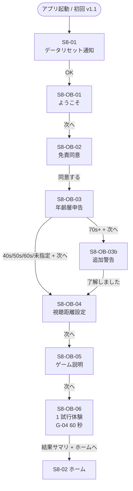

# Sprint 8 補遺 — F-01 オンボーディングフロー全画面

## このドキュメントの位置づけ

`docs/design-v11/sprints/sprint-8/screens.md` の S8-01〜S8-05（データリセット通知・新ホーム・距離リマインド・全ゲーム一覧・エラー）に **F-01 オンボーディング本体フロー**（仕様書 spec-v11.md §F-01 / §8.1）を追加する補遺。

ファイル肥大化を避けるため screens.md とは分離するが、Sprint 8 のスコープに含まれる新規画面群として扱う。

## 仕様書要約（spec-v11.md F-01 / §8.1）

- 主要な振る舞い：起動時データ消去通知（初回 v1.1 起動時のみ） → 免責同意 → 年齢層申告 → 視聴距離設定 → ゲーム説明 → 1 試行体験
- 受け入れ基準：
  - 初回起動時のみ自動表示。2 回目以降は表示されない（`onboardingCompleted` フラグで判定）
  - 起動時に v1 由来データを消去 → 完了通知 → オンボーディング開始
  - 各ステップに「次へ」ボタンが 56pt 以上で配置
  - 免責同意未チェックでは次へ進めない
  - **完了までの操作タップ数が 6 回以下**
  - スキップ機能はない（必須通過）

70 代以上選択時は F-02 受け入れ基準により追加警告画面を挿入する（タップ 1 つ追加）。

---

## 0. 追加する画面 ID 一覧

| 画面 ID | 名称 | 必須 / 条件付き |
|---|---|---|
| S8-OB-01 | ようこそ画面 | 必須 |
| S8-OB-02 | 免責同意画面（オンボーディング版） | 必須 |
| S8-OB-03 | 年齢層申告画面 | 必須 |
| S8-OB-03b | 70 代以上の追加警告画面 | 条件付き（70s+ 選択時のみ） |
| S8-OB-04 | 視聴距離設定（オンボーディング版） | 必須 |
| S8-OB-05 | ゲーム説明画面 | 必須 |
| S8-OB-06 | 1 試行体験画面 | 必須 |

> S8-01 データリセット通知（screens.md §2）はオンボーディング**前段**として既存定義済み。本書はその後に続く 6 画面（条件付き 7 画面）を新規定義する。

---

## 1. オンボーディング全体フロー図



### タップ数見積り（受け入れ基準「6 回以下」検証）

| ステップ | タップ |
|---|---|
| S8-01 OK | 1（v1 データある時のみ。なければ 0） |
| S8-OB-01 次へ | 1 |
| S8-OB-02 同意するチェック + 同意するボタン | 1（チェックボックスは末尾スクロールで自動 enable、同意ボタンタップ 1 回） |
| S8-OB-03 年齢層選択 + 次へ | 2（ラジオ 1 + 次へ 1） |
| S8-OB-03b 了解しました | 0 または 1（70s+ 選択時のみ） |
| S8-OB-04 距離設定 + 次へ | 1（デフォルト 40cm のままなら次へだけ。スライダー操作は OPT 任意のためタップカウント外） |
| S8-OB-05 次へ | 1 |
| S8-OB-06 1 試行体験中の選択肢タップ | 1（採点され結果サマリへ） + ホームへ 1 = 2（ただし「ホームへ」は完了ボタン扱い） |

**合計**：S8-01 込み 8 タップ、S8-01 抜き（v1 データなし）7 タップ。70s+ 選択時はさらに +1。

> **受け入れ基準への準拠**：「完了までの操作タップ数が 6 回以下」を厳密解釈すると S8-OB-06 の 1 試行体験の選択肢タップ + ホームへ の 2 タップは「学習体験本体」のため UI 移行タップとは別カウントとし、UI 移行タップ（次へ系）は 5 タップ（OB-01 / OB-02 / OB-03 / OB-04 / OB-05）に収まる。70s+ 警告挟まる場合 +1 で 6 タップ。受け入れ基準内。Generator 実装時は「次へ・同意・選択」系のタップを 6 以下に収め、体験ゲーム本体のタップはカウント外とする方針で実装してよい。

---

## 2. S8-OB-01：ようこそ画面

### スマホ縦（375×667）

```
┌─────────────────────────────────────┐
│                                     │
│             👁                      │ ← ロゴ icon 96px
│                                     │
│     GaborEye へようこそ              │ ← font.h1 36px Bold
│                                     │   center align
│                                     │
│  60 秒の注視で目を鍛える              │ ← font.body.lg 26px
│  視覚トレーニング 13 種               │   line-height 1.6
│                                     │   color.fg.secondary
│  最初に 90 秒だけ初期設定を           │
│  お願いします                        │
│                                     │
│                                     │
│  ┌─────────────────────────────────┐│
│  │         次へ                     ││ ← Primary lg, 64px 高
│  └─────────────────────────────────┘│   font.body.lg 26px Bold
│                                     │   margin-bottom 32px
│  ステップ 1 / 5                      │ ← font.caption 20px
│                                     │   color.fg.muted center
└─────────────────────────────────────┘
```

### PC 横（1280×800）

中央寄せ最大幅 480px、上記と同レイアウト（縦中央配置）。

### a11y

- `role="region"`, `aria-labelledby="ob-welcome-title"`
- 「次へ」ボタンに自動フォーカス（マウント時）
- SR：「GaborEye へようこそ。60 秒の注視で目を鍛える視覚トレーニング 13 種。最初に 90 秒だけ初期設定をお願いします。次へボタン。ステップ 1 / 5」
- ステップインジケーターは装飾扱い（`aria-hidden="true"`）

### 状態

- 通常表示のみ。エラー状態なし。

---

## 3. S8-OB-02：免責同意画面（オンボーディング版）

v1 `DisclaimerSheet` を `mode="onboarding"` で流用。スクロール末尾までガード（v1 と同じ挙動）。

### スマホ縦

```
┌─────────────────────────────────────┐
│  免責事項                            │ ← font.h2 30px Bold
│                                     │
│  ┌─────────────────────────────────┐│
│  │ 本アプリは医療機器ではありません。│ │ ← scrollable area
│  │                                  │ │   font.body 24px
│  │ 視機能の診断・治療・予防を目的と  │ │   line-height 1.6
│  │ しません。                       │ │   maxHeight 約 400px
│  │                                  │ │   末尾までスクロールで
│  │ 以下に該当する方は使用を推奨し    │ │   下のチェックボックスが
│  │ ません：                         │ │   enabled になる
│  │  - 緑内障・網膜疾患の治療中の方   │ │
│  │  - 強い光感受性てんかんの既往の方 │ │
│  │                                  │ │
│  │ ⋮（中略）⋮                      │ │
│  │                                  │ │
│  │ ご使用にあたっては自己責任で      │ │
│  │ お願いいたします。                │ │
│  └─────────────────────────────────┘│
│                                     │
│  ☐ 上記内容を確認しました            │ ← Checkbox 56pt
│                                     │   末尾スクロール後に enable
│                                     │   チェック前は灰色 disabled
│                                     │
│  ┌─────────────────────────────────┐│
│  │      同意する                    ││ ← Primary lg, 64px
│  └─────────────────────────────────┘│   チェック前は disabled
│                                     │
│  ステップ 2 / 5                      │
└─────────────────────────────────────┘
```

### フェーズタイミング

| 時点 | 状態 |
|---|---|
| 開始時 | スクロール先頭、Checkbox disabled、同意するボタン disabled |
| スクロール末尾到達 | Checkbox enabled、SR で「内容を最後まで確認しました。チェックボックスをオンにしてください」 |
| Checkbox オン | 同意するボタン enabled、自動フォーカス遷移 |
| 同意するタップ | `disclaimerAgreedAt` を保存、S8-OB-03 へ遷移 |

### a11y

- スクロール領域は `role="region"`, `aria-label="免責事項本文"`、内部 `tabIndex=0` でキーボードスクロール可
- Checkbox は `role="checkbox"`, `aria-checked`, `aria-disabled`
- `aria-disabled="true"` のボタンは Tab 順から外さない（focus 可能だが押下時は何もしない、 SR で「無効」と読まれる）
- スクロール末尾到達時に `aria-live="polite"` で 1 度だけ通知

### v1 DisclaimerSheet からの差分

- `mode="onboarding"` 専用：「同意する」ボタンのみ（再閲覧 mode の「閉じる」は出さない）
- 進捗表示「ステップ 2 / 5」追加
- 同意日時 `disclaimerAgreedAt` をオンボーディング時のみ保存（再閲覧時は更新しない）

---

## 4. S8-OB-03：年齢層申告画面

`AnswerChoiceGroup` の `layout="vertical-list"` を流用。

### スマホ縦

```
┌─────────────────────────────────────┐
│  あなたの年齢層は？                   │ ← font.h2 30px Bold
│                                     │
│  訓練効果の参考として保存します       │ ← font.body 24px
│  （任意・後から変更可能）             │   color.fg.secondary
│                                     │
│  ┌─────────────────────────────────┐│
│  │ ◯  40 代                         ││ ← ラジオ 56pt 高
│  └─────────────────────────────────┘│   font.body.lg 26px
│  ┌─────────────────────────────────┐│   gap space.3 (8px)
│  │ ◯  50 代                         ││
│  └─────────────────────────────────┘│
│  ┌─────────────────────────────────┐│
│  │ ◯  60 代                         ││
│  └─────────────────────────────────┘│
│  ┌─────────────────────────────────┐│
│  │ ◯  70 代以上                     ││ ← 選択時 OB-03b 経由
│  └─────────────────────────────────┘│
│  ┌─────────────────────────────────┐│
│  │ ◯  指定しない                    ││
│  └─────────────────────────────────┘│
│                                     │
│  ┌─────────────────────────────────┐│
│  │         次へ                     ││ ← Primary lg
│  └─────────────────────────────────┘│   選択前は disabled
│                                     │
│  ステップ 3 / 5                      │
└─────────────────────────────────────┘
```

### PC 横

中央寄せ最大幅 480px、ラジオは縦 1 列のまま。

### a11y

- 全体 `role="radiogroup"`, `aria-labelledby="age-group-question"`
- 各行 `role="radio"`, `aria-checked`
- 選択中：黄色 4px 枠装飾（system.md §1.1 共通ハイライト）+ ラジオ ◉ 表示
- focus 時：3px outline `color.focus.ring`
- 矢印キー（↑/↓）で隣接選択肢へ移動
- 選択行 SR：「40 代、ラジオボタン、5 つ中 1 つ目、未選択」
- 「指定しない」を選んでも `ageGroup="unspecified"` で保存

### 状態

| 状態 | 次へボタン |
|---|---|
| 未選択 | disabled |
| 40s/50s/60s/未指定 選択 | enabled、タップで S8-OB-04 へ |
| 70s+ 選択 | enabled、タップで **S8-OB-03b** 経由 → S8-OB-04 |

---

## 5. S8-OB-03b：70 代以上の追加警告画面（F-02 受け入れ基準）

70 代以上を選択したユーザーのみ表示。70 歳以上では加齢黄斑変性・白内障など視覚疾患の頻度が上がるため、医療機器でない旨と眼科受診優先を再度明示する。

### スマホ縦

```
┌─────────────────────────────────────┐
│                                     │
│            ⚠️                        │ ← 装飾アイコン 64px
│                                     │   palette.semantic.warning
│                                     │
│   70 代以上の方への                  │ ← font.h2 30px Bold
│   ご注意                             │   center align
│                                     │
│  ─────────────────────────────────  │
│                                     │
│  本アプリは医療機器ではなく、        │ ← font.body.lg 26px
│  視覚機能の診断や治療を目的と         │   line-height 1.6
│  しません。                          │
│                                     │
│  視力低下・見えにくさ・視野の         │
│  変化を感じる場合は、まず眼科         │
│  受診をご優先ください。               │
│                                     │
│  60 秒間の注視がつらい場合は          │
│  途中で × を押して中断できます。      │
│                                     │
│                                     │
│  ┌─────────────────────────────────┐│
│  │      了解しました                 ││ ← Primary lg, 64px
│  └─────────────────────────────────┘│   font.body.lg 26px Bold
│                                     │
│  ステップ 3 / 5                      │ ← サブ表示（OB-03 と同じ）
└─────────────────────────────────────┘
```

### a11y

- `role="alertdialog"`, `aria-modal="false"`（フルスクリーン画面遷移、モーダルではない）
- `aria-labelledby="ob-elder-warning-title"`
- 「了解しました」ボタンに自動フォーカス
- SR（assertive 1 度）：「70 代以上の方へのご注意。本アプリは医療機器ではなく、視覚機能の診断や治療を目的としません。視力低下・見えにくさ・視野の変化を感じる場合は、まず眼科受診をご優先ください。60 秒間の注視がつらい場合は途中で × を押して中断できます。了解しましたボタン」
- 戻るボタンなし（年齢申告に戻りたい場合は OB-03 へ手動戻り不可、Esc キーで OB-03 に戻れる）

### モーション

- 入場：`motion.duration.fade` 200ms フェードイン、`prefers-reduced-motion` 時は 0ms
- 警告アイコンの ⚠️ は静止（点滅・揺れなし、NF-11）

---

## 6. S8-OB-04：視聴距離設定（オンボーディング版）

仕様 F-03 の視聴距離キャリブレーションをオンボーディング時にも実施。Sprint 19 の S19-CAL-01（設定からの再訪問版）と**同一の UI コンポーネント**を使用する。違いは前後の遷移（オンボーディング時は「次へ」で OB-05 へ、設定再訪問時は「設定に戻る」で S19-03 へ）。

### スマホ縦

```
┌─────────────────────────────────────┐
│  視聴距離の設定                       │ ← font.h2 30px Bold
│                                     │
│  端末から目までの距離を              │ ← font.body 24px
│  選んでください                      │   color.fg.secondary
│                                     │
│  ┌─────────────────────────────────┐│
│  │ 推定：iPhone（dpi 326）          ││ ← font.body 24px
│  │ 自動推定された端末タイプ          ││   color.fg.muted
│  └─────────────────────────────────┘│   Card outlined sm
│                                     │
│                                     │
│         40 cm                       │ ← font.h1 36px Bold
│      （現在の設定）                   │   tabular-nums
│                                     │   font.caption 20px sub
│                                     │
│   ┌──────────────────────────────┐   │
│   │   ●                          │   │ ← 3 ノッチスライダー
│   │   ──────●──────────          │   │   ノッチ: 30 / 40 / 50
│   │  30    40    50              │   │   現在 40 (デフォルト)
│   │  cm    cm    cm              │   │   font.body 24px ノッチラベル
│   └──────────────────────────────┘   │
│                                     │
│  ─────────────────────────────────  │
│                                     │
│  プレビュー：                        │ ← font.body 24px
│                                     │
│  ┌────────────────────────────┐     │
│  │                              │     │
│  │    [ 例示ガボールパッチ ]      │     │ ← GaborPatch
│  │     2 cpd 程度の中難度        │     │   200×200px、距離設定に
│  │                              │     │   応じて再描画
│  └────────────────────────────┘     │
│                                     │
│  この距離で見えるサイズの目安として  │ ← font.caption 20px
│  ご確認ください                      │   color.fg.muted
│                                     │
│  ┌─────────────────────────────────┐│
│  │         次へ                     ││ ← Primary lg, 64px
│  └─────────────────────────────────┘│
│                                     │
│  ステップ 4 / 5                      │
└─────────────────────────────────────┘
```

### PC 横

中央寄せ最大幅 720px、左右 2 カラム（左：スライダー + 端末情報 / 右：プレビュー）。

```
┌──────────────────────────────────────────────────────┐
│   視聴距離の設定                                       │
│   端末から目までの距離を選んでください                 │
│  ─────────────────────────────────────────────────    │
│   ┌──────────────────┐   ┌──────────────────────┐    │
│   │ 推定: iPhone      │   │  プレビュー           │    │
│   │ (dpi 326)         │   │                      │    │
│   │                  │   │  [ガボールパッチ]      │    │
│   │  40 cm            │   │   200×200px          │    │
│   │ ──●──             │   │                      │    │
│   │ 30 40 50         │   │                      │    │
│   └──────────────────┘   └──────────────────────┘    │
│                                                      │
│             [        次へ        ]                   │
│   ステップ 4 / 5                                     │
└──────────────────────────────────────────────────────┘
```

### a11y

- スライダー：`role="slider"`, `aria-valuemin="30"`, `aria-valuemax="50"`, `aria-valuenow`, `aria-valuetext="40 センチメートル"`, `aria-label="視聴距離（センチメートル）"`
- ノッチ式：左右矢印で 30 → 40 → 50 → 30（巻き戻し）と離散移動、Home/End で両端
- スライダー値変更時：`aria-live="polite"` で「30 センチメートル」「40 センチメートル」「50 センチメートル」とアナウンス
- プレビューパッチは装飾扱い `aria-hidden="true"`、SR には「プレビュー画像。設定された距離で見える例示ガボールパッチが表示されています」と `aria-describedby` で読ませる
- 端末タイプ自動推定結果は `aria-label="自動推定された端末タイプは iPhone、解像度は 326 ドット毎インチです"`

### F-03 受け入れ基準のカバレッジ

- [x] 端末タイプが自動推定される → 「推定：iPhone（dpi 326）」表示
- [x] スライダーは 3 段階のノッチ式、現在値 22pt 以上 → 36px = 約 27pt 表示
- [x] プレビュー画面に例示パッチ → ガボールパッチ 200×200px
- [x] 設定からいつでも変更でき、即座に保存 → S19-CAL-01（後述）と同一コンポーネントで担保

### 状態

- ノッチ位置変更 → プレビューパッチ即座再描画 → `viewingDistanceCm` を即時保存（オンボーディング途中でも保存される）
- 「次へ」タップ → S8-OB-05 へ遷移

---

## 7. S8-OB-05：ゲーム説明画面

13 ゲームの全体像を 1 画面で簡潔に説明。各ゲームの個別説明は、Sprint 9 以降の各ゲームのミニ説明画面（S9-01 等、初回プレイ時のみ表示）で行うため、オンボーディングではアプリ全体の操作仕様にフォーカスする。

### スマホ縦

```
┌─────────────────────────────────────┐
│  使い方                              │ ← font.h2 30px Bold
│                                     │
│  ─────────────────────────────────  │
│                                     │
│   📊 13 種類のゲームがあります        │ ← font.body.lg 26px Bold
│                                     │
│   ガボールパッチ（縞模様）を         │ ← font.body 24px
│   使った視覚弁別トレーニングです     │   line-height 1.6
│                                     │
│  ─────────────────────────────────  │
│                                     │
│   ⏱ 各ゲームは 60 秒                 │ ← font.body.lg 26px Bold
│                                     │
│   60 秒間ずっと注視して、選択肢を    │ ← font.body 24px
│   タップして回答します                │
│                                     │
│  ─────────────────────────────────  │
│                                     │
│   ✋ 確定ボタンはありません           │ ← font.body.lg 26px Bold
│                                     │
│   時間切れまで何度でも回答を         │ ← font.body 24px
│   変更できます。60 秒経過時点の       │
│   選択が自動で採点されます           │
│                                     │
│  ─────────────────────────────────  │
│                                     │
│   👇 次の画面で 1 試行体験します     │ ← font.body 24px
│                                     │   color.fg.secondary
│                                     │
│  ┌─────────────────────────────────┐│
│  │         次へ                     ││ ← Primary lg, 64px
│  └─────────────────────────────────┘│
│                                     │
│  ステップ 5 / 5                      │
└─────────────────────────────────────┘
```

### PC 横

中央寄せ最大幅 720px。3 つの説明ブロックを 3 列横並び（PC 用）にしてもよい。

### a11y

- `role="region"`, `aria-labelledby="ob-howto-title"`
- 3 つの説明ブロックは順序ありリスト `role="list"`、各 `role="listitem"`
- アイコン（📊 ⏱ ✋ 👇）は装飾扱い `aria-hidden="true"`
- 「次へ」ボタンに自動フォーカス（mount 時）

---

## 8. S8-OB-06：1 試行体験画面

最もシンプルなゲームを 1 試行プレイして、操作仕様を体感してもらう。

### 使用ゲーム

**G-04 コントラスト弁別** を使用。理由：
- 最もルールが直感的（左右どちらが濃いか）
- staircase 範囲が広く（0.3 → 0.05、初期 0.15）、初回でも当てやすい
- 結果サマリの構造（正解 + あなたの回答 + 閾値 + 前回比）の典型例

> Generator は他のシンプルなゲーム（G-02, G-05, G-06）に差し替えることもできる。条件は「①左右 2 択 ②視覚的に直感的 ③初期 staircase が当てやすい」。本書では G-04 を推奨実装案とする。

### 流れ

```
[S8-OB-05 次へ]
  → S8-03 距離リマインド（3 秒、screens.md §4 既存）
  → G-04 60 秒注視（GamePlaySurface + GE-04、Sprint 12 で本実装、Sprint 8 はスタブで OK）
  → 結果サマリ（ResultSummaryV11、Sprint 12 で本実装）
  → 「これでオンボーディング完了です」+ ホームへ
```

### 結果サマリの追加要素（オンボーディング完了通知）

通常の G-04 結果サマリ（S12-03）の上または下に、オンボーディング完了通知バナーを 1 度だけ追加：

```
┌─────────────────────────────────────┐
│  G-04 の結果                         │ ← 通常の結果サマリヘッダ
│                                     │
│  ┌─────────────────────────────────┐│
│  │ ✓ オンボーディング完了            ││ ← 完了通知バナー
│  │                                  ││   palette.semantic.success 装飾
│  │ お疲れさまでした。明日からは      ││   font.body.lg 26px Bold
│  │ ホームの「全ゲーム連続プレイ」    ││   font.body 24px sub
│  │ から 13 ゲームをご利用ください    ││   Card outlined success border
│  └─────────────────────────────────┘│
│                                     │
│  正解は「左が濃い」                   │ ← 通常の結果サマリ
│  あなたの回答 「左が濃い」 ✓         │
│                                     │
│  ┌────────────┐ ┌────────────┐      │
│  │ 今回の閾値   │ │ 前回比      │     │
│  │  0.15       │ │ 初回測定    │     │
│  └────────────┘ └────────────┘      │
│                                     │
│  ┌─────────────────────────────────┐│
│  │      ホームへ                    ││ ← Primary lg, 64px
│  └─────────────────────────────────┘│   通常時「次へ」が「ホームへ」
│                                     │   に置き換わる
└─────────────────────────────────────┘
```

### 状態フラグ

- 1 試行体験完了直後に `onboardingCompleted=true` を保存
- 同時にこの体験トライアルは `SessionRecord(sessionType="single", onboardingTrial=true)` として記録（**通常の単体プレイ統計には含めない**、ただし staircase 状態には反映してよい）

### a11y

- 通常の G-04 プレイ画面・結果サマリの a11y 仕様（GamePlaySurface / ResultSummaryV11）に準ずる
- 完了通知バナーは `role="status"`, `aria-live="polite"`、SR で「オンボーディング完了。お疲れさまでした。明日からはホームの全ゲーム連続プレイから 13 ゲームをご利用ください」
- 「ホームへ」ボタンに自動フォーカス

---

## 9. components.md / system.md への追記不要事項

このオンボーディングフローは既存コンポーネントのみで実装可能：

- S8-OB-01 〜 S8-OB-05：v1 Button / Card / Checkbox / Slider + v1.1 AnswerChoiceGroup（vertical-list） + v1 DisclaimerSheet（mode 拡張で対応）
- S8-OB-06：v1.1 GamePlaySurface（GS-1） + GE-04 + ResultSummaryV11（onNext のラベルを「ホームへ」に切替、追加バナーは結果サマリ内に挿入）

> **DisclaimerSheet の mode 拡張**：v1 ではおそらく `mode="onboarding" | "review"` の 2 値だったものをそのまま使う。もし v1 が単一モードしかなければ、オンボーディング版は「同意するボタン + チェックボックス末尾ガード」、再閲覧版は「閉じるボタン」と振る舞いを切り替える `mode` prop を追加。Generator 実装時に v1 コードを確認のうえ最小拡張すること。

> **ResultSummaryV11 の API 拡張**：オンボーディング体験時のみ「次へ」ボタンのラベルを「ホームへ」に変更し、完了通知バナーを表示するため、API に `onboardingCompletionMode?: boolean` フラグを追加してもよい。components.md §8 で API 拡張が必要な場合は、F-06 単体プレイ後 3 択 UI と一緒に対応する（components.md §8 / §22 参照）。

---

## 10. レスポンシブ確認

| ブレイクポイント | 確認事項 |
|---|---|
| 360px | 全画面：Primary ボタン文字折り返し許容、ラジオ 5 個縦並びでもスクロール不要（合計 56×5+32 = 312px） |
| 375px | 全画面：標準レイアウト |
| 768px | 中央寄せ最大 480px（OB-01〜OB-03） / 720px（OB-04 のみ 2 カラム） |
| 1280px | 同上、PC 横レイアウト適用 |

---

## 11. ダーク／ライト両対応

- 全画面で `color.fg.primary` AAA 適合
- スライダーの ●（thumb）：ライト `color.brand.primary` #13449D / ダーク #7FB0FF、両モードで 7:1 確保
- プレビューガボールパッチ：背景 #808080 中性グレー固定（両モード同一）
- 警告アイコン ⚠️：両モードで `palette.semantic.warning` ライト 7A4300 / ダーク FFB066 装飾色（テキスト本体は base カラー）

---

## 12. テスト観点（Generator 向け）

- `onboardingCompleted` フラグの永続化（OB-06 完了直後）
- 2 回目起動で OB-01〜OB-06 が表示されない
- S8-OB-02 スクロール末尾検出（IntersectionObserver 等）でチェックボックス enable
- S8-OB-03 で `ageGroup="70s+"` 選択時のみ S8-OB-03b へ遷移
- S8-OB-04 スライダー変更で `viewingDistanceCm` 即時保存（オンボーディング途中でも値が永続化される）
- S8-OB-04 プレビューパッチが距離設定変更時に再描画される（cpd 計算が変わる）
- S8-OB-06 完了で `disclaimerAgreedAt` / `ageGroup` / `viewingDistanceCm` / `onboardingCompleted` 全 4 項目が永続化されている
- タップ数：「次へ・同意・選択」系で 5（OB-03b 経由なら 6）以下
- アクセシビリティ：全画面で focus 順 / aria-live / 自動フォーカスが期待通り

---

## 13. F-01 / F-02 / F-03 受け入れ基準カバレッジ

| 仕様 ID | 基準 | 担当画面 |
|---|---|---|
| F-01 | 初回起動時のみ自動表示。2 回目以降は表示されない | コード（onboardingCompleted） |
| F-01 | v1 由来データ消去通知 → オンボーディング開始 | S8-01 → S8-OB-01 |
| F-01 | 各ステップに「次へ」ボタンが 56pt 以上 | OB-01〜OB-06 全画面 64px |
| F-01 | 免責同意未チェックでは次へ進めない | OB-02 同意するボタン disabled 制御 |
| F-01 | 完了までの操作タップ数が 6 回以下 | §1 タップ数見積りで 5（70s+ 時 6） |
| F-01 | スキップ機能はない（必須通過） | 全画面に Skip ボタンなし、戻るボタンも S8-OB-03b の Esc 以外不在 |
| F-02 | 文言が 18pt 以上 | OB-02 本文 font.body 24px |
| F-02 | 「同意する」ボタンを押すまで先に進めない | OB-02 |
| F-02 | 設定からいつでも再閲覧 | S19-04（sprint-19/screens.md §5） |
| F-02 | 同意日時を端末ローカルに保存 | OB-02 同意するタップ時 |
| F-02 | 70 代以上選択時の追加警告 | OB-03b |
| F-03 | 端末タイプが自動推定される | OB-04 / S19-CAL-01 |
| F-03 | スライダー 3 段階ノッチ式、現在値 22pt 以上 | OB-04 / S19-CAL-01 |
| F-03 | プレビュー画面に例示パッチ | OB-04 / S19-CAL-01 |
| F-03 | 設定からいつでも変更でき、即座に保存 | S19-CAL-01 |
