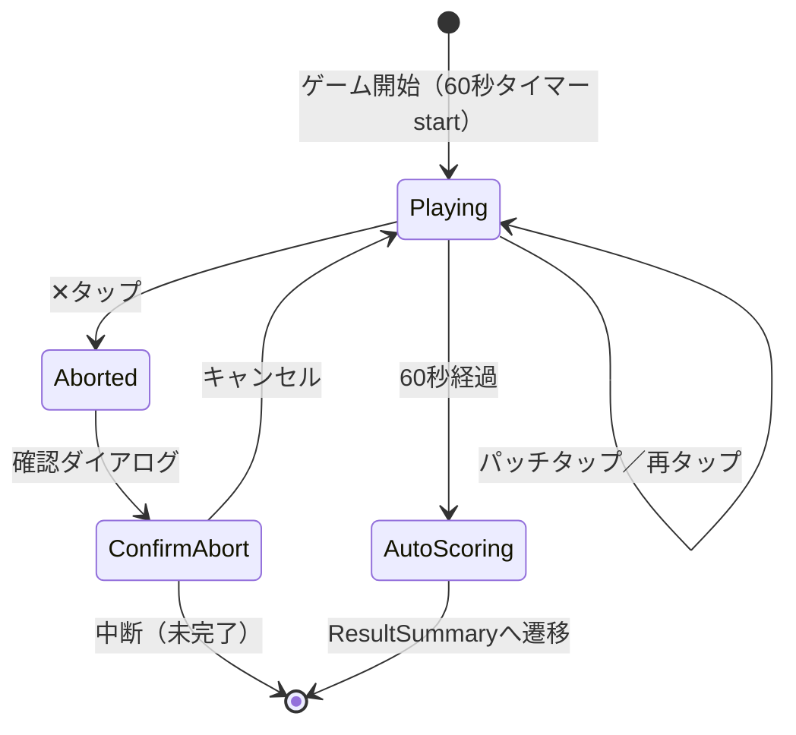

# Sprint 9 — G-01 変化察知（v1 改修）

> **Sprint 20 改訂注記（v1.1.1、2026-04-30）**：本スプリントの **S9-03 G-01 結果サマリ独立画面は撤去**された。Sprint 20 で結果開示が刺激画面統合方式（ResultOverlay 重畳）に再設計されたため、S9-03 のレイアウト記述は新規実装の参照には使わない。最新仕様は `docs/design-v11/sprints/sprint-20/screens.md` §7 S20-G01-RESULT を参照。S9-01（ミニ説明）/ S9-02（プレイ画面）の記述は引き続き有効。なお、S9-02 の選択枠表現「黄色 4px」は v1.1.1 で「中性グレー 2px」に改訂（components.md §3 / §4 参照）。

## スプリントの目的（spec-v11.md §13）

G-01 が単体プレイで動く。60 秒注視 → 自動採点 → 結果サマリの 1 試行ループが完結。

含む機能：F-07（G-01）、F-10（結果サマリ v1.1）

---

## 0. このスプリントで作る／更新する画面

| 画面 ID | 名称 | 状態 |
|---|---|---|
| S9-01 | G-01 ミニ説明（初回のみ） | 新規 |
| S9-02 | G-01 プレイ画面（60 秒注視 + グリッド） | 新規（v1 Sprint 1 から OPT-12 統一改修） |
| S9-03 | G-01 結果サマリ（v1.1 統一フォーマット） | 新規 |

---

## 1. 受け入れ基準カバレッジ

| 仕様 ID | 基準 | 担当 |
|---|---|---|
| F-07 共通 | 1 試行 60 秒で自動終了 | S9-02 |
| F-07 共通 | 残り N 秒が 22pt 以上で常時表示 | S9-02 |
| F-07 共通 | タップで自由に何度でも回答変更 | S9-02 |
| F-07 共通 | 確定ボタン存在しない | S9-02 |
| F-07 共通 | 60 秒経過で自動採点 | S9-02 |
| F-07 共通 | 未回答 = 不正解、staircase 易方向 | コード |
| F-07 共通 | 試行中の正誤フィードバックなし | S9-02 |
| F-07 共通 | × ボタン中断（緊急脱出） | S9-02 |
| F-07 共通 | 選択中＝黄色 4px 枠 | S9-02（ImageChoiceCell） |
| F-07 共通 | 「現在の回答：◯◯」テキスト表示なし | S9-02 |
| 7.1 G-01 | 3×3〜5×5 グリッド、変化していくパッチ | S9-02 |
| 7.1 G-01 | 複数選択可（True Positive +1 / False Positive -1） | S9-02 |
| 7.1 G-01 | staircase: 最大角度差 易 8°→難 3°、初期 5°、step 1° | コード |
| 7.1 G-01 | 正解開示で実際の変化箇所を拡大ハイライト 1.5 秒 | S9-03 |
| F-10 | 「正解 + 回答 + 閾値 + 前回比」を 1 枚で開示 | S9-03 |
| F-10 | 単体時：「次へ」を押すまで自動進行なし | S9-03 |
| F-10 | コース時：10 秒カウントダウンで自動進行 | S9-03（コース連携は Sprint 18） |

---

## 2. S9-01：G-01 ミニ説明（初回のみ）

ユーザーが G-01 を初めてプレイする時に 1 度表示。2 回目以降はスキップ。

### スマホ縦（375×667）

```
┌─────────────────────────────────────┐
│  ←  G-01 変化察知                    │ ← header
│                                     │
│                                     │
│         じーっと見つめて、            │ ← font.h2 30px Bold
│      動いているパッチを見つけよう      │   center align
│                                     │
│                                     │
│   ┌─────────────────────────────┐   │
│   │   ▦▦▦                       │   │ ← デモ画像（3×3 例示、静止）
│   │   ▦▦▦   ← この中に動くやつ   │   │   200×200px
│   │   ▦▦▦      がいます           │   │
│   └─────────────────────────────┘   │
│                                     │
│   ・60 秒間、グリッド全体を見渡す      │ ← font.body 24px、リスト
│   ・動いていると思ったパッチをタップ   │   line-height 1.7
│   ・タップで選択／再タップで解除       │
│   ・複数選んでいい                    │
│   ・60 秒経つと自動で結果が出る        │
│                                     │
│  ┌─────────────────────────────────┐│
│  │     はじめる                      ││ ← Primary lg, 64px
│  └─────────────────────────────────┘│
└─────────────────────────────────────┘
```

### a11y
- 「次へ」ボタンへフォーカス自動遷移
- リスト箇条書きは `<ul>` で SR 順番通り読み上げ
- デモ画像 `aria-hidden="true"`

---

## 3. S9-02：G-01 プレイ画面（60 秒注視）

`GamePlaySurface`（GS-1）+ `MorphGridStimulus`（GE-01）+ 注視領域内の `ImageChoiceCell` グリッド。

### スマホ縦（375×667）

```
┌─────────────────────────────────────┐
│  ✕     残り 47 秒                    │ ← GameStatusBarV11 (64px)
│                                     │
│                                     │
│  ┌────────────────────────────┐     │
│  │ ▦  ▦  ▦  ▦  ▦              │     │ ← MorphGridStimulus (5×5 例)
│  │                            │     │   全体辺 320×320px
│  │ ▦  [▦] ▦  ▦  ▦             │     │   各セル 56〜64px
│  │     ↑                      │     │   セル間ギャップ 8px
│  │  選択中（黄 4px 枠）          │     │
│  │ ▦  ▦  ▦ [▦] ▦              │     │   60 秒間モーフィング進行
│  │                            │     │   背景 #808080
│  │ ▦  ▦  ▦  ▦  ▦              │     │
│  │                            │     │
│  │ ▦  ▦  ▦  ▦  ▦              │     │
│  └────────────────────────────┘     │
│                                     │
│  動いていると思うパッチを              │ ← guidance text
│  タップしてください                  │   font.body 24px
│                                     │
└─────────────────────────────────────┘
```

### PC 横（1280×800）

```
┌──────────────────────────────────────────────────────┐
│  ✕      残り 47 秒                                    │
│                                                      │
│         ┌──────────────────────────────┐             │
│         │ ▦  ▦  ▦  ▦  ▦                │             │
│         │ ▦  [▦] ▦  ▦  ▦               │             │ ← 480×480px
│         │ ▦  ▦  ▦  [▦] ▦               │             │   各セル 88×88px
│         │ ▦  ▦  ▦  ▦  ▦                │             │
│         │ ▦  ▦  ▦  ▦  ▦                │             │
│         └──────────────────────────────┘             │
│                                                      │
│         動いていると思うパッチをクリックしてください       │
│                                                      │
└──────────────────────────────────────────────────────┘
```

### モックアップ（Mermaid 状態図）



### フェーズタイミング表

| 時刻 | グリッド表示 | ユーザー操作 |
|---|---|---|
| 0s | 5×5 グリッド初期角度（ランダム） | - |
| 0s〜60s | 各パッチがゆっくりモーフィング（変化対象は max 5° 振幅） | 任意のセルをタップ／再タップ |
| 60s | 自動採点 → S9-03 へ | 操作不可 |

### 状態

- default：黒/白の縞ガボール、選択枠なし
- selected：黄色 4px 枠（color.highlight.correct）
- focus-visible：青 3px outline + 2px offset（黄枠と並立可能）
- disabled（中断確認時）：opacity 0.5

### `prefers-reduced-motion: reduce` 時
- モーフィングは連続変化ではなく **5 段階階段状**（v1 と同じ）
- 12 秒ごとにステップ変化（5 ステップで 60 秒）

### a11y
- グリッド全体は `<div role="grid">`、各セルは `role="gridcell"` + `role="checkbox"` + `aria-checked`
- 各セル：`aria-label="縞模様、3 列 2 行目"`
- カウントダウン残秒：`aria-live="polite"`（5 秒以下のみ更新通知）
- ガイド文：`aria-describedby` でグリッドにリンク

### F-07 / OPT-12 適合
- 試行中の正誤フィードバックなし（背景色変化・音なし）
- × 中断時は `AbortConfirmDialog`：「コースを中断しますか？」「ここまでの記録は未完了として保存されます」

---

## 4. S9-03：G-01 結果サマリ（v1.1 統一フォーマット）

`ResultSummaryV11`（RS-1）。

### スマホ縦（375×667）

```
┌─────────────────────────────────────┐
│           G-01 の結果                │ ← font.h2 30px Bold
│                                     │
│                                     │
│  正解は「3 列 2 行目」「2 列 4 行目」 │ ← font.h1 36px Bold
│   など 計 3 個                        │   黄色 4px 装飾枠
│                                     │
│   ┌──────────────────┐               │
│   │ [グリッド再現]    │               │ ← 採点結果ハイライト
│   │ ▦▦▦▦▦           │               │   1.5 秒拡大ハイライト後
│   │ ▦▦▦*▦  *=正解   │               │   静止表示
│   │ ▦▦▦▦▦           │               │
│   │ *▦▦▦▦           │               │
│   │ ▦▦*▦▦           │               │
│   └──────────────────┘               │
│                                     │
│   あなたの回答 「3 列 2 行目」「1 列 4 行目」│ ← font.body.lg 26px Medium
│   （正解 1, 誤答 1）                 │   不正解時：左にエラー装飾アイコン
│                                     │
│  ┌────────────────┐ ┌────────────────┐
│  │ 今回の閾値      │ │ 前回比          │ ← MetricCard ×2
│  │                │ │                │   各 minHeight 140px
│  │   5.0°         │ │  +0.3 ↓ 改善   │   value font.h2 30px Bold
│  │ 角度差          │ │                │   diff 矢印は装飾色のみ
│  └────────────────┘ └────────────────┘
│                                     │
│  ┌─────────────────────────────────┐│
│  │     次へ                          ││ ← Primary lg, 64px
│  └─────────────────────────────────┘│   font.body.lg 26px Bold
│                                     │   コース時は右上にカウントダウン
└─────────────────────────────────────┘
```

### PC 横

```
┌──────────────────────────────────────────────────────────┐
│                G-01 の結果                                │
│                                                          │
│        正解は「3 列 2 行目」「2 列 4 行目」「5 列 1 行目」 │
│                                                          │
│         ┌────────────────────┐                           │
│         │ [グリッド再現+正解]  │                           │
│         └────────────────────┘                           │
│                                                          │
│        あなたの回答 「3 列 2 行目」「1 列 4 行目」（正解 1, 誤答 1）│
│                                                          │
│   ┌──────────────────┐  ┌──────────────────┐             │
│   │ 今回の閾値          │ │ 前回比             │             │
│   │  5.0°              │ │  +0.3 ↓ 改善      │             │
│   └──────────────────┘  └──────────────────┘             │
│                                                          │
│            ┌──────────────────────┐                      │
│            │       次へ            │                     │
│            └──────────────────────┘                      │
│                                                          │
└──────────────────────────────────────────────────────────┘
```

### G-01 固有の指標

| 表示項目 | 値の例 |
|---|---|
| correctAnswerLabel | 「3 列 2 行目」「2 列 4 行目」「5 列 1 行目」（変化対象パッチの位置一覧） |
| userAnswerLabel | 「3 列 2 行目」「1 列 4 行目」（ユーザーが選択していた位置一覧） |
| threshold | value=5.0、unit="角度差（°）" |
| diff | sign="-"、magnitude="0.3"、direction="improved"（角度差が小さい方が良い → 改善） |

### G-01 では「グリッド再現+正解ハイライト」を MetricCard の上に配置（ゲーム特有の追加要素）
- 採点後、変化箇所を黄色枠 + scale(1→1.18→1) の 1.5 秒ハイライト
- ハイライト後は静止表示
- 誤答（False Positive）は赤枠で別装飾（テキスト本体は base）

### フェーズタイミング

| 時刻 | 表示 |
|---|---|
| 0.0s（採点直後） | 「G-01 の結果」フェードイン |
| 0.2s | 「正解は ◯◯」h1 表示 |
| 0.4s | グリッド再現表示開始、正解パッチ拡大ハイライト 1.5 秒 |
| 1.9s | 「あなたの回答」表示 |
| 2.0s | MetricCard ×2 表示 |
| 任意 | 「次へ」タップ → 次画面 |
| 単体時 | 自動進行なし、無限待機 |
| コース時 | 10 秒カウントダウン → 自動進行 |

### a11y
- `role="region"`、`aria-labelledby="result-title"`
- `aria-live="assertive"` で 1 度だけ：「G-01 結果。正解は 3 つのパッチ。あなたの回答は 2 つ、うち正解 1 つ、誤答 1 つ。今回の閾値は 5 度。前回より 0.3 度改善。次へボタン」
- 単体時：「次へ」ボタンに自動フォーカス
- コース時：自動進行カウントダウンも `aria-live="polite"`

### モックアップ

ASCII で十分。Mermaid タイムライン補助：

```mermaid
gantt
    title G-01 セッション 1 試行のタイムライン（単体）
    dateFormat  s
    axisFormat  %S
    section 流れ
    距離リマインド (3秒)    :0, 3
    G-01 注視 60 秒          :3, 60
    結果サマリ表示開始       :63, 2
    ユーザー「次へ」待機     :65, 30
```



---

## 5. レスポンシブ確認

| ブレイクポイント | グリッド全体辺 | セル一辺 |
|---|---|---|
| 360px | 320 - 32 = 288px | 約 50px (5×5) |
| 375px | 320px | 56px |
| 768px | 480px | 88px |
| 1280px | 480px | 88px |

5×5 配置時もセル一辺 50px 以上（OPT-2 タップ領域、ガボール領域パディング込みで 48pt 確保）。

## 6. ダーク／ライト両対応

- ガボール領域は **常に #808080**（OS のダーク化に追従しない、system.md §7 参照）
- ステータスバー・選択枠・結果サマリは両モード対応

## 7. テスト観点（Generator 向け）

- 60 秒タイマー起動 → 0 で自動採点
- 中断確認ダイアログの表示・キャンセル
- True Positive / False Positive 採点ロジック
- staircase 直近 5 セッション平均
- prefers-reduced-motion: reduce 時の階段状モーフィング
- ResultSummaryV11 の単体／コース両モード切替
